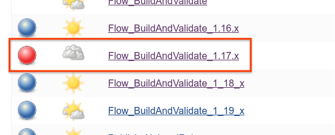
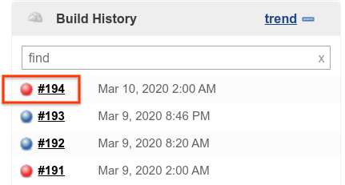
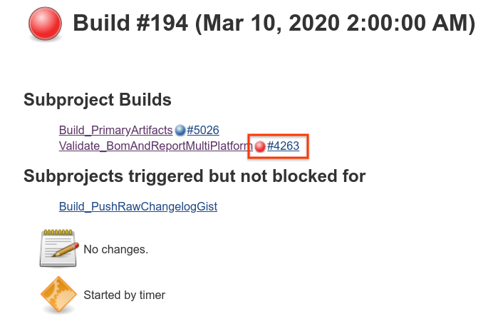
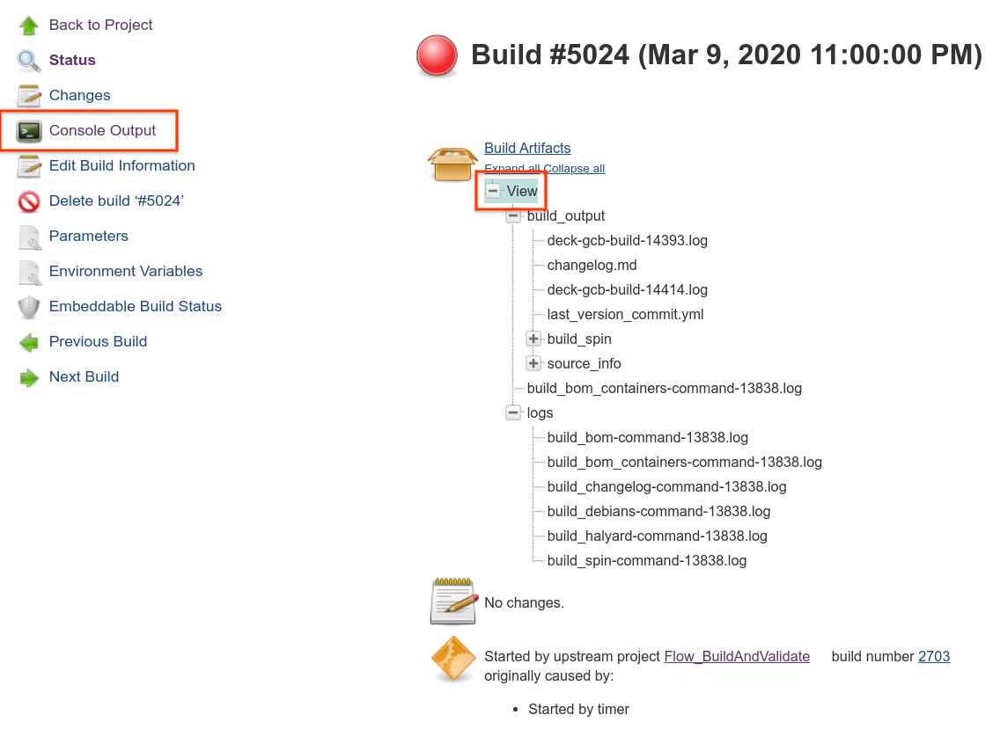
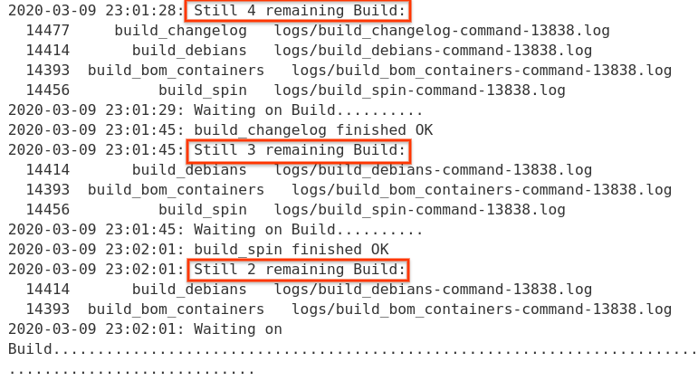
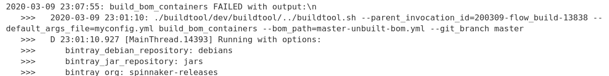
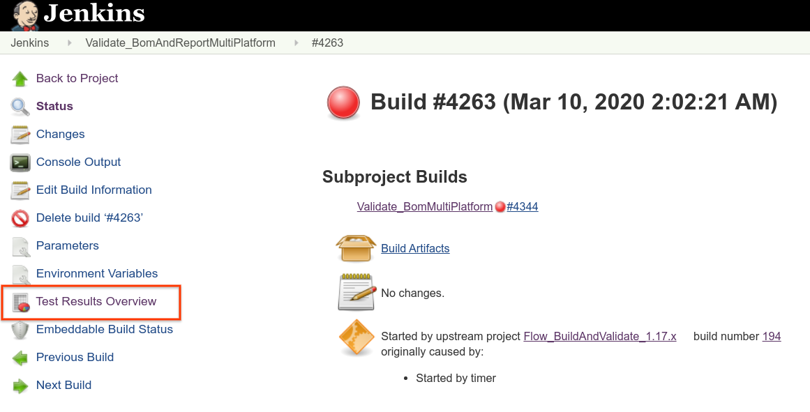
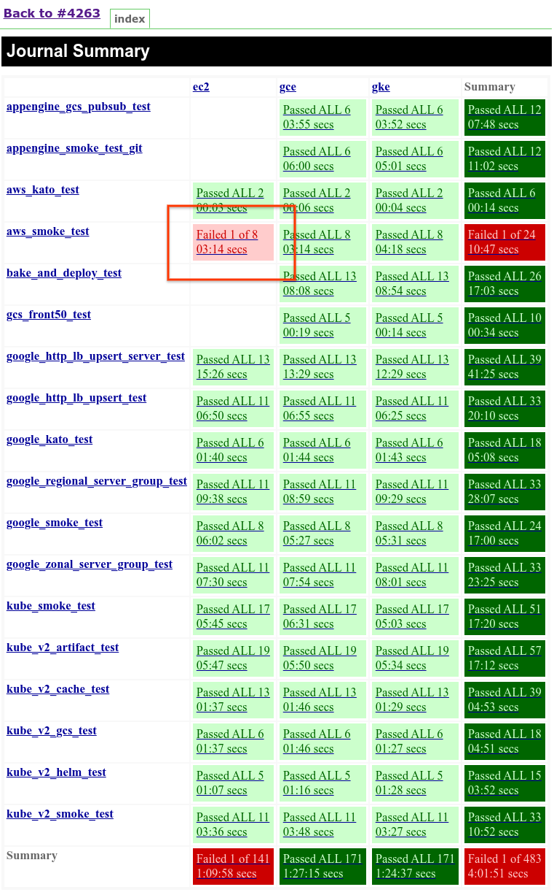
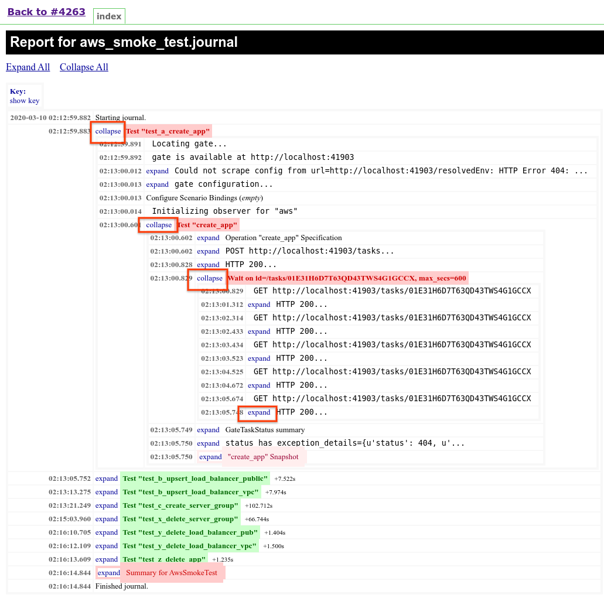
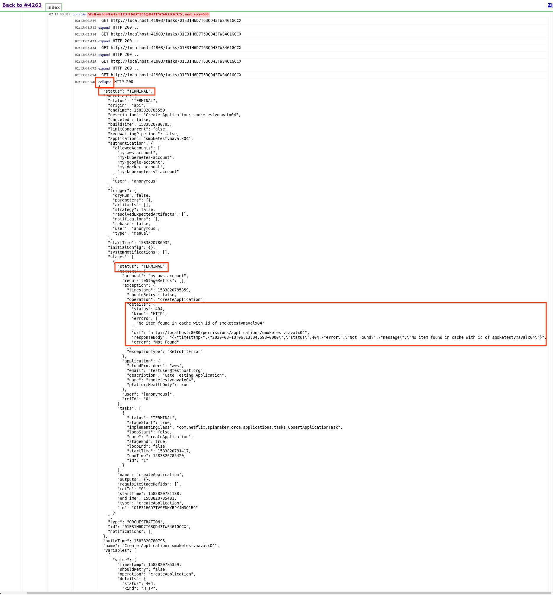



Bugs affecting more than one service commonly surface only when the whole system is running. Our continuous integration system builds and runs a suite of integration tests against Spinnaker nightly on real cloud provider infrastructure to detect these bugs.

> **Access the CI system here**: [https://builds.spinnaker.io](https://builds.spinnaker.io){:target="\_blank"}
>
> Viewers must be a member of the `build-cops` GitHub Team.

## Build Cop

The **build cop** responsibilities include:

* Triage integration test failures on `master` and the 3 most recent release branches
* [Clean up](#cleaning-orphaned-resources) orphaned resources across target cloud providers
* Route [new GitHub issues](https://github.com/spinnaker/spinnaker/issues){:target="\_blank"} to the appropriate SIG
  (applying GitHub labels as appropriate). You can find the full list of SIGs in the
  [governance repo](https://github.com/spinnaker/governance/blob/master/sig-index.md){:target="\_blank"}
* Observe any systemic problems raised in the [#general](https://spinnakerteam.slack.com/messages/general/){:target="\_blank"}
  and [#dev](https://spinnakerteam.slack.com/messages/dev/){:target="\_blank"} Slack channels
* Log observations and corrective actions taken in the [rotation log](https://docs.google.com/document/d/1T0kifZ0C7zSIKOy2McKfmDnwvmRuU5Z3t81Tly6kH1M/edit#){:target="\_blank"}

## Process Structure

The CI system comprises both _jobs_, which do a specific task, and _flows_, which invoke a series of jobs.

[`Flow_BuildAndValidate`](https://builds.spinnaker.io/job/Flow_BuildAndValidate/){:target="\_blank"} is the primary entry point for the `master` branch flow.

`Flow_BuildAndValidate_<version>` is the the entry point for the respective top-level release. It is a copy of the primary `Flow_BuildAndValidate` when that release was cut. Top-level release flows work off their respective `release-1.ABC.x` branches.

As its name implies, `Flow_BuildAndValidate` builds and tests the whole Spinnaker system. It follows this general process:

### 1. [Build_PrimaryArtifacts](https://builds.spinnaker.io/job/Build_PrimaryArtifacts/){:target="\_blank"}

1. `git checkout` all services
1. Constructs a BOM from the most recent commit on the target branch
1. Builds a Docker container and a Debian package of each Spinnaker microservice.
1. Builds additional supporting artifacts:
  * `halyard`
  * `spin-cli`
  * Changelog
1. Publishes the BOM under the following names:
  * _With the floating tag:_ `<branchName>-latest-unvalidated` (e.g. `master-latest-unvalidated`)
  * _With a fixed tag:_ `<branchName>-<timestamp>` (e.g. `master-20191213154039`)
1. Publishes the [changelog](https://gist.github.com/spinnaker-release/4f8cd09490870ae9ebf78be3be1763ee)

### 2. [Validate_BomAndReportMultiPlatform](https://builds.spinnaker.io/job/Validate_BomAndReportMultiPlatform/){:target="\_blank"}

For uninteresting reasons, this job must wrap the following `ValidateBomMultiPlatform` in order to aggregate its results.

### 3. [ValidateBomMultiPlatform](https://builds.spinnaker.io/job/Validate_BomMultiPlatform/){:target="\_blank"}

This "Multi-configuration project" specifies the same test(s) to run across different environments. This confirms
Spinnaker works whether deployed as a single VM or in a Kubernetes cluster, for instance.

1. Starts Halyard in a new VM
1. Connects to this instance and executes a series of `hal config` steps, including account setup for the managed cloud provider(s).
1. Deploys the configuration with `hal deploy apply`.
1. Invokes [`citest`](https://github.com/google/citest){:target="\_blank"} integration tests against the new Spinnaker instance.
    * `citest` invokes a command to Spinnaker, and then uses the underlying cloud provider's CLI to confirm the expected changes were made. For example, using `gcloud` to confirm a GCE server group was created or deleted.

## Cleaning Orphaned Resources

Occasionally, integration tests fail in a way that is either undesirable or difficult to automatically clean up. Build cops should periodically ensure these orphaned resources are deleted from the following locations:

* [`spinnaker-community` GCP project](https://console.cloud.google.com/home/dashboard?organizationId=912934373776&project=spinnaker-community){:target="\_blank"}
  * [Instance Groups](https://console.cloud.google.com/compute/instanceGroups/list?organizationId=912934373776&project=spinnaker-community&instanceGroupsTablesize=50&instanceGroupsTablequery=%255B%257B_22k_22_3A_22name_22_2C_22t_22_3A10_2C_22v_22_3A_22_5C_22gcp*_5C_22_22%257D%255D){:target="\_blank"} named `gcp<testName>-*`
  * [VMs](https://console.cloud.google.com/compute/instances?organizationId=912934373776&project=spinnaker-community&instancessize=50&instancesquery=%255B%257B_22k_22_3A_22name_22_2C_22t_22_3A10_2C_22v_22_3A_22_5C_22jenkins-validate-bom*_5C_22_22%257D%255D){:target="\_blank"} named `jenkins-validate-bom-*`
  * [Load balancers](https://console.cloud.google.com/net-services/loadbalancing/loadBalancers/list?project=spinnaker-community&organizationId=912934373776&filter=%255B%257B_22k_22_3A_22Name_22_2C_22t_22_3A10_2C_22v_22_3A_22_5C_22gcp*_5C_22_22%257D%255D){:target="\_blank"} named `gcp<testName>-*`
  * [Managed certificates](https://console.cloud.google.com/net-services/loadbalancing/advanced/sslCertificates/list?project=spinnaker-community&organizationId=912934373776&sslCertificateTablesize=50&sslCertificateTablequery=%255B%257B_22k_22_3A_22domain_22_2C_22t_22_3A10_2C_22v_22_3A_22_5C_22localhost_5C_22_22%257D%255D){:target="\_blank"} that are _**not**_ `builds.spinnaker.io` (!)

## Deleting Obsolete Artifacts

The following jobs assist in removing old artifacts created during the build process:
* [Admin_DailyJanitor](https://builds.spinnaker.io/view/5%20Admin/job/Admin_DailyJanitor/){:target="\_blank"}
* [Admin_AuditBoms](https://builds.spinnaker.io/view/5%20Admin/job/Admin_AuditBoms/){:target="\_blank"}
* [Admin_DeleteObsoleteArtifacts](https://builds.spinnaker.io/view/5%20Admin/job/Admin_DeleteObsoleteArtifacts/){:target="\_blank"}

## Troubleshooting Playbook

Check whether the failure happened during the _build_ or the _test_ phase:

1. Click the failing Flow.

    

1. Click for the most recent failing build.

    

1. Click through to the failing phase.

    

### Build Failures

1. The build phase uses many subshells to perform its work in parallel. Use the `Console Output`
to help narrow down which step of the build has failed, and use the collected logs to view more information
on what specificially went wrong.

    

1. The Console Output prints out after each completion how much work is still remaining.

    

1. Frequently, the build error will be printed out directly to the Console Output, but sometimes this output can be hard to read. View the raw file directly using the Build Artifacts link from Step 1.

    

### Test Failures

1. View the Test Results Overview.

    

1. Identify the failing test.

    

1. Identify which step in the test is failing.

    

1. It can sometimes help to view the last call that was made prior to that stage failing.

    
