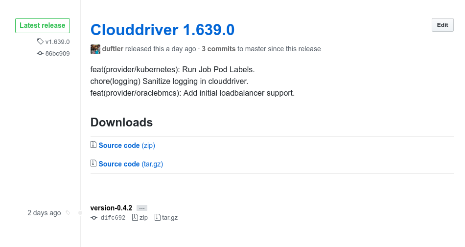



## What are the integrations available to Spinnaker?

### Cloud providers
* Amazon Web Services
* Google Cloud Platform
* Cloud Foundry
* Kubernetes
* Microsoft Azure
* Netflix Titus ( coming soon )

### CI platforms
* Jenkins
* Travis

### Source repositories
* GitHub
* BitBucket Server / Stash

### Messaging support
* Email
* Slack
* Twilio

### Docker Registries
 * Anything with support for the [v2 Docker Registry API](https://docs.docker.com/registry/spec/api/)

If you would like to add your own integration, we're happy to help you out in the slack channel.

## I have an existing pre-1.0 Spinnaker installation - how do I migrate to Halyard?

There is no one-size-fits-all migration strategy because of how varied 
Spinnaker installations & configurations can be. However, there are a few
things you can keep in mind:

1. As long as you use the same storage source (GCS/S3/AZS bucket) all of your existing
   pipelines & applications will be migrated.
2. If you create the same cloud provider accounts that you had in your old Spinnaker 
   installation, all of the same infrastructure will be available to you.

## Why don't the versions used in each subcomponent in the new top-level versioned Spinnaker match those in the github releases?

You'll notice that, for example today, the
[releases](https://github.com/spinnaker/clouddriver/releases) tab for
Clouddriver has version 1.639.0 listed as the most recent release, while Spinnaker
1.0.1 uses Clouddriver version 0.4.2. At first glance, it appears that
Clouddriver is way out of date. However, this is not true. There are now two
versioning schemes at play: one to stay compatible with Netflix's release
process, and a second one that follows [semantic
versioning](http://semver.org/). The top-level Spinnaker releases rely on the
latter.

If you're curious when a release `<version>` was cut for a particular component,
any tag that matches `v<version>` follows Netflix's releases, while any tag
that matches `version-<version>` follows semantic versioning. You can see an
example of this below:

   
## I want to build my own cloud provider, how do I start?

Adding a new cloud provider is not a simple task. You would want to extend the Clouddriver and Deck modules to support your new cloud provider. Look at the [Kubernetes commit stream](https://github.com/spinnaker/clouddriver/pulls?q=is%3Apr+author%3Alwander+is%3Aclosed) for an example.

## How do I store my Spinnaker application in version control?

There are two kinds of application metadata at play within Spinnaker.

1. Data unique to Spinnaker, e.g. pipelines and their execution state, active triggers, deployment strategies, etc... These data can be exported with [this script](https://github.com/spinnaker/spinnaker/blob/master/pylib/spinnaker/import_export.py). Currently, these are stored inside Cassandra and Redis, but we are actively adding support for S3 and GCS buckets, as well as Git backed data stores to make exporting, transferring and versioning this state simpler.
2. Data and relationships between different Spinnaker resources. These come entirely from data available from the underlying platform (AWS, GCP, etc...), and are derived from either
  a. Platform state, e.g. instance health, load balancer and server group relationships, etc... 
  b. Spinnaker's naming conventions. For example, if you create a server group with name `myapp-dev-v000`, Spinnaker picks up this name from the platform and derives that you have an application `myapp`, with a cluster named `myapp-dev`, which contains a single server group with version `v000`.

## Where can I find the Spinnaker API?

If you've installed Spinnaker, and the API server [Gate](https://github.com/spinnaker/gate) is running and accessible (usually at `localhost:8084`) navigate your browser to `<gate_endpoint>/swagger-ui.html` for the auto-generated API docs. By default this is [localhost:8084/swagger-ui.html](http://localhost:8084/swagger-ui.html).
