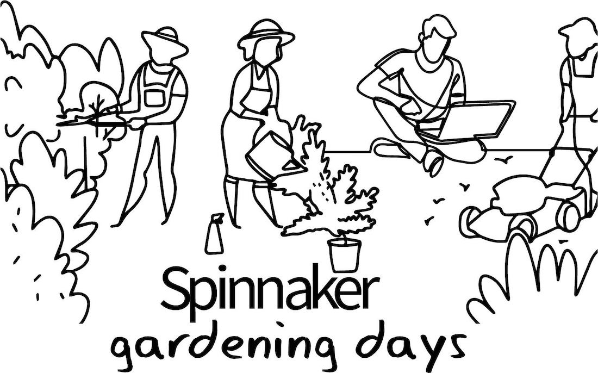

## Register
[Register for Spinnaker Gardening Days](https://go.armory.io/gardening) to join our hackathon and earn rewards for your Spinnaker contributions July 16-23.

## Jump In!
* Join [Spinnaker Slack](https://join.spinnaker.io) to chat in [event & team channels](slack-map.md). Visit __#gardening-general__, our main event channel to engage.
* Find out how weeklong Gardening Days 2.0 will work on the [Hackathon logistics](hack-logistics.md) page.
* The [What to hack](what-to-hack.md) page list all eligible contributions types.
* Check the [Master schedule](schedule.md) to see our more time-zone inclusive global schedule.
* The updated [Slack map](slack-map.md) has a shorter, sweeter list of Slack channels to engage in.
* Set up your [Development environment](dev-environment.md) using this guide.
* Dive into [Developing plugins](developing-plugins.md) with this training series.
* Gardening project repositories should live in the [Spinnaker-hackathon Github organization](https://github.com/spinnaker-hackathon).

To attend Spinnaker Gardening Days, you'll need Zoom. See Zoom's ["Joining a Meeting" documentation](https://support.zoom.us/hc/en-us/articles/201362193-Joining-a-Meeting) to learn how to join.

## Guidelines
1. No racist or other hate speech, put-downs, or sexual content allowed in hackathon meetings or channels. Keep it classy and remember, we all have the same intrinsic value.
2. Don't be afraid to share your thoughts, ask for help in __#gardening-ineedhelp__, or try something new. This is a safe space!
