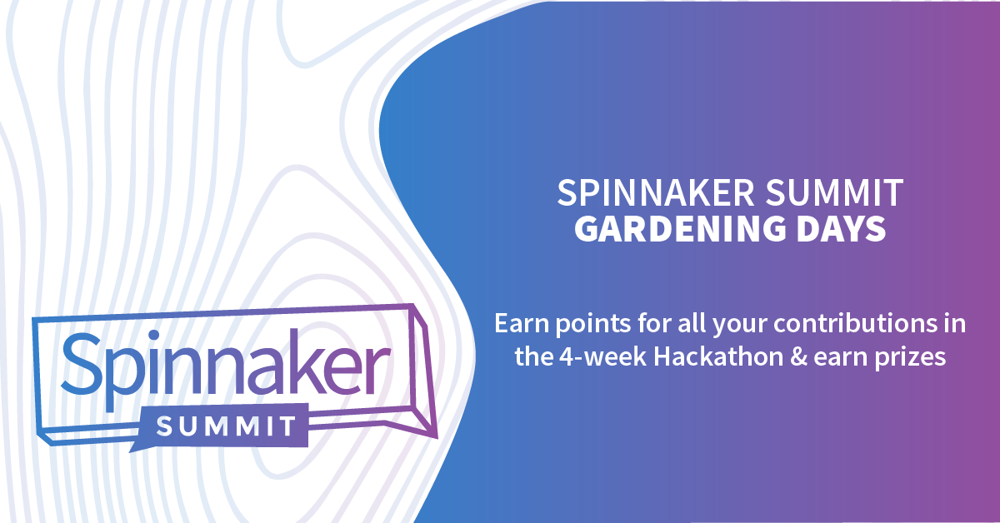

## Register
[Register for Summit Gardening Days](https://events.linuxfoundation.org/spinnaker-summit/register/), part of the 2020 Spinnaker Summit, to join our hackathon and earn rewards for your Spinnaker contributions October 19 - November 12.

## Jump In!
- [Spinnaker Slack](https://join.spinnaker.io): Join our Slack to participate. Have questions? Ask them in [__#gardening-general__](https://spinnakerteam.slack.com/archives/CV4A90DPF), our main event channel.
- [Spinnaker Summit schedule](https://events.linuxfoundation.org/spinnaker-summit/program/schedule/): View the global schedule for Spinnaker Summit and Summit Gardening in your time zone.
- [Getting started](https://github.com/spinnaker-hackathon/gardening/blob/master/getting-started.md): Find out how to get started with Gardening Days.
- [Gardening repository](https://github.com/spinnaker-hackathon/gardening): All things gardening live in this repo, including information about prizes, challenges, project ideas, and contribution eligibility and tracking.
- [Development environments](dev-environment.md): Set up your Spinnaker environment using this guide, and use free AWS compute if you like.
- [Developing plugins](developing-plugins.md): Learn more about developing Spinnaker plugins with this training series.

To attend Spinnaker Gardening Days, you'll need Zoom. See Zoom's ["Joining a Meeting" documentation](https://support.zoom.us/hc/en-us/articles/201362193-Joining-a-Meeting) to learn how to join.

## About
Gardening Days rewards contributors for building the Spinnaker ecosystem. All contributions attendees make in the week add up to points. This includes project and plugin code, documentation, content, videos, issues [and more](https://spinnaker.io/community/gardening/what-to-hack/). All registered contributors will receive [prizes](https://github.com/spinnaker-hackathon/gardening/blob/master/prizes.md) based on point totals, so contribute when you can. After you [sign up](https://events.linuxfoundation.org/spinnaker-summit/register/), you'll be matched with a team. Teams can choose a project to compete in [a challenge category](https://github.com/spinnaker-hackathon/gardening/blob/master/challenges.md) for a team prize package. Challenges include software delivery solutions and content focused on Spinnaker, GitHub Action, Sumo Logic, AWS, New Relic, and more.

Elevate your impact with free compute from AWS, a global-friendly schedule, and [Spinnaker Summit programming](https://events.linuxfoundation.org/spinnaker-summit/program/schedule/) all month long!

## Guidelines
1. No racist or other hate speech, put-downs, or sexual content allowed in hackathon meetings or channels. Keep it classy and remember that all participants have the same intrinsic value.
2. Don't be afraid to share your thoughts and ask for help in the [#gardening-general](https://spinnakerteam.slack.com/archives/CV4A90DPF) and [#gardening-ineedhelp](https://spinnakerteam.slack.com/archives/CURFZGL2E) channels, or to try something new. This is a safe space!
3. Use the points system to get rewarded for valuable (if small) contributions. Abuses haven't been a problem in past Gardening Days; if they do arise, abusers will be disqualified from individual prize eligibility.
