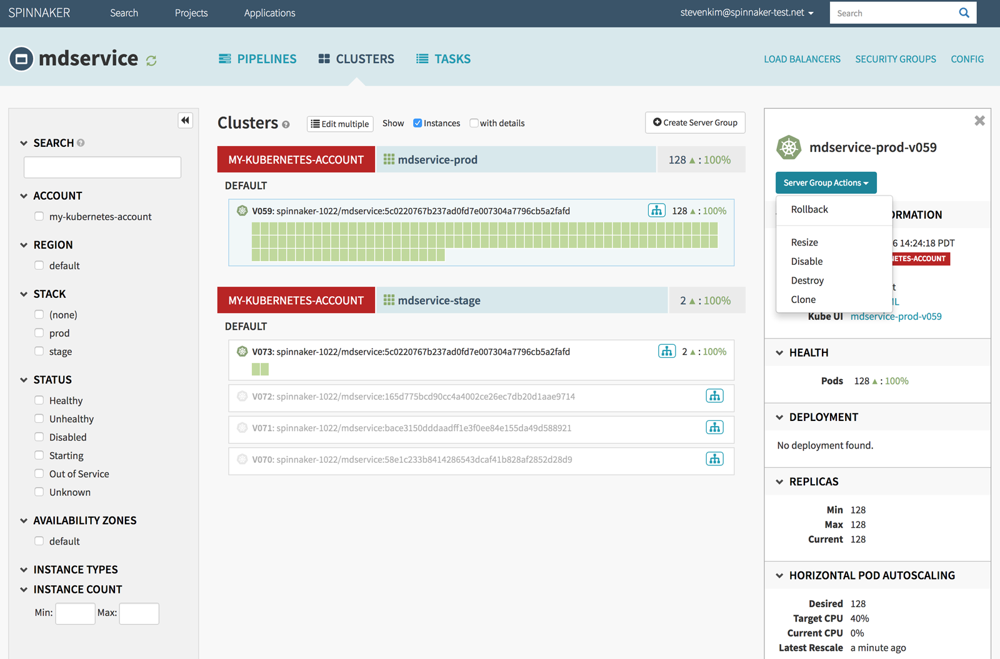



Spinnaker acts as a single pane of glass from which to manage your global deployments across multiple clouds. Here, we surface information related to health and status of running environments, and metadata around deployments and individual instances.

Also available are ad-hoc actions you can perform on the resources you see such as resize, clone, disable, and roll back. Together, the Clusters section acts as command and control base where we can increasingly layer on information relevant to deploying your applications.

<!-- TODO(stevenkim): better screenshot with multi-cloud, multi-region -->

* On the left are filters for viewing your deployed services. You can search by string match, or narrow by specific attributes of your services, such as cloud platform, region, or your designated environments and stacks.

* The main/center section lists the deployed services. Following the description in the [Concepts](/concepts/) page, you can see the grouping in action. Here, the green chiclets are individual instances (e.g. an EC2 VM instance, a Kubernetes Pod), grouped into Server Groups (a particular deployment), which are further grouped into Clusters.

* The right section provides details for the item currently selected in the center section. For each item, Spinnaker provides details related to both application-level concerns (Jenkins job details) as well as infrastructure-level concerns (machine type, auto-scaling policies).
