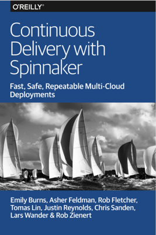

# Download Free
**[PDF](ContinuousDeliveryWithSpinnaker.pdf) | [Epub](ContinuousDeliveryWithSpinnaker.epub) | [Mobi](ContinuousDeliveryWithSpinnaker.mobi)**

# Ebook Description

Many companies are moving away from “big bang” software releases every six months or so to a continuous delivery (CD) model that enables IT to release updates frequently, even if that means several times a day. Using Netflix and its open source Spinnaker CD platform as examples, this practical ebook demonstrates how a new host of tools can help you deploy software changes to production quickly, safely, and automatically.

A team of experts from Netflix and Google show you how to automate deployments with Spinnaker across multiple cloud accounts, regions, and even across multiple cloud platforms into continuous deployment pipelines. You’ll learn how Spinnaker enables your company to design and automate a delivery process that not only fits your release cadence, but also the business criticality of your application.

* Learn about the organizational and technical practices that enable continuous delivery
* Understand the fundamental considerations you need to solve before successfully deploying software to the cloud
* Manage cloud resources for consistency across accounts, regions, and cloud providers
* Use Spinnaker’s pipelines to structure deployments from customizable pieces
* Understand how CD pipelines to Kubernetes differ from pipelines to VM-based clouds
* Examine how Spinnaker ensures safety across cluster deployments and pipeline executions
* Learn how to integrate automated testing techniques such as chaos engineering or automated canary analysis into the delivery process
