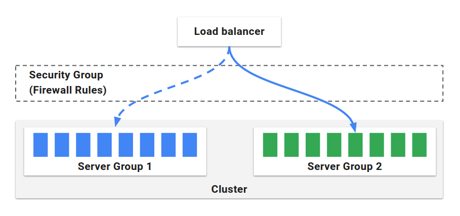
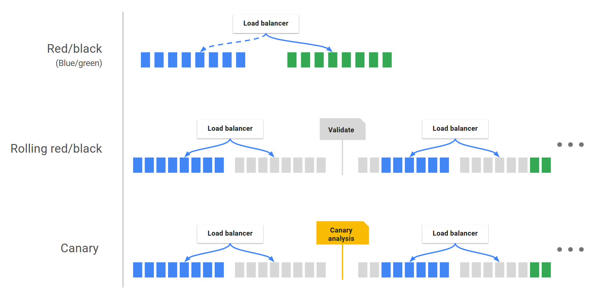



Spinnaker is an open-source, multi-cloud continuous delivery platform that helps
you release software changes with high velocity and confidence.

Spinnaker provides two core sets of features:

* [application management](#application-management)

* [application deployment](#application-deployment)

This article is an overview of these features:

## Application management

You use Spinnaker's application management features to view and manage your
cloud resources.

Modern tech organizations operate collections of services&mdash;sometimes
referred to as "applications" or "microservices." A Spinnaker application models
this concept.

[Applications](#application), [clusters](#cluster), and [server
groups](#server-group) are the key concepts Spinnaker uses to describe your
services. Load balancers and firewalls describe how your services are exposed to
users.

### Application

An application in Spinnaker is a collection of clusters, which in turn are
collections of server groups. The application also includes firewalls and load
balancers.

An application *represents* the service which you are going to deploy using
Spinnaker, all configuration for that service, and all the infrastructure on
which it will run.

You will typically create a different application for each service, though
Spinnaker does not enforce that.

Read more about applications, and how to create and configure them,
[here](/guides/user/applications/).

### Cluster

You can define *Clusters*, which are logical groupings of Server Groups in
Spinnaker.

> **Note:** cluster, here, does not map to a Kubernetes cluster. It's merely a
> collection of Server Groups, irrespective of any Kubernetes clusters that might
> be included in your underlying architecture.

### Server Group

The base resource, the *Server Group*, identifies the deployable artifact (VM image, Docker image, source location) and basic configuration settings such as number of instances, autoscaling policies, metadata, etc.
This resource is optionally associated with a Load Balancer and a Firewall.
When deployed, a Server Group is a collection of instances of the running
software (VM instances, Kubernetes pods).

### Load Balancer

A *Load Balancer* is associated with an ingress protocol and port range. It balances traffic among instances in its Server Groups. Optionally, you can enable health checks for a load balancer, with flexibility to define health criteria and specify the health check endpoint.

### Firewall

A *Firewall* defines network traffic access. It is effectively a set of firewall rules defined by an IP range (CIDR) along with a communication protocol (e.g., TCP) and port range.

> Learn more about cluster management on the [Clusters](/concepts/clusters/) page.

## Application deployment

You use Spinnaker's application deployment features to construct and manage continuous delivery workflows.

### Pipeline

The *pipeline* is the key deployment management construct in Spinnaker.
It consists of a sequence of actions, known as stages. You can pass parameters
from stage to stage along the pipeline.

You can start a pipeline manually, or you can configure it to be automatically
triggered by an event, such as a Jenkins job completing, a new Docker image appearing in your registry, a CRON schedule, or a stage in another pipeline.

You can configure the pipeline to emit notifications, by email, Slack, or SMS,
to interested parties at various points during pipeline execution (such as on
pipeline start/complete/fail).

### Stage

A *Stage* in Spinnaker is an atomic building block for a pipeline, describing an
action that the pipeline will perform. You can sequence
[stages](/reference/pipeline/stages/) in a Pipeline in any order, though some
stage sequences may be more common than others. Spinnaker provides a number of
stages such as Deploy, Resize, Disable, Manual Judgment, and many more. You can
see the full list of stages and read about implementation details for each
provider in the [Reference](/reference/providers) section.

### Deployment strategies

Spinnaker treats cloud-native deployment strategies as first class constructs, handling the underlying orchestration such as verifying health checks, disabling old server groups and enabling new server groups. Spinnaker supports the red/black (a.k.a. blue/green) strategy, with rolling red/black and canary strategies in active development.

> Learn more about deployment management on the [Pipelines](/concepts/pipelines/) page.
