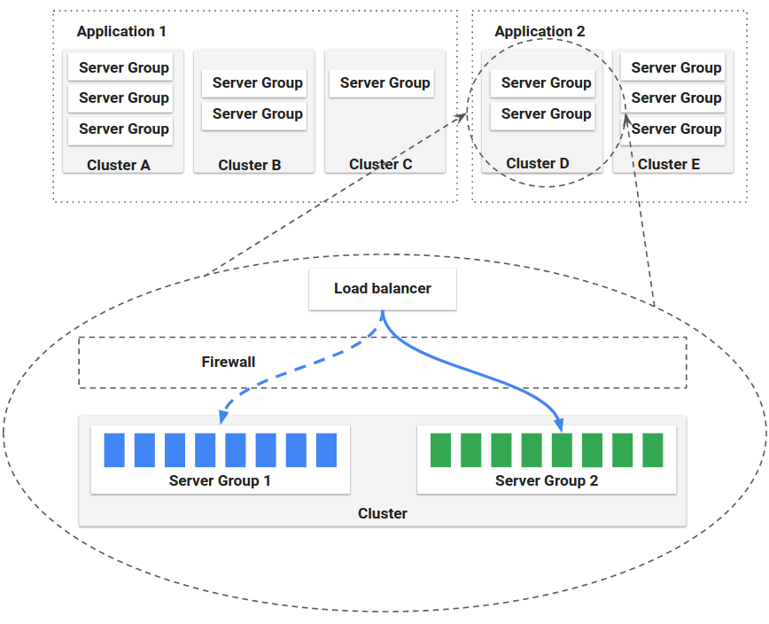



Spinnaker is an open-source, multi-cloud continuous delivery platform that helps
you release software changes with high velocity and confidence.

Spinnaker provides two core sets of features:

* [Application management](#application-management-aka-infrastructure-management)

* [Application deployment](#application-deployment)

In addition, Spinnaker provides a higher-level experience that builds on top of the above features via [Managed delivery](#managed-delivery).

This article provides an overview of these topics.

## Application management (a.k.a. infrastructure management)

You use Spinnaker's application management features to view and manage your
cloud resources.

Modern tech organizations operate collections of services&mdash;sometimes
referred to as "applications" or "microservices." A Spinnaker application models
this concept.

[Applications](#application), [clusters](#cluster), and [server
groups](#server-group) are the key concepts Spinnaker uses to describe your
services. Load balancers and firewalls describe how your services are exposed to
users.

### Application

An application in Spinnaker is a collection of clusters, which in turn are
collections of server groups. The application also includes firewalls and load
balancers.

An application *represents* the service which you are going to deploy using
Spinnaker, all configuration for that service, and all the infrastructure on
which it will run.

You will typically create a different application for each service, though
Spinnaker does not enforce that.

Read more about applications, and how to create and configure them,
[here](/guides/user/applications/).

### Cluster

You can define *Clusters*, which are logical groupings of Server Groups in
Spinnaker.

> **Note:** cluster, here, does not map to a Kubernetes cluster. It's merely a
> collection of Server Groups, irrespective of any Kubernetes clusters that might
> be included in your underlying architecture.

### Server Group

The base resource, the *Server Group*, identifies the deployable artifact (VM image, Docker image, source location) and basic configuration settings such as number of instances, autoscaling policies, metadata, etc.
This resource is optionally associated with a Load Balancer and a Firewall.
When deployed, a Server Group is a collection of instances of the running
software (VM instances, Kubernetes pods).

### Load Balancer

A *Load Balancer* is associated with an ingress protocol and port range. It balances traffic among instances in its Server Groups. Optionally, you can enable health checks for a load balancer, with flexibility to define health criteria and specify the health check endpoint.

### Firewall

A *Firewall* defines network traffic access. It is effectively a set of firewall rules defined by an IP range (CIDR) along with a communication protocol (e.g., TCP) and port range.

> Learn more about cluster management on the [Clusters](/concepts/clusters/) page.

## Application deployment

You use Spinnaker's application deployment features to construct and manage continuous delivery workflows.

### Pipeline

The *pipeline* is the key deployment management construct in Spinnaker.
It consists of a sequence of actions, known as stages. You can pass parameters
from stage to stage along the pipeline.

You can start a pipeline manually, or you can configure it to be automatically
triggered by an event, such as a Jenkins job completing, a new Docker image appearing in your registry, a CRON schedule, or a stage in another pipeline.

You can configure the pipeline to emit notifications, by email, Slack, or SMS,
to interested parties at various points during pipeline execution (such as on
pipeline start/complete/fail).

### Stage

A *Stage* in Spinnaker is a collection of sequential Tasks and composed Stages that
describe a higher-level action the Pipeline will perform either linearly or in parallel.
You can sequence [stages](/reference/pipeline/stages/) in a Pipeline in any order, though some
stage sequences may be more common than others. Spinnaker provides a number of
stages such as Deploy, Resize, Disable, Manual Judgment, and many more. You can
see the full list of stages and read about implementation details for each
provider in the [Reference](/reference/providers) section.

### Task

A *Task* in Spinnaker is an automatic function to perform.

### Deployment strategies

Spinnaker treats cloud-native deployment strategies as first class constructs, handling the underlying orchestration such as verifying health checks, disabling old server groups and enabling new server groups. Spinnaker supports the red/black (a.k.a. blue/green) strategy, with rolling red/black and canary strategies in active development.

> Learn more about deployment management on the [Pipelines](/concepts/pipelines/) page.

## Managed delivery
Managed Delivery takes Spinnaker's infrastructure management and deployment capabilities
to a new level by abstracting away many of the low-level details of configuring infrastructure
and delivery workflows, and focusing on your application _requirements_, specified in a declarative
format.
 
It allows you to declare the _desired state_ of your application in terms of logical _environments_
(think `test` and `prod`) where your cloud infrastructure resources exist (e.g. compute clusters),
and where your _software artifacts_ (think Debian package or Docker image) are deployed. 
Spinnaker automatically detects when a new version of your code is available for deployment and
satisfies any deployment constraints you may have configured, or when your infrastructure resources
diverge from the desired state, and acts upon that information to reconcile the current with the 
desired state. 

For more details on the inspiration and guiding principles behind
Managed Delivery, check out [our blog](https://blog.spinnaker.io/managed-delivery-evolving-continuous-delivery-at-netflix-eb74877fb33c),
or the talk below from Spinnaker Summit 2019.

<iframe src="https://www.youtube.com/embed/mEgvOfmLnlY" frameborder="0" allow="accelerometer; autoplay; clipboard-write; encrypted-media; gyroscope; picture-in-picture" allowfullscreen></iframe>

> :bulb: _To get started with Managed Delivery, head on over to the [user guide](/guides/user/managed-delivery/)._
