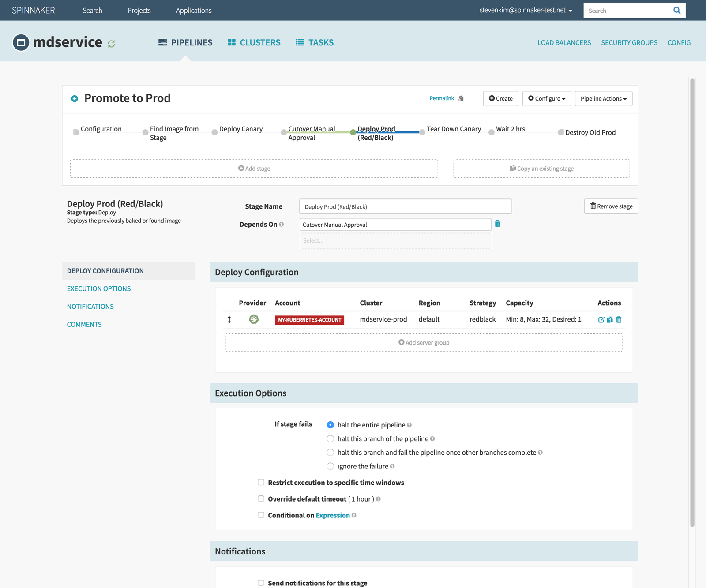
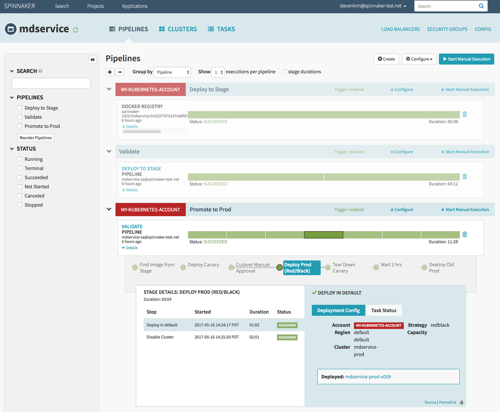
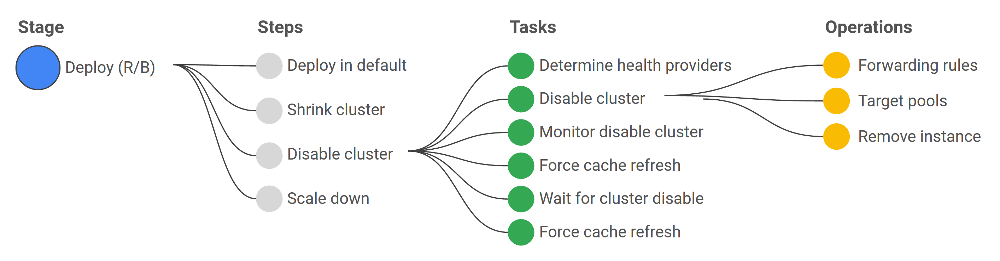



## About pipelines

Pipelines are your way of managing deployments in a consistent, repeatable and safe way. A pipeline is a sequence of stages provided by Spinnaker, ranging from functions that manipulate infrastructure (deploy, resize, disable) as well as utility scaffolding functions (manual judgment, wait, run Jenkins job) that together precisely define your runbook for managing your deployments.

* Define your sequence of stages at the top. Spinnaker supports parallel paths of stages, as well as the ability to specify whether multiple instances of a pipeline can be run at once.

* Specify details for a given stage in the sections below.

You can view pipeline execution history, which serves as a means to introspect details of each deployment operation, as well as an effective audit log of enforced processes/policies on how you make changes to your deployed applications landscape.

Automation does not end with orchestrating only the high-level steps of your release process. Each of these operational steps often corresponds to a sequence of calls to the cloud platform, each of which needs to be remediated in failure scenarios. The red/black Deploy stage is an example of how Spinnaker fully supports this notion:

* The Red/Black Deploy stage in Spinnaker actually entails a sequence of steps

* Each given step is actually a set of tasks that need polling, remediation to ensure requisite state is reached prior to proceeding

* A given task often entails multiple API calls to the specific cloud platform, cognizant of expected response codes and remediating actions in failure

## Pipeline templates

Managed pipeline templates are a way to scalably manage pipelines across different teams. 

Pipeline templates have two main components:

* Template

  A pipeline template defines a parameterized pipeline, with the set of
  variables for which your users will provide values.

* Configuration

  A concrete implementation of a template. Configurations can inject new stages
  into the final pipeline graph and inherit or override, or both, triggers,
  notifications, and parameters.

### Terminology

#### Pipeline template

A parameterized pipeline, minus the pipeline configuration found on a pipeline
instance. This template helps developers create pipelines that follow a pattern
that you establish.

#### Pipeline configuration

The same as the [configuration for a pipeline not created from a
template](/guides/user/pipeline/managing-pipelines/#create-a-pipeline), plus
variable bindings and a reference to the template.

#### Pipeline

Whether it's created from a template or not, an executable pipeline that can
be visualized in the Deck UI, and can be run by [Orca](/reference/architecture/).

### Pipeline template variable

A variable defined in a pipeline template, whose value is deteremined when a
pipeline is instantiated based on the template. Contrast with pipeline
variables, which vary per execution of the pipeline.