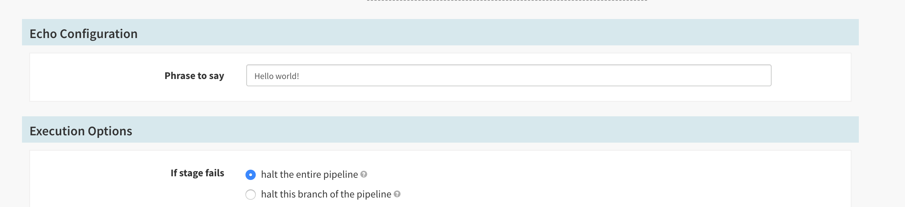

For users of Kubernetes or Titus, Custom Job Stages offer a native solution for enhancing Spinnaker's functionality with the power of containers. Custom Job Stages enable operators to extend Spinnaker without having to maintain a custom build of Orca.

*Note: Custom Job stages are only supported for the Kubernetes and Titus providers.*

## How it works

At its core, Custom Job Stages use the [Run Job stage](/reference/pipeline/stages/#run-job) to start a Task (Titus) or Job (Kubernetes) to perform some type of work. These jobs are defined as configuration for Orca and registered when the application starts. When used in a pipeline, Orca takes this configuration, generates a Run Job stage and then executes it. To support a more native experience, we provide configuration options for things like stage name, description and parameters so that this stage feels less like a Run Job stage and more like an out of the box stage. 

### When should I use Custom Job Stages?

Custom Job Stages are perfect for when you need to encapsulate a common task so that all users of Spinnaker can benefit and standardize. For example, if you see a large number of users running database migrations in the same way, but manually defining jobs (via Run Job), simply define a Custom Job Stage which captures all the complexity of the job and exposes a subset of customization options.

Some example use cases for Custom Job Stages include:
* Building Docker images with Kaniko
* Running integration tests
* Interacting with external systems
* Performing database migrations


## Creating a Custom Job Stage

Custom Job stages are configured as part of Orca's configuration. To enable them, simply add configurations via the `job.preconfigured.{cloudProvider}` block in `orca-local.yml` where `cloudProvider` is the name of the cloud provider which will be used to run the job. For example, if you are using Kubernetes, the value will be `kubernetes`. The following properties are supported for all providers.

* `enabled` - Determines if stage will be available in the UI.
* `label` - Human readable stage name.
* `description` - Human readable description of what the stage does.
* `type` - _Unique_ key used to determine stage type.
* `cloudProvider` - Cloud provider to use for this stage. Valid values are `titus` or `kubernetes`.
* `credentials` - Account name used when executing the job. Must be valid account for `cloudProvider`.
* `waitForCompletion` - If `true`, the stage will not be marked complete until the job completes.
* `parameters` - List of parameters presented to the end user.

### Custom Job Stages - Kubernetes

The following properties are supported for the `kubernetes` cloud provider.

* `account` - Account name used when executing the job. Must be valid account for `cloudProvider`.
* `application` - Name of the application to associate the job with.
* `manifest` - YAML definition for the [Kubernetes Job](https://kubernetes.io/docs/concepts/workloads/controllers/jobs-run-to-completion/) that will be run when the stage is executed.

_Note: If you're using the slash (`/`) character in any manifest annotations, you'll need to use this [special syntax](https://github.com/spring-projects/spring-boot/issues/13404#issuecomment-395307439) to prevent the slash from being dropped when the application reads its configuration. For example, if your annotation key is `iam.amazonaws.com/role` you'll need to define it like so: `[iam.amazonaws.com/role]`._

### Custom Job Stages - Titus

* `cluster` - Definition of the cluster to be created when the stage is executed.
* `region` - Region in which to run the underlying job.
* `propertyFile` - File to download once the job completes.

## Custom Job Stage parameters

Using parameters with the Custom Job Stage enables your users to customize specific fields of the job configuration at runtime. Before the stage is started, user supplied values will replace the values in the stage's configuration. Parameters support the following properties

* `name` - Name of parameter.
* `label` - Human readable parameter name (shown in the UI).
* `defaultValue` - default value, if not overridden by user.
* `description` - Description of what parameter is used for.
* `order` - Display order of the parameter in the UI.


## Example Custom Job Stage

```
job:
  preconfigured:
    kubernetes:
      - label: Echo
        type: echoPhrase
        description: Echo a configured phrase
        cloudProvider: kubernetes
        account: kubernetes
        credentials: kubernetes
        waitForCompletion: true
        application: k8s2
        parameters:
          - name: PHRASE
            label: Phrase to say
            description: Phrase to be echoed.
            mapping: manifest.spec.template.spec.containers[0].env[0].value
            defaultValue: "Hello world!"
        manifest:
          apiVersion: batch/v1
          kind: Job
          metadata:
            name: say-hello
            namespace: spinnaker
          spec:
            backoffLimit: 0
            template:
              spec:
                restartPolicy: Never
                containers: 
                  - name: hello
                    image: alpine:latest
                    env:
                      - name: PHRASE
                        value: placeholder
                    command: ["echo", $(PHRASE)]
```

## Using a Custom Job Stage

Custom Job Stages will appear as native stages within the Spinnaker UI. Users can add these stages to their pipelines as they would any other stage. 


If the stage defines any variables they will be rendered and presented to the user. At this point, the user is free to override the values as they need.




Custom Job stages also take on a native look and feel while executing. The below screen shots show an example of the Echo stage running. You'll notice that logs are presented to the user for ease of debugging.


