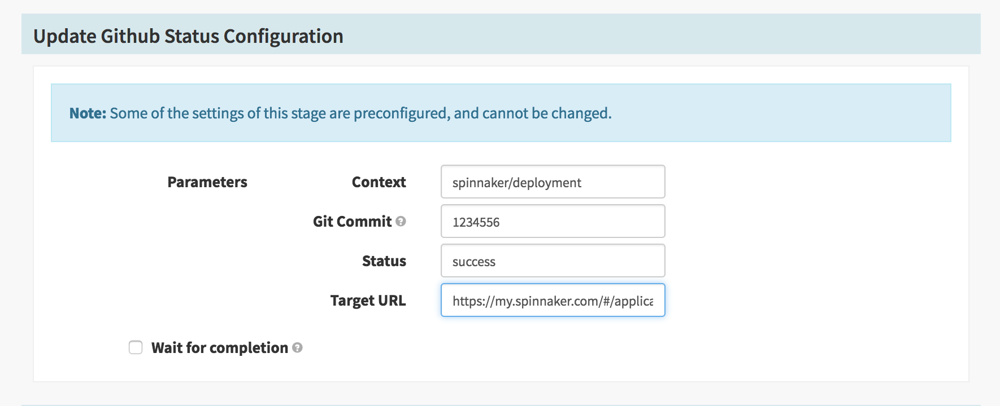

Custom webhook stages provide a simple, yet powerful, way of adding custom stages to Spinnaker. These stages are typically used to make quick API calls to an external system as part of a pipeline. Instead of extending the various components through code, users can simply add configuration to Orca for these stages. They appear in the UI as if they were a native stage.


## Creating a custom webhook stage

To create a custom webhook stage, you'll need to add configuration for the stage in `orca-local.yml`. The `webhook.preconfigured` property supports configuring multiple webhook stages.

```yaml
webhook:
  preconfigured:
  - label: Github - Github Commit Status
    type: githubStatus
    enabled: true
    description: Update a Github Commit Status
    method: GET
    url: https://api.example.com
```

Custom webhook stages support a variety of options, most of which are available via the UI when using the vanilla Webhook stage. Once a property is set within a custom webhook stage, users will not be allowed to override that settings via the UI. The following basic properties can be set within your configuration. More advanced properties will be covered in other sections.

* `enabled` - whether the stage will appear in the UI
* `label` - the human readable name of the stage
* `description` - a human readable description of what the stage is used for
* `type` - a _unique_ key used to identifty the stage type within a pipeline
* `url` - the url for the webhook
* `customHeaders` - any headers needed for your webhook's http request. ex. API tokens.
* `method` - HTTP method used for the webhook.
* `payload` - the JSON payload 

## Configuring parameters for custom webhook stages

Custom webhook parameters allow for variables to be used within your stages. These parameters are rendered in the UI and let users of your stage set them as necessary. When the stage executes, the values of these parameters are evaluated using SpEL which means that they can be dynamic in nature. To configure webhook parameters, you can use the following configuration within your webhook stage:

```yaml
parameters:
- label: Git Commit
  name: gitCommit
  description: The Git commit of your application
  defaultValue: ''
  type: string
```

Currently, the only supported `type` is `string`, however, we imagine more advanced types will be supported in the future.

The value of these properties can be accessed via SpEL within various attributes of the webhook configuration. For example, if we built a stage for updating Github statuses of a commit, we could use the above property and reference it's value by using SPeL within our webhook URL.

```yaml
url: https://api.github.com/repos/spinnaker/my-repo/statuses/${parameterValues['gitCommit']}
```

Webhook properties are rendered in the UI as input fields.


## Using a custom webhook stage

Custom webhook stages will be added to the list of stages within the Pipeline editor. You can add these stages as you would any other stage.


If you've specified any `parameters`, they will be rendered and editable as part of the stage configuration. You can also use SPEL as a way of setting these values dynamically during pipeline execution.



## Useful custom webhook stages

### Update Github commit status
```yaml
label: Github - Github Commit Status
type: githubStatus
enabled: true
description: Update a Github Commit Status
method: POST
customHeaders:
  Authorization:
    - token MY_API_TOKEN
url: https://api.github.com/repos/ethanfrogers/spinnaker/statuses/${parameterValues['gitCommit']}
payload: |-
  {
    "state": "${parameterValues['state']}",
    "target_url": "${parameterValues['targetUrl']}",
    "context": "${parameterValues['context']}"
  }
parameters:
  - label: Git Commit
    name: gitCommit
    description: The Git Commit to create a status for
    type: string
  - label: Status
    name: status
    type: string
  - label: Target URL
    name: targetUrl
    type: string
  - label: Context
    name: context
    type: string
```

### Create New Relic Deployment
```yaml
label: New Relic - Create Deployment
type: newRelicDeplpyment
enabled: true
description: Create a Deployment in New Relic
method: POST
customHeaders:
  X-Api-Key:
    - my-api-key
  Content-Type:
    - application/json
url: https://api.newrelic.com/v2/applications/${parameterValues['appId']}/deployments.json
payload: |-
  {
    "deployment": {
      "revision": "${parameterValues['revision']}",
      "user": "${parameterValues['user']}",
      "description": "${parameterValues['description']}"  
    }
  }
parameters:
  - label: Application ID
    name: appId
    description: New Relic Application ID
    type: string
  - label: Revision
    name: revision
    type: string
  - label: User
    name: user
    type: string
  - label: Description
    name: description
    type: string
```