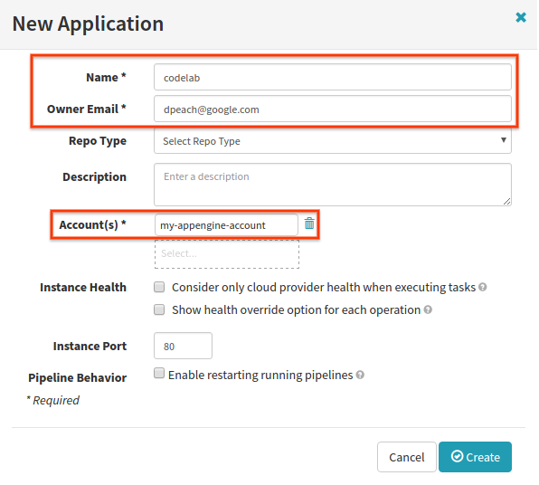
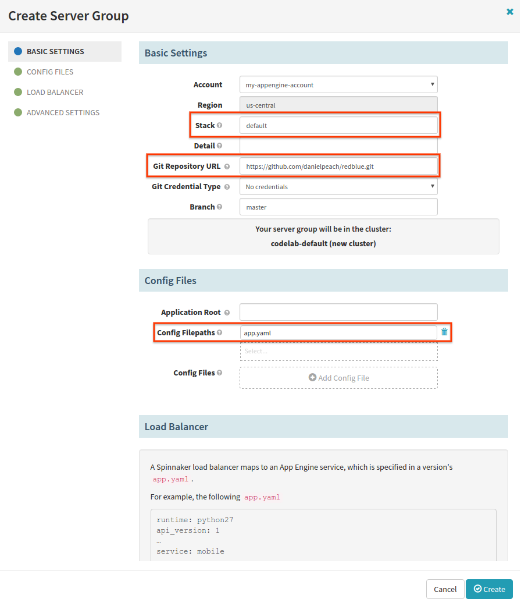
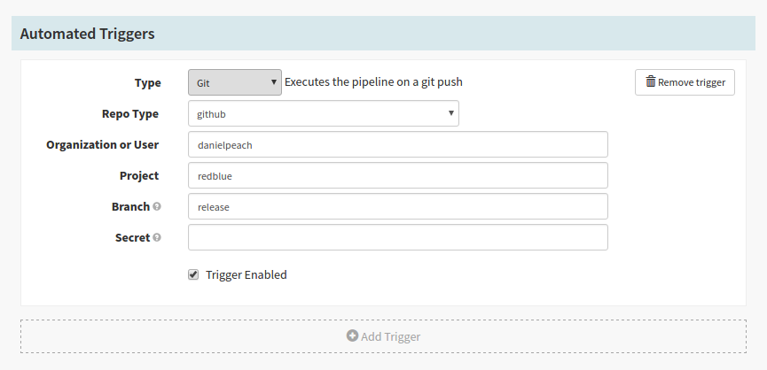
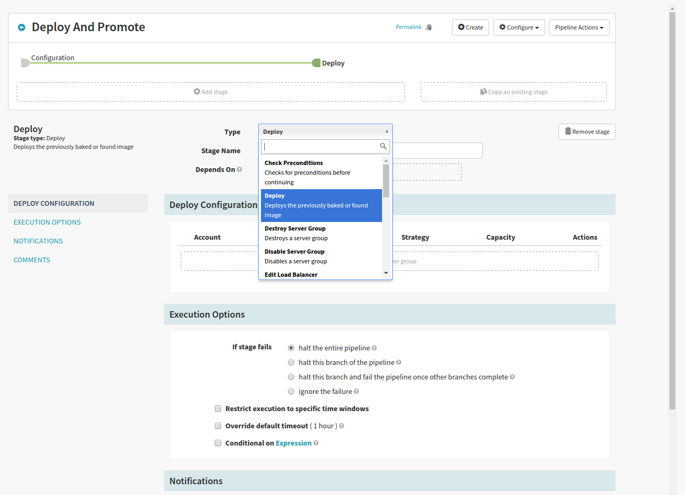
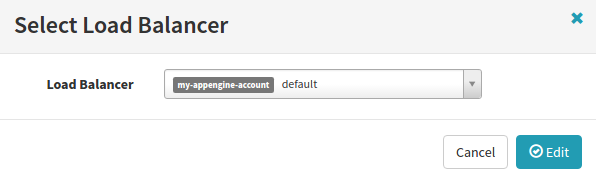
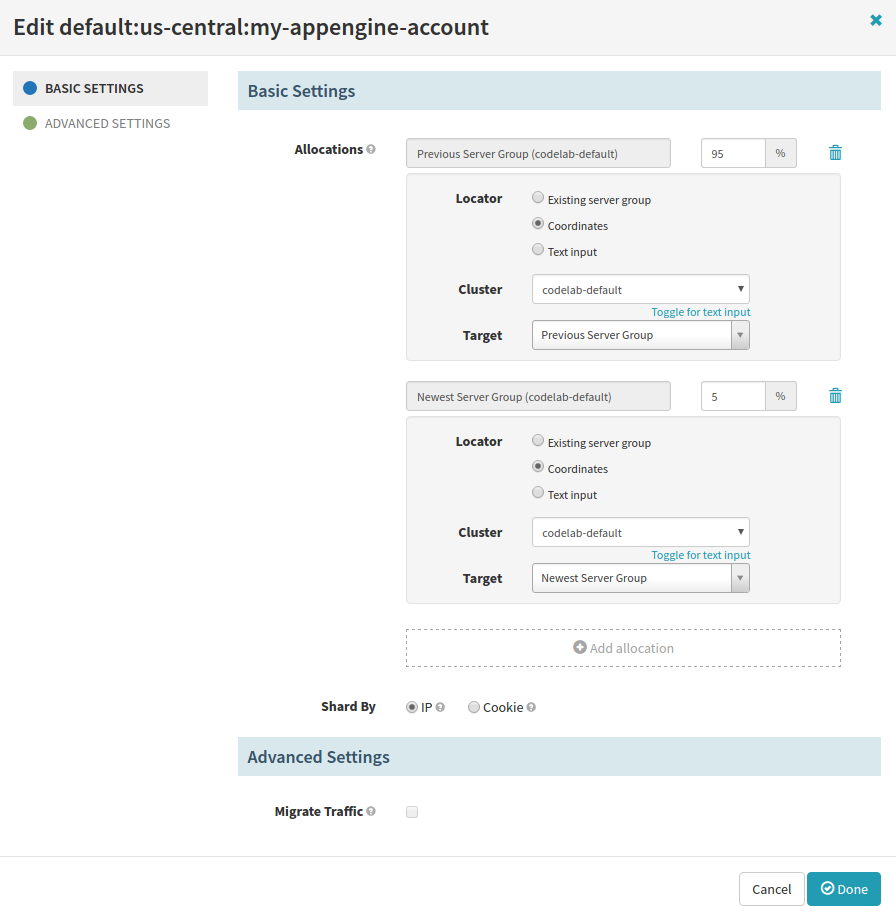
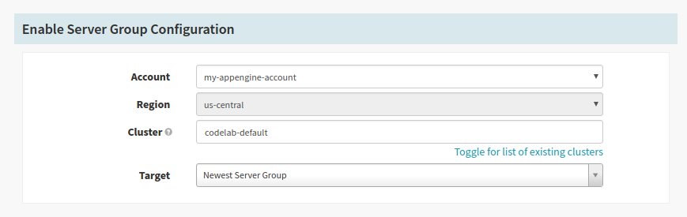
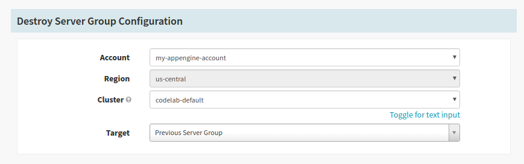
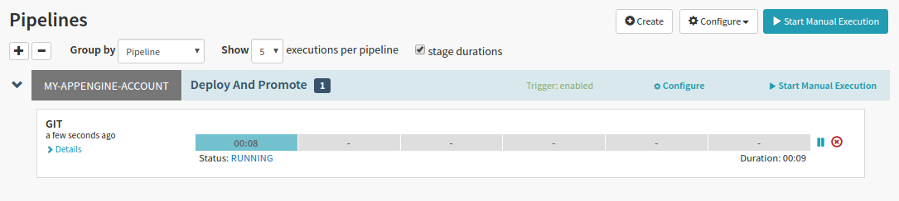
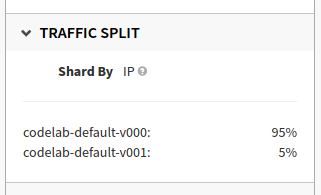



This codelab provides an overview of Spinnaker's integration with App Engine.
You'll build and run a simple App Engine deployment pipeline with the following steps:


# Prerequisites
- Be sure you have your Google Cloud Platform project's ID. This value will be referenced as `GCP-PROJECT-ID` below.
- Be sure you have `gcloud` installed, and that it is authenticated with your GCP project. In most cases, this should only require running `gcloud auth login <your@email.com>`
and following the instructions in the prompt. If you don't have `gcloud` installed locally, you can always run `gcloud` from inside Cloud Shell, which you can open from your GCP console.
- Be sure you have the App Engine Admin and Compute Engine APIs enabled for your GCP project: 

```bash
gcloud service-management enable appengine.googleapis.com
gcloud service-management enable compute-component.googleapis.com
```

- If this is your first time deploying to App Engine in your project, execute the following command to create an App Engine application. You cannot change the region, so choose wisely:
`gcloud app create --region <e.g., us-central>`.

# Configuration & Installation
Create a new firewall rule for your GCP project. We're going to trigger our Spinnaker pipelines using Github webhooks. 
The Spinnaker service that receives these webhooks listens on port 8089, and 
[GitHub webhooks](https://help.github.com/articles/github-s-ip-addresses/#service-hook-ip-addresses) are sent from IPs in the CIDR range given below.

```
gcloud compute firewall-rules create allow-github-webhook \
    --allow="tcp:8089" \ 
    --source-ranges="192.30.252.0/22" \
    --target-tags="allow-github-webhook"
```

Provision a new virtual machine. We'll install Spinnaker on this machine:

```
gcloud compute instances create $USER-spinnaker \
    --scopes https://www.googleapis.com/auth/cloud-platform \
    --machine-type="n1-highmem-4" \
    --image-family="ubuntu-1404-lts" \
    --image-project="ubuntu-os-cloud" \
    --zone="us-central1-f" \
    --tags="allow-github-webhook"
```

Next, run the following command to SSH into the machine we’ve just provisioned. We’ll also pass flags to forward ports 9000 and 8084 - Spinnaker’s UI and API servers listen on these ports.

```
gcloud compute ssh $USER-spinnaker --ssh-flag="-L 9000:localhost:9000" --ssh-flag="-L 8084:localhost:8084"
```

Download and install Halyard on this machine. Halyard is a tool for configuring, installing, and updating Spinnaker.

```
curl -O https://raw.githubusercontent.com/spinnaker/halyard/master/install/stable/InstallHalyard.sh

sudo bash InstallHalyard.sh
```

Once you’ve installed Halyard, run the following commands to configure Spinnaker for deploying to App Engine:

```
hal config version edit --version 0.3.0

hal config provider appengine enable

hal config provider appengine account add my-appengine-account --project $GCP-PROJECT-ID

hal config storage gcs edit --project $GCP-PROJECT-ID

hal config storage edit --type gcs
```

Run `sudo hal deploy apply` to install and run Spinnaker.


The installation process will take several minutes. While you’re waiting for Spinnaker to start, you can configure your Github webhook:
 - Determine your Spinnaker instance’s external IP: <br>
   ```gcloud compute instances describe $USER-spinnaker | grep natIP```
 - Fork this repository, which contains a sample App Engine application: [https://github.com/danielpeach/redblue](https://github.com/danielpeach/redblue).
 - Inside your fork, click "Settings", then "Webhooks", then "Add Webhook".
 - Under "Payload URL", enter `http://{externalIP}:8089/webhooks/git/github`.
 - Under "Content Type", select `application/json`.

At this point, Spinnaker should be up and running. Point your browser at [localhost:9000](http://localhost:9000) to view Spinnaker’s UI.

# Deploy to App Engine

First, we’ll create a Spinnaker application.
 - In the top-right corner of the UI, click "Actions", then `Create Application`.
 - Under "Name", enter `codelab`.
 - Under "Owner Email", enter your email address.
 - Under "Account(s)", select `my-appengine-account`. This is the account we configured with Halyard - 
   it is associated with a set of credentials that allows Spinnaker to deploy to App Engine within your project.
   You can configure Spinnaker with multiple accounts to deploy to multiple GCP projects.
 - Click "Create".

 

 - Once your application has been created, you’ll be taken to the "Clusters" tab.
   Click "Create Server Group". A Spinnaker server group is an App Engine Version. 
   When creating server groups, Spinnaker applies its own naming conventions: all Versions created from the application "codelab" will be prefixed with "codelab-" 
 - Under "Stack", enter `default`. Omit "Detail". In a Spinnaker application, a Cluster is a logical grouping of server groups with the same Stack and Detail.
   It can be helpful to use the name of an App Engine Service as the value for Stack - in our case, our Version will be deployed to the Service named "default".
 - Under "Git Repository URL", enter `https://github.com/{YourGitHubUsername}/redblue.git`; i.e., the URL to the repository you forked earlier.
 - Under "Branch", enter `master`.
 - Under "Config Filepaths", enter `app.yaml`.
 - Click "Create".



Your server group will take a moment to deploy. Once it appears in the UI, click on the section labeled "V000". 
You should see a panel open on the right with details about the server group. 
To view the app you just deployed, click one of the links under "DNS". 
It should be a "Hello World" page with a bright red background.

Click on the tab labeled "Load Balancers". You will see a panel labeled "default". This is your default App Engine Service.
If you deploy Versions to different App Engine Services, those Services will also appear under this tab.

# Deployment Pipeline


Next, we’ll build a deployment pipeline. It will include the following stages:

- Trigger on a GitHub webhook - this will be triggered by a push to the forked repository.
- Deploy - we’ll deploy the updated app to App Engine.
- Edit Load Balancer - we’ll split traffic between our two server groups. 
- Manual Judgment - we’ll verify that we’re ready to move all traffic to the new server group.
  This stage could be a stand-in for integration tests or canary analysis.
- Enable - we’ll send 100% of traffic to the new server group.
- Wait - we’ll wait for two minutes to be sure everything is OK before destroying the old server group.
  In a real deployment pipeline, it’s likely that this wait time would be longer - perhaps an hour or more.
- Destroy - we’ll destroy the old server group.

## Pipeline creation

- Click on the "Pipelines" tab adjacent to the "Clusters" and "Tasks" tabs.
- Click "New".
- Under "Pipeline Name", enter `Deploy And Promote`.
- Click "Create".

## Webhook Trigger

Under "Automated Triggers":
- Under "Type", select `Git`.
- Under "Repo Type", select `github`.
- Under "Organization or User", enter your GitHub username.
- Under "Project", enter `redblue`.
- Under "Branch", enter `release`.



## Deploy Stage

- Click "Add Stage". 
- Under "Type", select `Deploy`.



- Click "Add server group".
- Under "Stack", enter `default`.
- Under "Git Repository URL", enter `https://github.com/{YourGithubUsername}/redblue.git`; i.e., the URL to the repository you forked earlier.
- Under "Branch", enter `release`.
- When configuring your Git webhook trigger, you can specify a regex - 
  the pipeline will only be triggered if the commit to the repository occurs on a branch matching the regex. 
  We can dynamically deploy to App Engine from the branch matching the regex by clicking "Resolve via trigger" in this dialog.
- Under "Config Filepaths", enter `app.yaml`.
- Click "Add".

## Edit Load Balancer Stage

- Click "Add Stage", then under "Type", select `Edit Load Balancer`.
- Under "Stage Name", enter `Split Traffic 5%/95%`.
- Click "Add Load Balancer". In the dialog that pops up, select `default` - this is your App Engine default Service.



This next part is tricky. We’ll specify how much traffic each server group will receive. 
We could specify their exact names - e.g., `codelab-default-v000` and `codelab-default-v001` - but we want to run 
this pipeline over and over again as we make changes to our app. We will need to resolve the names of the server groups dynamically. 

These steps allow us to allocate traffic to the newest server group in the Cluster `codelab-default` - 
this will always be the server group we deploy in our "Deploy" stage:

- Next to the percent symbol, enter `5`. This is the percentage of traffic that this server group will receive.
- Under "Locator", select `Coordinates`. 
- Under "Cluster", click "Toggle for list of existing clusters", then select `codelab-default`.
- Under "Target", select `Newest server group`. 

These steps to allocate traffic to the second-oldest server group in the Cluster `codelab-default` - 
when we run this pipeline for the first time, it will be the server group we deployed at the beginning of this codelab:

- Click "Add allocation"
- Next to the percent symbol, enter `95`. This is the percentage of traffic that this server group will receive.
- Under "Locator", select `Coordinates`. 
- Under "Cluster", click "Toggle for list of existing clusters", then select `codelab-default`.
- Under "Target", select `Previous server group`. 
- Click "Done".



## Manual Judgment Stage

- Click "Add Stage", then under "Type", select `Manual Judgment`.
- Under "Stage Name", enter `Validate Release`.
- Under "Instructions", enter `Verify that the new release should receive 100% of traffic.`

## Enable Stage

- Click "Add Stage", then under "Type", select `Enable Server Group`.
- Under "Stage Name", enter `Enable Release`.
- Under "Cluster", click "Toggle for list of existing clusters", then select `codelab-default`.
- Under "Target", select `Newest server group`.

When this stage runs, all traffic will be directed to the server group deployed in this pipeline.



## Wait Stage

- Click "Add Stage", then under "Type", select `Wait`.
- Under "Wait time (seconds)", enter `120`.

## Destroy Stage

- Click "Add Stage", then under "Type", select `Destroy Server Group`.
- Under "Stage Name", enter `Destroy Previous Release`.
- Under "Cluster", click "Toggle for list of existing clusters", then select `codelab-default`.
- Under "Target", select `Previous server group`.

When we run this pipeline for the first time, this stage will destroy the first server group we deployed in this codelab.



Once you’re finished configuring your stages, click "Save Changes" on the bottom right corner of the screen.

# Pipeline Trigger

- If you haven’t already done so, clone your forked repository to your local workstation.
- Check out a new branch named "release".
- Open "main.py" in your favorite text editor.
- On the line that starts with `self.response.write`, replace `background-color: red` with `background-color: blue`.
- Using git, add and commit your changes. Push your changes to your remote repository; i.e., `git push origin release`.
- If we’ve configured everything correctly, you should see your pipeline start within Spinnaker. 
  If you haven’t configured a webhook, you can also click "Start Manual Execution" to start your pipeline.

# Pipeline Execution

Under the "Pipelines" tab, you should see your running pipeline.



Once the "Split Traffic 5%/95%" stage completes, your pipeline will pause on the "Validate Release" stage. 
Two points of interest:
- Under the "Clusters" tab, you should see your new server group. 
  Click on the new server group; a panel should open on the right. 
  Click one of the links under "DNS" - your site’s background will have changed to blue.
- Under the "Load Balancers" tab, click on the load balancer labeled "Default"; a panel should open on the right.
  Under "Traffic Split", you should see the relative traffic allocations between your two server groups:
  


Once you’re ready, go back to the "Pipelines" tab. Click "Continue" on the "Validate Release" stage. Your pipeline will continue:
- Your new server group will receive 100% of traffic.
- Your pipeline will wait for two minutes.
- The first server group (the one we deployed at the beginning of this codelab) will be destroyed.
