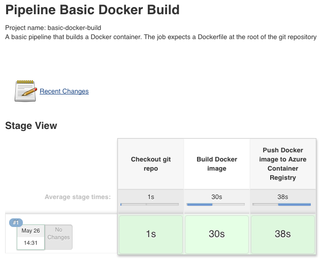
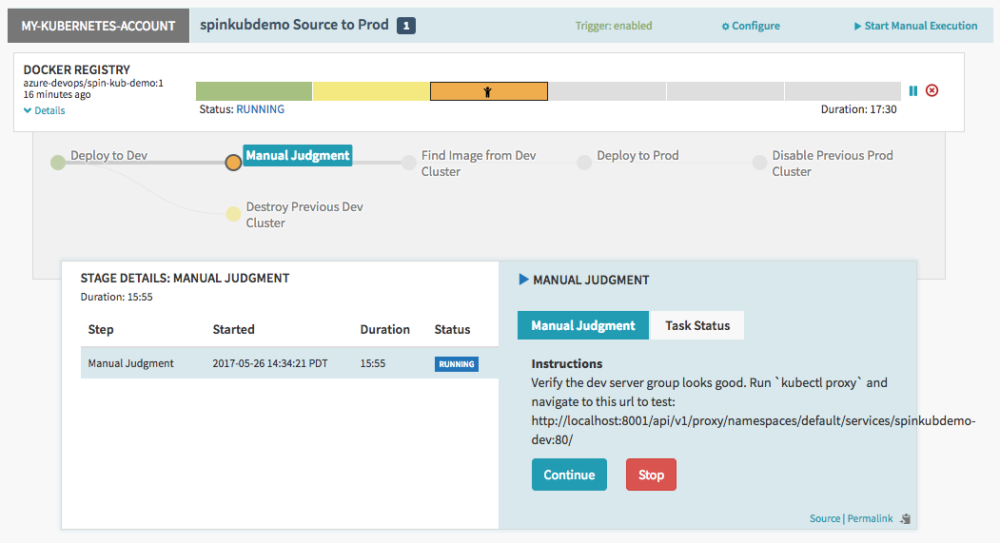
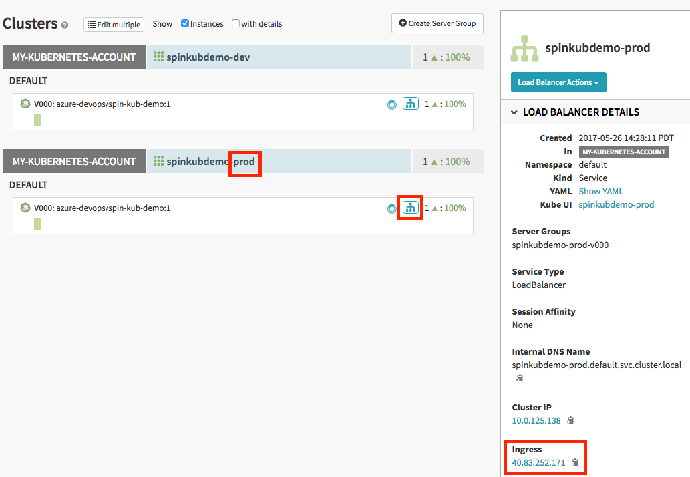



In this codelab, you will create a Source to Prod pipeline targeting a Kubernetes cluster in Azure. In the end you will have a Jenkins instance with a sample job that builds a container image and pushes it to an Azure Container Registry. You will also have a Spinnaker instance with a sample pipeline that deploys the container image to a staging environment, waits for manual judgement, and then deploys the image to a production environment.

## Setup

Fork [this repository](https://github.com/azure-devops/spin-kub-demo) with a simple 'Hello World' application written in Go. You will commit a change to this fork in order to trigger the Source to Prod pipeline.

## Deploy DevOps VM

Run the following command to deploy the 'Continuous Delivery to Kubernetes' [Quickstart Template](https://github.com/Azure/azure-quickstart-templates/tree/master/301-jenkins-acr-spinnaker-k8s) in Azure. It will make sure you have the [Azure CLI 2.0](https://docs.microsoft.com/cli/azure/install-azure-cli) installed and interactively ask if you want to change any of the default behavior. **Important:** When asked, make sure to specify your fork of the sample git repository so that you can trigger the pipeline with your own commits.

```bash
bash <(curl -sL https://aka.ms/DeployDevOps)
```

The script should list several outputs after it has finished. Run the 'SSH' output to connect to your Jenkins and Spinnaker instances hosted on the same VM.
> NOTE: The command will forward traffic from your VM to your local machine on several ports, including port 8080 for the Jenkins dashboard, port 9000 for the Spinnaker dashboard, and port 8084 for the Spinnaker gate service. It also forwards port 8001, which is used to view the Kubernetes dashboard - just run `kubectl proxy` on your VM and navigate to [localhost:8001/ui](http://localhost:8001/ui).

## Verify sample pipeline

Navigate to [localhost:8080](http://localhost:8080) to see your Jenkins dashboard. Follow the default Jenkins 'Getting Started' instructions and verify the sample 'Basic Docker Build' job successfully built and pushed to your Azure Container Registry as shown in the image below:



Navigate to [localhost:9000](http://localhost:9000) to see your Spinnaker dashboard. Go to 'Applications > spinkubdemo > Pipelines' and verify the pipeline has already started. It should be waiting at the manual judgement stage after already deploying to the staging environment as shown in the image below. Follow the instructions for the manual judgement and click 'Continue' after you have verified the staging environment.



> NOTE: The 'Destroy Previous Dev Cluster' stage is expected to have failed because there is no previous cluster yet

After the pipeline finishes, go to the Cluster view to inspect your production environment. Unlike the 'dev' cluster, the 'prod' cluster will have a publicly available Ingress IP listed where you can verify your app. Click the icon for the load balancer under the 'prod' cluster as shown in the image below:



## Trigger sample pipeline

Finally, make a change to your sample app in git and push your changes (for example, you can change the color or wording in the 'content/index.html' file) in order to [trigger](https://wiki.jenkins-ci.org/display/JENKINS/GitHub+Plugin) your pipeline. Follow the same steps above to watch as your new image is built and deployed to your staging/production environments.
