

In this codelab, you will create a source-to-prod continuous delivery flow from source to production for a simple java based application.

After completing this lab the following workflow will happen: 
  1. Some code is checked in on gthub.
  2. Jenkins automatically runs a job to create a new build. 
  3. Spinnaker deploys the new version of the application to a Test server group and disable the previous deployment.
  4. The deployment is verified
  5. Spinnaker redeploys the same image to the production environment and disable the previous deployment.
  
This codelab will walk through the steps to  implement this scenario: 

  * Setup the environment and the necessary pre-requisites
  * Configure Jenkins and Spinnaker
  * Create the pipeline for the deployment

## 0. Environment pre-requisites 

### Deploy Spinnaker and Jenkins on Azure 

You need the following resources to perform the codelab: 
- **Azure subscription**: You can create one for free using the [Azure Free trial](https://azure.microsoft.com/free/).
- **Spinnaker and Jenkins VM**: You can deploy them on your Azure subscription with the [Continuous Deployment quick start template](https://github.com/Azure/azure-quickstart-templates/tree/master/301-jenkins-aptly-spinnaker-vmss) 

From a shell run the following command that will walk you through all the steps necessary to deploy Jenkins and Spinnaker in Azure:

```bash 
bash <(curl -sL https://aka.ms/DeployDevOps)
```

In the output of the above script you will find the command to open an SSH tunnel to the DevOps VM that has just been deployed. The command should look like this: 

```bash
ssh -L 8080:localhost:8080 -L 9000:localhost:9000 -L 8084:localhost:8084 -L 8087:localhost:8087 username@vmdnsprefix.selected_region.cloudapp.azure.com
```

> NOTE: You will have to enter the password that you have specified in the previous step.


## 1. Configure Jenkins 

1. After you have started your ssh tunnel, navigate to `http://localhost:8080/` on your local machine.
1. The instance should already be unlocked and your first account setup. Login with the credentials you specified when deploying the template.
1. Click **Install suggested plugins**: 
   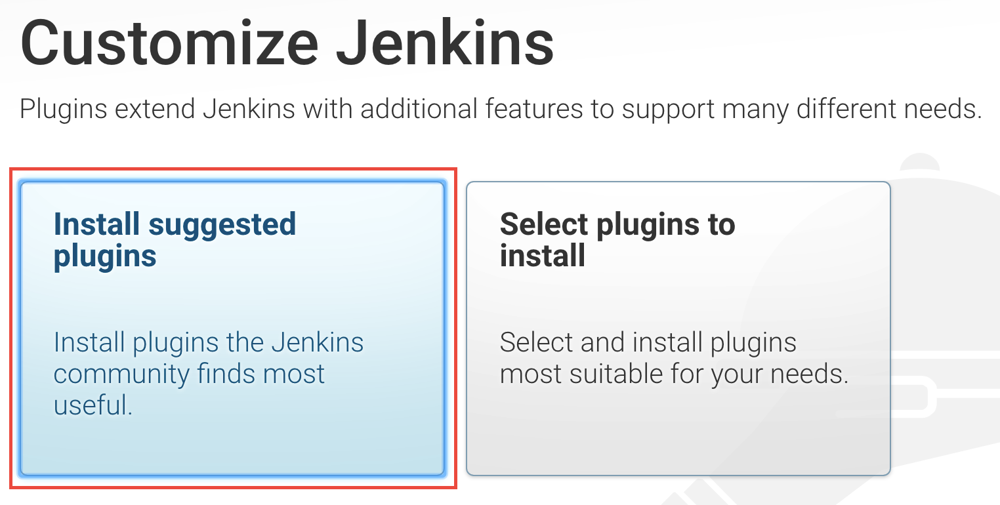
1. Your Jenkins instance is now ready to use!
1. Run the `Sample Aptly Job` by clicking on the run button for the job. Verify that the job completes successfully.

   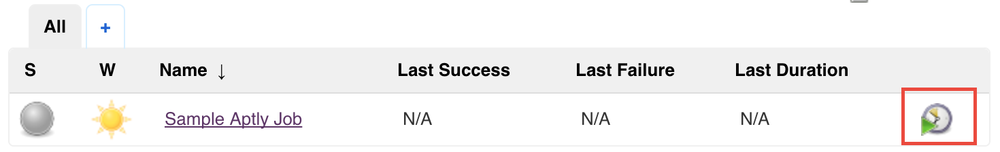

## 2. Configure Spinnaker

### I. Create the "codelab" application 

1. Navigate to your Spinnaker VM by using `http://localhost:9000` on your local machine. 
1. Click on the **Actions** menu on the right

   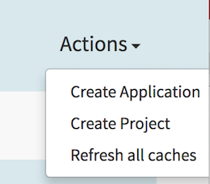
   
1. In the *New Application* window, enter the following values: 
  * Name: codelab
  * Owner Email: Enter your email
  
    And click **Create**
  
    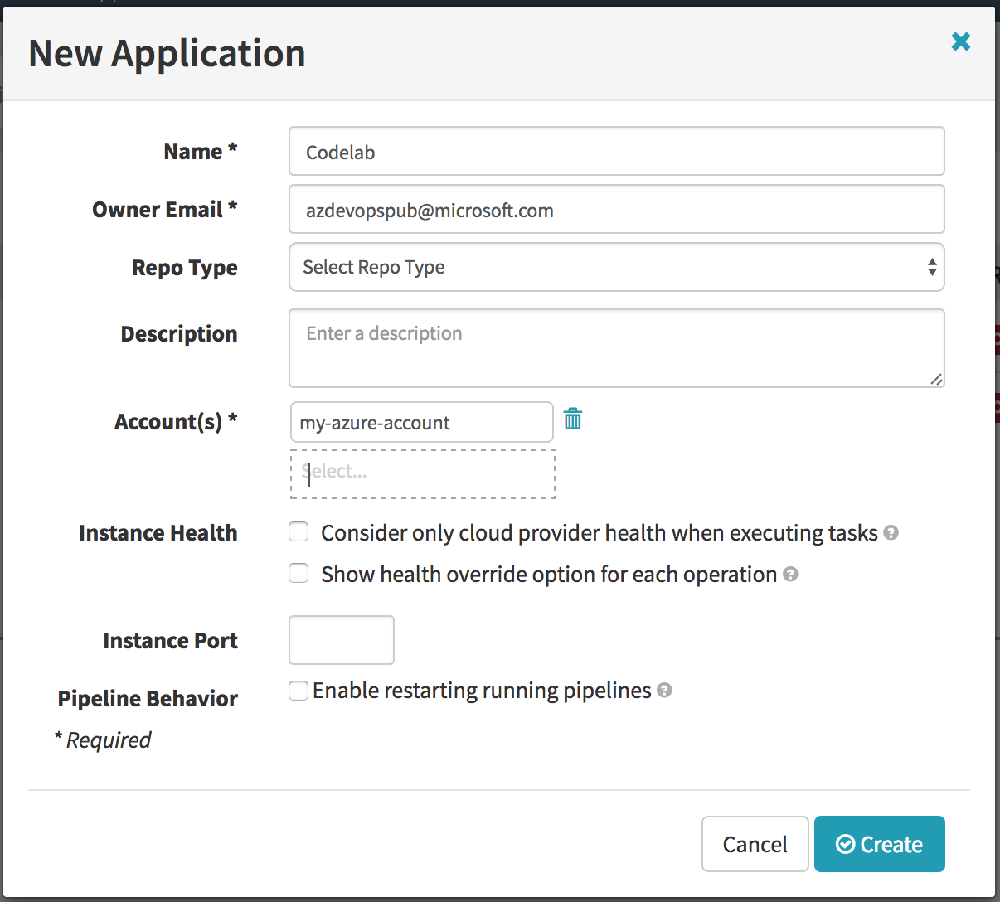
  
    You can read more how the Spinnaker application matches to Azure resources in the [Azure reference for Spinnaker](/reference/providers/azure/)

### II. Create a Security Group"

1. Navigate to the [SECURITY GROUPS](http://localhost:9000/#/applications/codelab/securityGroups) page and click on the **Create Security Group** button.
1. Provide the following values in the *Create New Security Group* dialog: 
  * Detail: web
  * Account: my-azure-account (should be selected by default)
  * Region: westus (select the region that is closest to your location)

    Ingress (click *Add new Security Group Rule*):
  * Protocol: TCP
  * Start Port: 80
  * End Port: 80 

    And click **Create**, if the loadbalancer does not appear in the page once the creation is complete, refresh your browser.

    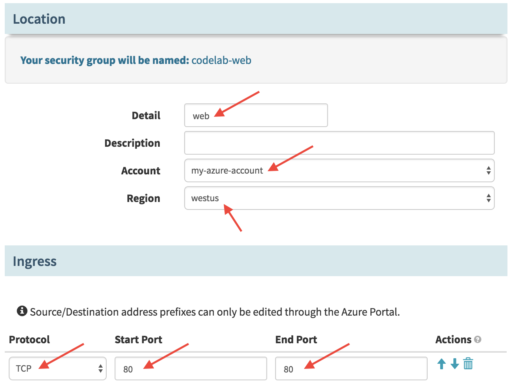

  > Note: We are using westus for the region but you can select any other region that is closer to your location. Be careful to match the region in the following steps.

  You can read more about the implementation of Security Groups in Azure in the [Azure reference for Spinnaker](/reference/providers/azure/)

### III. Create a Load Balancer

1. Navigate to the [LOAD BALANCERS](http://localhost:9000/#/applications/codelab/loadBalancers) page and click the **Create Load Balancer** button.
1. Provide the following values in the "Create New Load Balancer" dialog: 
  * Account: my-azure-account
  * Region: westus (unless you have selected a different region previously)
  * Virtual Network: devopsVnet
  * Subnet: devopsSubnet1
  * Stack: test 
  * Detail: frontend

    Verify that the Listener is configured as follows: 
  * Protocol: HTTP
  * External Port: 80
  * Internal Port: 8080 

    And click **Create**, this will take approximately 15 minutes to complete.

    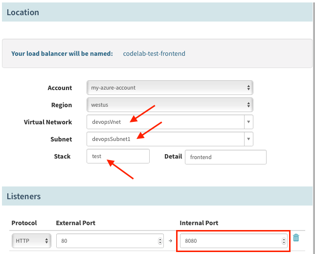

    You can learn more about the implementation of the Spinnaler Load Balancer in the [Azure reference for Spinnaker](/reference/providers/azure/)

1. Repeat the above steps to create a second load balancer for production. Use the same parameters but the following change:
  * Stack: prod 

    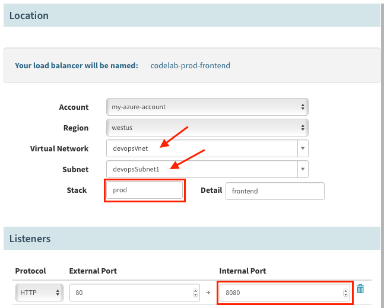

## 3. Bake and Deploy to Test

In this section you will create a Spinnaker pipeline that will bake the image from a Jenkins build then deploy it to test.

### I. Create a new pipeline

1. Navigate to the [PIPELINES](http://localhost:9000/#/applications/codelab/executions) page and click on the *New* button (+ sign) on the right to create a new pipeline.
1. Name your pipeline: "Deploy codelab" and click **Create**.

   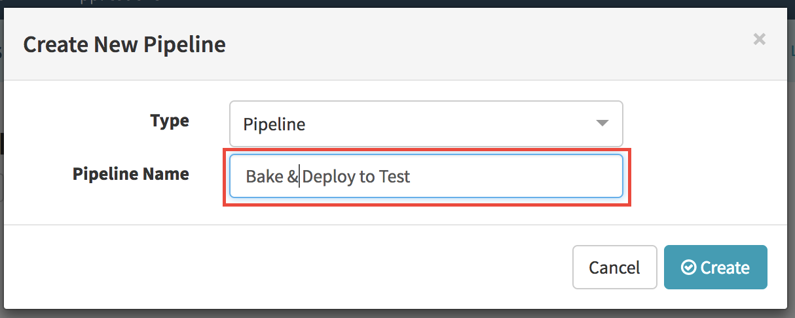

### II. Add a trigger for the pipeline

1. Click *Add Trigger* in the *Deploy codelab* window.
1. Select the following options: 
  * Type: "Jenkins"
  * Master:  "Jenkins" 
  * Job: "hello-karyon-rxnetty"
  * Property File: leave empty 

    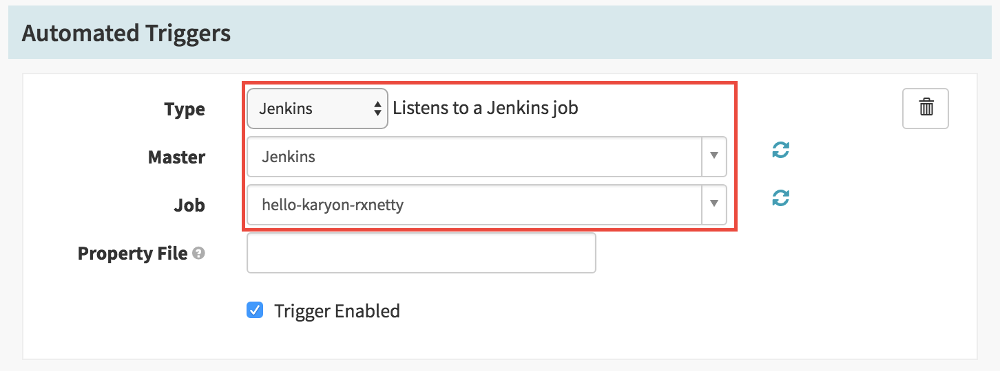

### III. Add *Bake* stage

1. Click *Add stage* in the *Deploy codelab* window.
1. Enter the following values: 
  * Type: Bake
  * Stage Name: Bake
  * Regions: westus (or select the region that you have selected when creating the Security Group)
  * Package: ```hello-karyon-rxnetty```
  * Base OS: ubuntu (v14.05)

    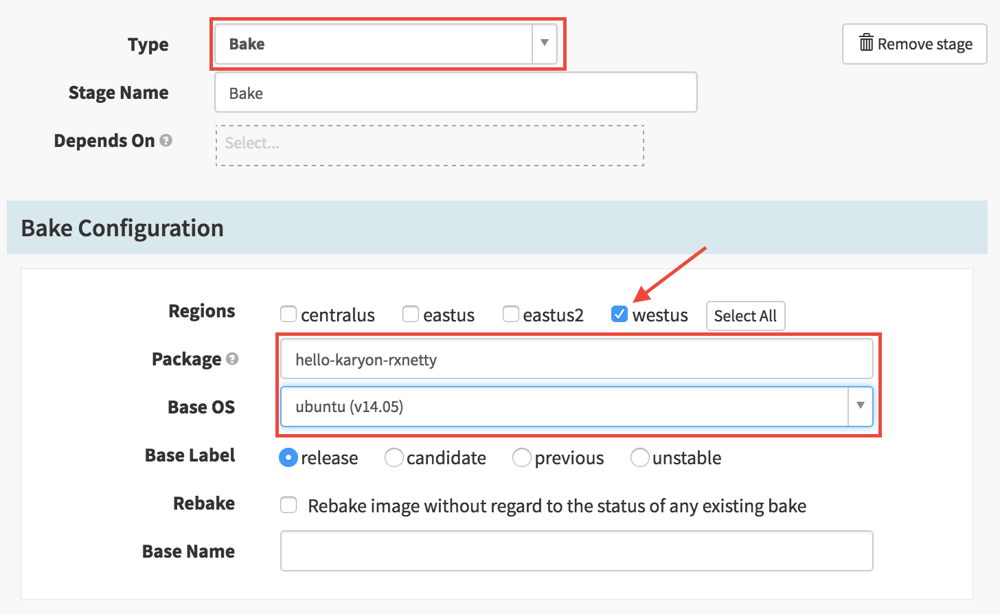

### IV. Add *Deploy to test* stage

1. Click *Add stage*
1. Enter the following values: 
  * Type: Deploy
  * Stage Name: Deploy to Test
  * Depends On: Bake

    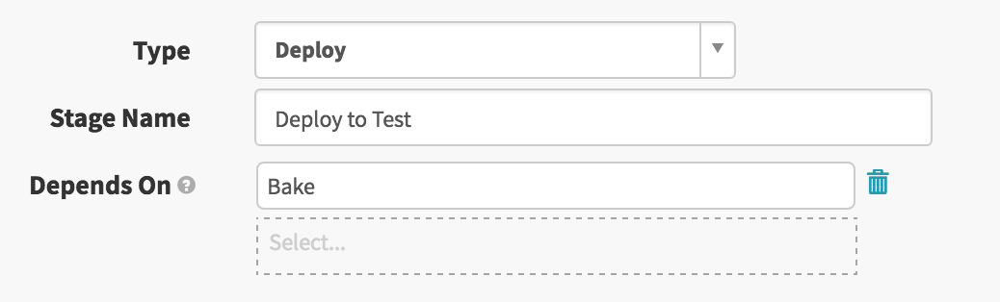

### V. Create Test deployment configuration

1. Click *Add server group* in the Deploy Configuration section. 

   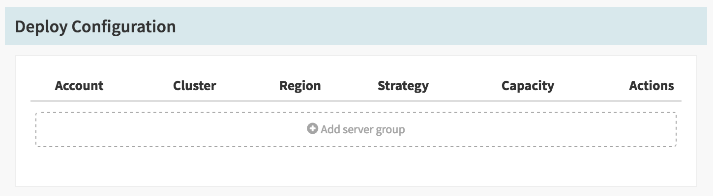

1. Click "Continue without a template"
1. In the "Configure Deployment Cluster" enter the following values:
  * Account: my-azure-account
  * Region: westus (or select the region that you have selected when creating the Security Group)
  * Stack: test
  * Details: tutorial
  * Load Balancers: codelab-test-frontend

    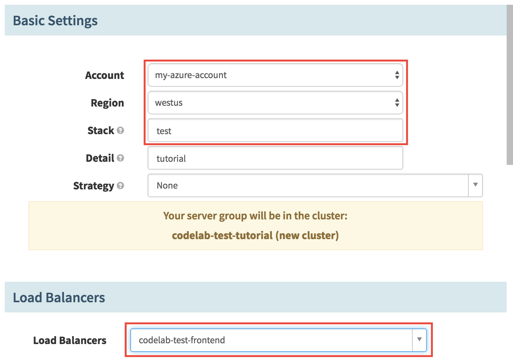
    
  * Subnets: devopsSubnet0
  * Security Groups: codelab-web

    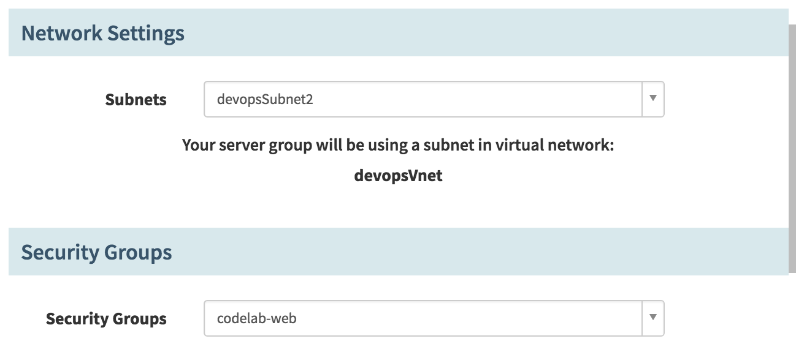

  * "Advanced Settings": 
    - Custom Data: TEST
    - Custom Script: https://raw.githubusercontent.com/azure-devops/hello-karyon-rxnetty/master/scripts/setcustomenv.sh
    - Command To Execute: sudo bash ./setcustomenv.sh

      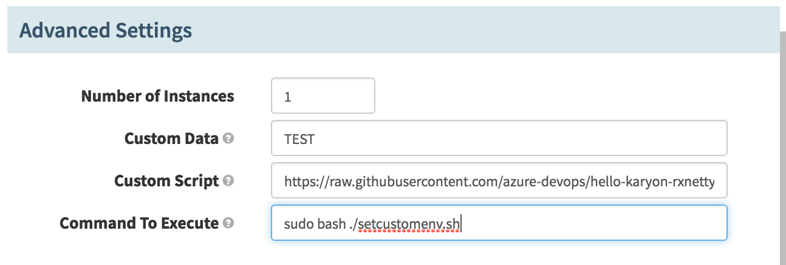

  * Click **Add** 

> NOTE: Record the name of the cluster. it will be used in the next step.

### VI. Enable test deployment 

1. Click *Add stage* in the *Deploy codelab* section.
1. Enter the following values: 
  * Type: Enable Server Group
  * Stage Name: Enable Test Deployment
  * Depends On: Deploy to Test
  * Account: my-azure-account
  * Regions: westus (or select the region that you have selected when creating the Security Group)
  * Cluster: codelab-test-tutorial (or the name of your cluster if you have used different values)
  * Target: Newest Server Group

    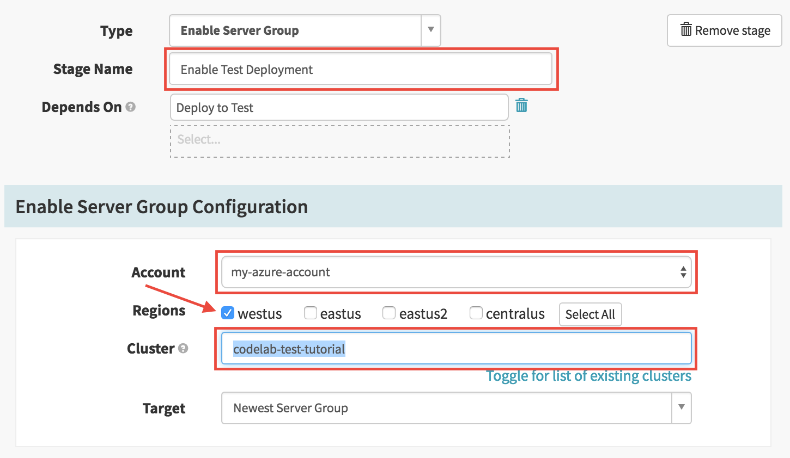

### VII. Manual Judgement 

1. Click *Add stage* in the *Deploy codelab* section.
1. Use the following values: 
  * Type: Manual Judgment
  * Name: Manual Judgment
  * Depends On: Enable Test Deployment
  * Instructions: Validate test cluster 

Save the pipeline by clicking the *Save Changes* button at the bottom right.

## 4. Promote to Prod

In this section we will add the steps that will promote the deployment to test in production.

### I. Add Deploy to prod stage

1. Click *Add stage* in the *Promote to Prod* section. 
1. Use the following values to configure the stage:
  * Type: Deploy
  * Stage Name: Deploy to Prod
  * Depends On: Manual Judgment

### II. Create Production deployment configuration 

1. Click *Add server group* in the Deploy Configuration section. 
1. Click *Continue without a template*
1. In the *Configure Deployment Cluster* enter the following values:
  * Account: my-azure-account
  * Region: westus (or select the region that you have selected when creating the Security Group)
  * Stack: prod
  * Details: tutorial
  * Load Balancers: codelab-prod-frontend

    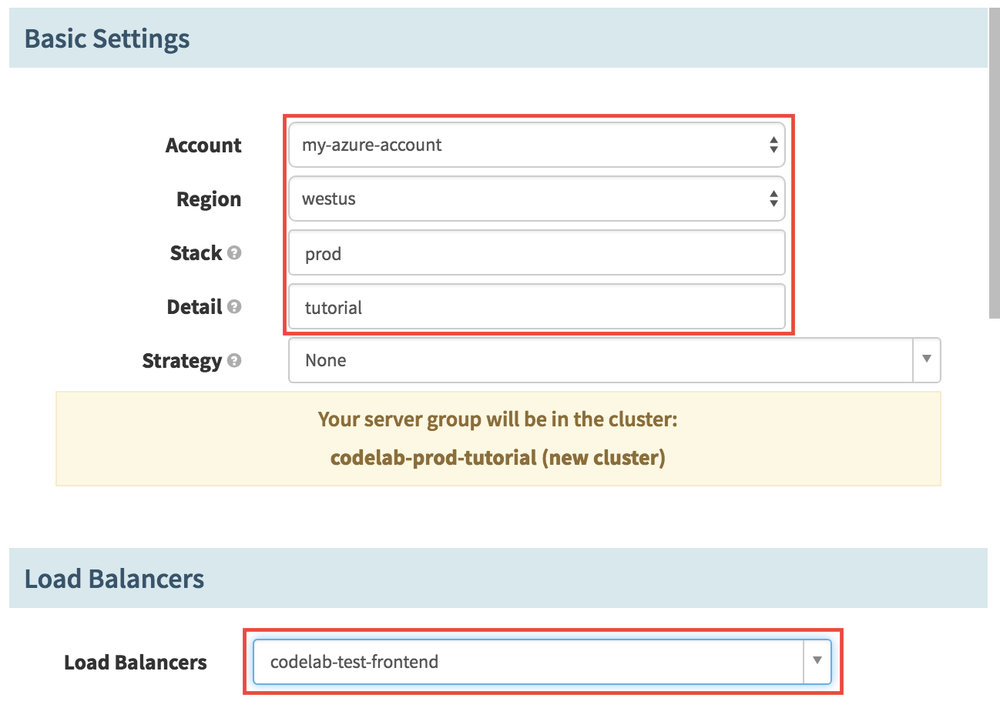

  * Subnets: devopsSubnet2
  * Security Groups: codelab-web

    

  * "Advanced Settings": 
    - Custom Data: PROD
    - Custom Script: https://raw.githubusercontent.com/azure-devops/hello-karyon-rxnetty/master/scripts/setcustomenv.sh
    - Command To Execute: sudo bash ./setcustomenv.sh
  
      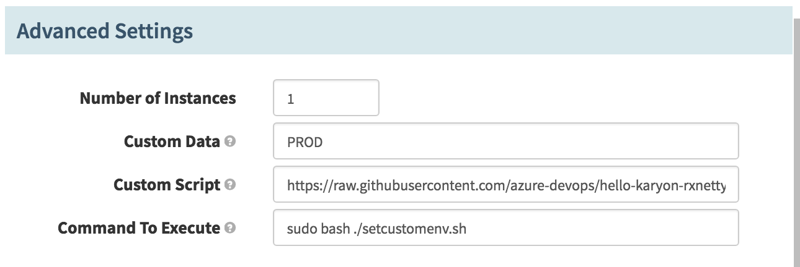

  * Click **Add** 

> NOTE: Record the name of the cluster. it will be used in the next step.

### III. Enable Prod deployment

1. Click *Add stage* in the *Deploy codelab* section.
1. Use the following values to configuret this stage: 
  * Type: Enable Server Group
  * Stage Name: Enable Prod Deployment
  * Depends On: Deploy to Prod
  * Account: my-azure-account
  * Regions: westus (or select the region that you have selected when creating the Security Group)
  * Cluster: codelab-prod-tutorial
  * Target: Newest Server Group

    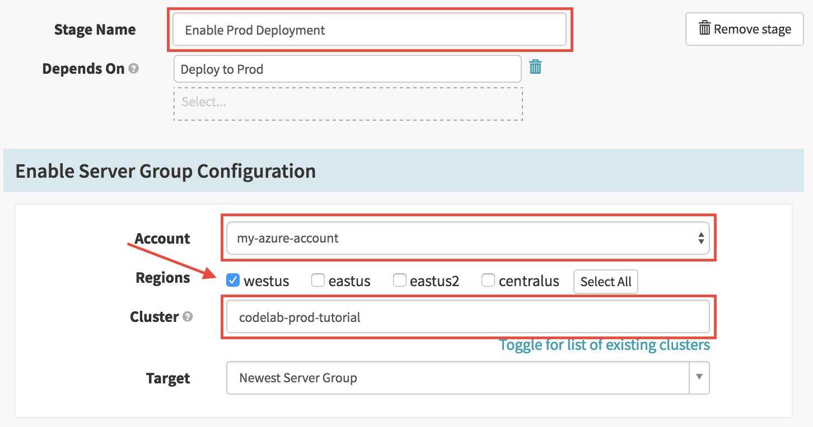

  * Click **Save Changes**

## 5. Test it out 

In this step you will try out the pipeline that you have just build. 

1. Got to [Jenkins](http://localhost:8080) and launch a new build of the "Sample Aptly Job" like you did in the [*Configure Jenkins* section](#1-configure-jenkins). After some minutes, you should see your pipeline running. 

   You can also click on *Start Manual Execution* on your pipeline. 

1. Navigate to the [PIPELINES](http://localhost:9000/#/applications/codelab/executions) tab
1. Click on *Details* to get more information about the status of your deployment
1. Connect to your application. 
   You can find the public name of your application ny looking at the DNS Name that has been assigned to your load balancer.

   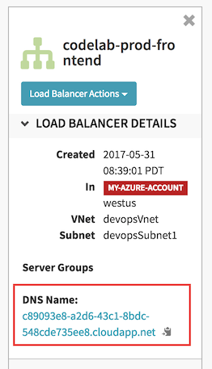 

## 6. Tear Down

### I. Delete your pipeline 

1. In the configuration of your pipeline, click on *Pipeline Actions* then click on *Delete*

   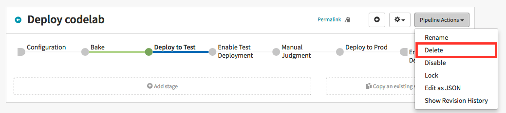

### II. Delete your server groups 

1. Navigate to the [CLUSTERS](http://localhost:9000/#/applications/codelab/clusters) section.
1. Select each Server Group in the list and select *Destroy* for each of them. 

   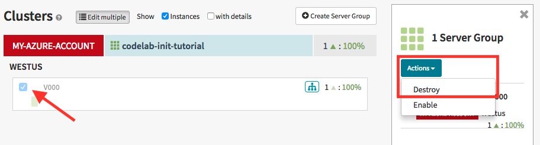

### III. Delete your load balancers

1. Navigate to the [LOAD BALANCERS](http://localhost:9000/#/applications/codelab/loadBalancers) section.
1. Select each Load Balancer in the list then in the *Load Balancer Actions* select *Delete Load Balancer* 

   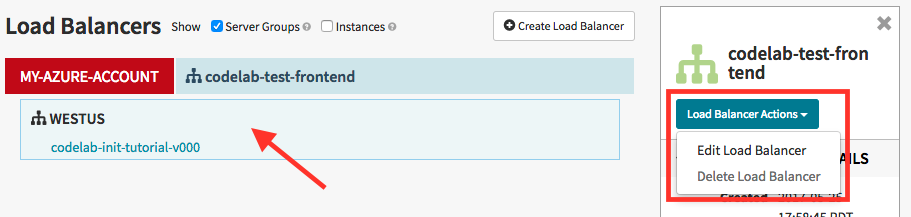

### IV. Delete your security group

1. Navigate to the [SECURITY GROUP](http://localhost:9000/#/applications/codelab/securityGroups) section.
1. Select each Security Group in the list then in the *Security Group Actions* select *Delete Security Group* 

   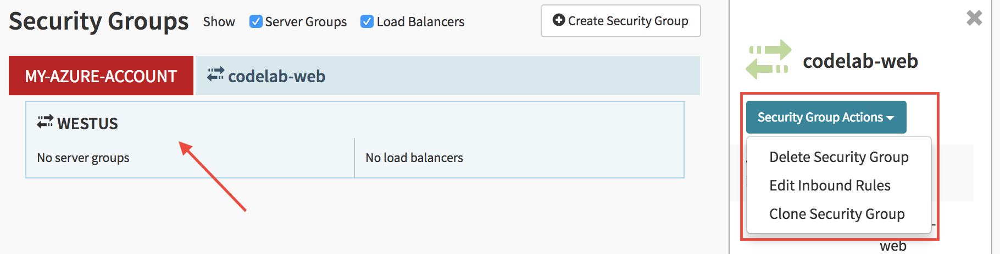
