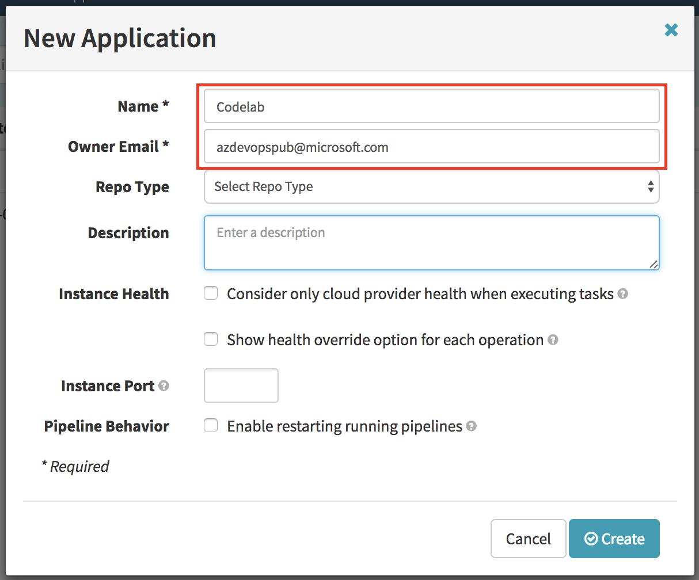
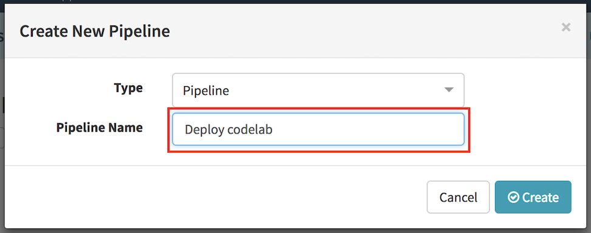
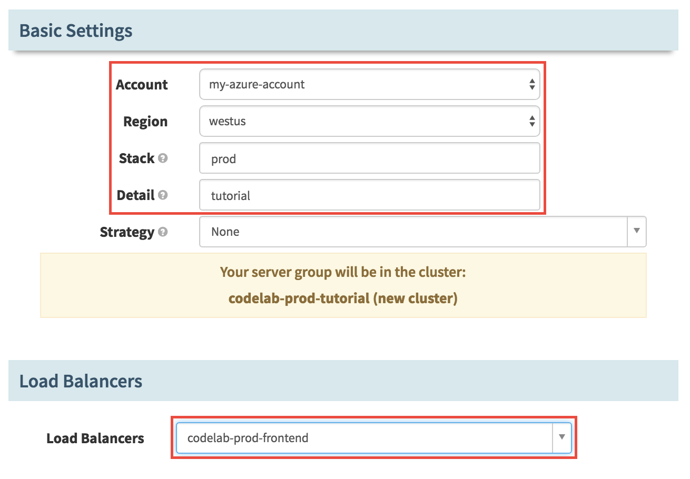



In this codelab, you will create a source-to-prod continuous delivery flow from source to production for a simple java based application.
When the developer checkin code on github, a new build will be automatically triggered on Jenkins then the new version of the application will be deployed to a test environment in Azure. After a successfull test, the updated version of the application will be promoted to production. 

This codelab will walk through the following step in order to implement the scenario described above: 

0. Setup the environment and the necessary pre-requisites
1. Configure Jenkins and Spinnaker
2. Create a pipeline for test
3. Create the promotion of the test to production

## 0. Environment pre-requisites 

### Deploy Spinnaker and Jenkins on Azure 

If you already have Jenkins and Azure deployed on Azure, skip to the [first section](#1. Configure Jenkins).

You need the following resources to perform the codelab: 
- **Azure subscription**: You can create one for free using the [Azure Free trial](https://azure.microsoft.com/free/).
- **Spinnaker and Jenkins VM**: You can deploy them on your Azure subscription with the [Continuous Deployment quick start template](https://github.com/Azure/azure-quickstart-templates/tree/master/301-jenkins-aptly-spinnaker-vmss) 

Create a service principal with the following commands: 

```bash
az ad sp create-for-rbac --name "Spinnaker"
APP_ID=<Insert App Id>
TENANT_ID=<Insert Tenant Id>
```

Next, create a Resource Group with the following commands: 

```bash
RESOURCE_GROUP=codelab
az group create -n $RESOURCE_GROUP -l westus
```

> NOTE: It is suggested to use "codelab" for the name of the resource group but you can use the name you want. It should be unique in your subscription.

Then deploy the DevOps VM that will have Spinnaker and Jenkins configured: 

```bash
TEMPLATE_URI=https://raw.githubusercontent.com/Azure/azure-quickstart-templates/master/301-jenkins-aptly-spinnaker-vmss/azuredeploy.json

az group deployment create -g $RESOURCE_GROUP -n First.Deployment \
--template-uri $TEMPLATE_URI \
--parameters "{ \"adminUsername\": {\"value\":\"<$Insert your admin username>\"}, \
                \"adminPassword\": {\"value\": \"<$Insert your admin password>\"}, \
                \"devopsDnsPrefix\": {\"value\": \"<$Insert your dns prefix>\"}, \
                \"servicePrincipalAppId\": {\"value\": \"$APP_ID\"}, \
                \"servicePrincipalAppKey\": {\"value\": \"$TENANT_ID\"}}"

```

> NOTE: This step will take some time, be patient, enjoy a coffee :)

Open an SSH tunnel to the DevOps VM that has just been deployed: 

```bash
SSH=$(az group deployment show -n First.Deployment -g codelab --query "properties.outputs.ssh.value" | tr -d '"')
eval $SSH
```

> NOTE: You have to enter the password that you have specified in the previous step.


## 1. Configure Jenkins 

1. After you have started your ssh tunnel, navigate to `http://localhost:8080/` on your local machine.
1. The instance should already be unlocked and your first account setup. Login with the credentials you specified when deploying the template.
1. Click "Install suggested plugins: 
   
1. Your Jenkins instance is now ready to use!
1. Run the "Sample Aptly Job" once by clicking on the run button for the job. Verify that the job completes successfully.
   

## 2. Configure Spinnaker

### 1. Create the "codelab" application 

1. Navigate to your Spinnaker VM by using `http://localhost:9000` on your local machine. 
1. Click on the "Actions" menu on the right

   
   
1. In the **New Application** window, enter the following values: 
  * Name: codelab
  * Owner Email: Enter your email 
  * Account(s): Select in the list "my-azure-account"
  
    And click "Create"
  
    
  
    You can read more how the Spinnaker application matches to Azure resources in the [Azure reference for Spinnaker](/reference/providers/azure.md)

### 2. Create a Security Group"

1. Navigate to the [SECURITY GROUPS](http://localhost:9000/#/applications/codelab/securityGroups) page and click on the *Create Security Group* button.
1. Provide the following values in the "Create New Security Group" dialog: 
  * Detail: web
  * Account: my-azure-account (should be selected by default)
  * Region: westus (select the region that is closest to your location)

    Ingress (click "Add new Security Group Rule"):
  * Protocol: TCP
  * Start Port: 80
  * End Port: 80 

    And click "Create", if the loadbalancer does not appear in the page once the creation is complete, refresh your browser.

    

  > Note: We are using westus for the region but you can select any other region that is closer to your location. Be careful to match the region in the following steps.

  You can read more about the implementation of Security Groups in Azure in the [Azure reference for Spinnaker](/reference/providers/azure.md)

### 3. Create a Load Balancer

1. Navigate to the [LOAD BALANCERS](http://localhost:9000/#/applications/codelab/loadBalancers) page and click the *Create Load Balancer* button.
1. Provide the following values in the "Create New Load Balancer" dialog: 
  * Account: my-azure-account
  * Region: westus (unless you have selected a different region previously)
  * Virtual Network: devopsVnet
  * Subnet: devopsSubnet1
  * Stack: test 
  * Detail: frontend

    Verify that the Listener is configured as follows: 
  * Protocol: HTTP
  * External Port: 80
  * Internal Port: 80 

    And click "Create", this will take approximately 15 minutes to complete.

    

    You can learn more about the implementation of the Spinnaler Load Balancer in the [Azure reference for Spinnaker](/reference/provider/azure.md)

## 3. Bake and Deploy to Test

In this section you will create a Spinnaker pipeline that will bake the image from a Jenkins build then deploy it to test.

### 1. Create a new pipeline

1. Navigate to the [PIPELINES](http://localhost:9000/#/applications/codelab/executions) page and click on the *New* button (+ sign) on the right to create a new pipeline.
1. Name your pipeline: "Deploy codelab" and click *Create*.



### 2. Add a trigger for the pipeline

1. Click *Add Trigger* in the *Deploy codelab* window.
1. Select the following options: 
  * Type: "Jenkins"
  * Master:  "Jenkins" 
  * Job: "hello-karyon-rxnetty"
  * Property File: leave empty 


### 3. Add *Bake* stage

1. Click *Add stage* in the *Deploy codelab* window.
1. Enter the following values: 
  * Type: Bake
  * Stage Name: Bake
  * Regions: westus (or select the region that you have selected when creating the Security Group)
  * Package: ```hello-karyon-rxnetty```
  * Base OS: ubuntu (v14.05)


### 4. Add *Deploy to test* stage

1. Click *Add stage*
1. Enter the following values: 
  * Type: Deploy
  * Stage Name: Deploy to Test
  * Depends On: Bake


### 5. Create Test deployment configuration

1. Click *Add server group* in the Deploy Configuration section. 

1. Click "Continue without a template"
1. In the "Configure Deployment Cluster" enter the following values:
  * Account: my-azure-account
  * Region: westus (or select the region that you have selected when creating the Security Group)
  * Stack: test
  * Details: tutorial
  * Load Balancers: codelab-test-frontend
  
  * Subnets: devopsSubnet0
  * Security Groups: codelab-web
  
  * "Advanced Settings": 
    - Custom Data: TEST
    - Custom Script: https://raw.githubusercontent.com/azure-devops/hello-karyon-rxnetty/master/scripts/setcustomenv.sh
    - Command To Execute: sudo bash ./setcustomenv.sh
  

  * Click Add 

> NOTE: Record the name of the cluster. it will be used in the next step.

### 6. Enable test deployment 

1. Click *Add stage* in the *Deploy codelab* section.
1. Enter the following values: 
  * Type: Enable Server Group
  * Stage Name: Enable Test Deployment
  * Depends On: Deploy to Test
  * Account: my-azure-account
  * Regions: westus (or select the region that you have selected when creating the Security Group)
  * Cluster: codelab-test-tutorial (or the name of your cluster if you have used different values)
  * Target: Newest Server Group

    

### 7. Manual Judgement 

1. Click *Add stage* in the *Deploy codelab* section.
1. Use the following values: 
  * Type: Manual Judgment
  * Name: Manual Judgment
  * Depends On: Enable Test Deployment
  * Instructions: Validate test cluster 
  * Judgement Inputs: Click *Add judgment input* and type *Go*
    Users will select this value for the input of the manual judgement stage

Save the pipeline by clicking the *Save Changes* button at the bottom right.

## 4. Promote to Prod

In this section we will ad the steps that will promote the deployment to test in production.

### 1. Add Deploy to prod stage

1. Click *Add stage* in the *Promote to Prod* section. 
1. Use the following values to configure the stage:
  * Type: Deploy
  * Stage Name: Deploy to Prod
  * Depends On: Manual Judgment

### 2. Create Production deployment configuration 

1. Click *Add server group* in the Deploy Configuration section. 
1. Click *Continue without a template*
1. In the *Configure Deployment Cluster* enter the following values:
  * Account: my-azure-account
  * Region: westus (or select the region that you have selected when creating the Security Group)
  * Stack: prod
  * Details: tutorial
  * Load Balancers: codelab-test-frontend
  
  * Subnets: devopsSubnet2
  * Security Groups: codelab-web
  
  * "Advanced Settings": 
    - Custom Data: PROD
    - Custom Script: https://raw.githubusercontent.com/azure-devops/hello-karyon-rxnetty/master/scripts/setcustomenv.sh
    - Command To Execute: sudo bash ./setcustomenv.sh
  

  * Click *Add* 

> NOTE: Record the name of the cluster. it will be used in the next step.

### 3. Enable Prod deployment

1. Click *Add stage* in the *Deploy codelab* section.
1. Use the following values to configuret this stage: 
  * Type: Enable Server Group
  * Stage Name: Enable Prod Deployment
  * Depends On: Deploy to Prod
  * Account: my-azure-account
  * Regions: westus (or select the region that you have selected when creating the Security Group)
  * Cluster: codelab-prod-tutorial
  * Target: Newest Server Group
    

  * Click *Save Changes*

## 5. Test it out 

In this step you will try out the pipeline that you have just build. 

1. Click on *Start Manual Execution* 
1. Navigate to the [PIPELINES](http://localhost:9000/#/applications/codelab/executions) tab
1. Click on *Details* to get more information about the status of your deployment

## 6. Tear Down

### 1. Delete your pipeline 

1. In the configuration of your pipeline, click on *Pipeline Actions* then click on *Delete*


### 2. Delete your server groups 

1. Navigate to the [CLUSTERS](http://localhost:9000/#/applications/codelab/clusters) section.
1. Select each Server Group in the list and select *Destroy* for each of them. 


### 3. Delete your load balancers

1. Navigate to the [LOAD BALANCERS](http://localhost:9000/#/applications/codelab/loadBalancers) section.
1. Select each Load Balancer in the list then in the *Load Balancer Actions* select *Delete Load Balancer* 


