

In this codelab, you will set up a source-to-prod continuous delivery flow for a
hello world app deployed via containers, on the Google Cloud Platform. You can
first watch a [short video of a demo](https://youtu.be/aubbyQ60W2U), which
follows a similar setup to this codelab.

This codelab is estimated to take an hour.

## Overview

The end goal is to set up an environment by which a push to a release branch in
GitHub will trigger a series of orchestrated build, deploy and promotion events
that employ best practices in several key areas. The sequence of events is:

1. Developer promotes code by pushing to the `release` branch in GitHub
2. Google Container Registry automatically builds a new release container
3. Spinnaker automatically deploys it to a staging Kubernetes environment
4. User validates the deployment in the staging environment
5. Spinnaker promotes the container to the production Kubernetes environment

## Part 0: Set up Your Environment

This codelab assumes you have git on your local workstation, a Github account,
and a billing-enabled GCP project.

### Install gcloud

If you don't already have gcloud installed, [install gcloud](https://cloud.google.com/sdk/downloads#interactive).

### Enable APIs

Verify that the [Service Management API](https://console.cloud.google.com/apis/api/servicemanagement.googleapis.com/overview) is enabled.

### Create a Kubernetes cluster (GKE)

* Navigate to the [Google Cloud Console’s Container Engine section](https://console.cloud.google.com/kubernetes) and click the *Create a container cluster* button.

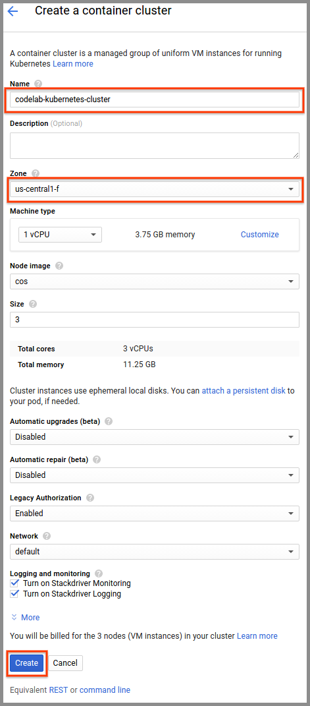

* Name the cluster "codelab-kubernetes-cluster"
* Select "us-central1-f" in the *Zone* drop down list.
* Click the *Create* button

### Create a Spinnaker instance

* Navigate to the [Spinnaker Launcher offering](https://console.cloud.google.com/launcher/details/click-to-deploy-images/spinnaker?q=spinnaker)
and click the *Launch on Compute Engine* button.

| 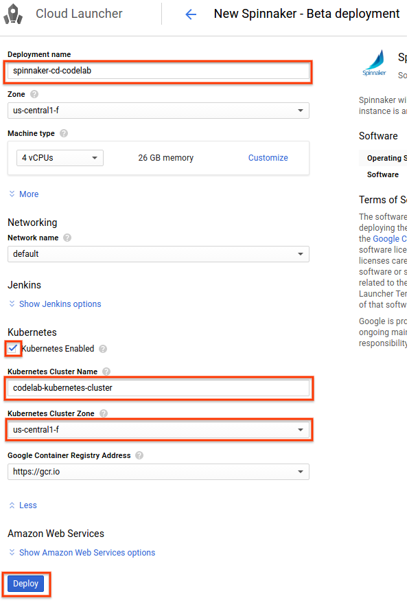 |

* Set the *Deployment name* "spinnaker-cd-codelab"
* Select "us-central1-f" in the *Zone* drop down list.
* Expand the *Show Kubernetes options* section at the bottom
* Check on the "Kubernetes Enabled" checkbox
* Enter the name of the Kubernetes Cluster you created in the step above ("codelab-kubernetes-cluster")
* Select "us-central1-f" in the *Kubernetes Cluster Zone* drop down list.
* Click the *Deploy* button

This will provision a Spinnaker instance with providers set up for your
Kubernetes cluster as well as your GCP project’s Container Registry.

## Part 1: Code and Builds

### Your Source Code

Create a GitHub project named "gcp-cd-codelab" and clone it locally. Create a
`README.md` file in the new GitHub repo before cloning it.

Add `main.go`:

```
package main

import (
	"io"
	"net/http"
)

func hello(w http.ResponseWriter, r *http.Request) {
	io.WriteString(w, "Hello World!")
}

func main() {
	http.HandleFunc("/", hello)
	http.ListenAndServe(":80", nil)
}
```

Add `cloudbuild.yaml`:

```
steps:
  - name: "gcr.io/cloud-builders/go"
    args: ["install", "github.com/{GITHUB_HANDLE}/gcp-cd-codelab"]
    env: ["PROJECT_ROOT=github.com/{GITHUB_HANDLE}/gcp-cd-codelab"]
  - name: "gcr.io/cloud-builders/docker"
    args: ["build", "-t", "gcr.io/{GCP_PROJECT_ID}/gcp-cd-codelab:$REVISION_ID", "-f", "Dockerfile", "."]
images:
  - "gcr.io/{GCP_PROJECT_ID}/gcp-cd-codelab:$REVISION_ID"
```

* Replace `GITHUB_HANDLE` with your GitHub handle
* Replace `GCP_PROJECT_ID` with your GCP project ID

Add `Dockerfile`:

```
FROM alpine

COPY gopath/bin/gcp-cd-codelab /go/bin/gcp-cd-codelab

ENTRYPOINT /go/bin/gcp-cd-codelab
```

### Set Up Your Automated Builds

Create a new triggered build:

* Navigate to [Cloud Container Registry Build Triggers](https://console.cloud.google.com/gcr/triggers)
and click the *Create trigger* button.
* Select "GitHub" in the *Select source* options list and click the *Continue*
button.
* Walk through the GitHub authentication flow and select your codelab GitHub
project.

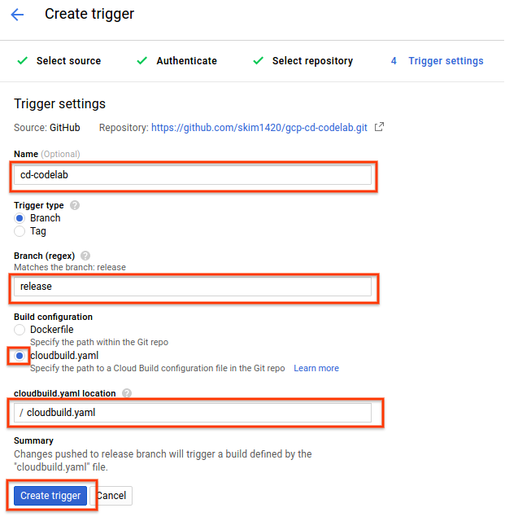

* After the repo mirroring completes, in the *Trigger Settings* section:
  * Enter "cd-codelab" for *Name*.
  * Leave the *Trigger type* to "Branch".
  * Enter "release" in the *Branch* field. There will be a warning that the
  name does not match any branch; you can ignore this as you will be creating
  the branch in the next part.
  * Select "cloudbuild.yaml" for *Build configuration*.
  * Enter "cloudbuild.yaml" for *cloudbuild.yaml location*.
  * Click the *Create trigger* button

To try out the build, and to seed the container registry for selection later in
Spinnaker, trigger the build by pushing to the release branch (note: if you
have enabled GitHub two-factor authentication, you may need to generate a
[personal access token](https://help.github.com/articles/creating-a-personal-access-token-for-the-command-line/)
and use that in place of your GitHub password):

```
git checkout -b release
git add main.go cloudbuild.yaml Dockerfile
git commit -m 'First build!'
git push origin release
```

## Part 2: Create Your Deployment Pipelines

Open an SSH tunnel through which your local workstation will connect to
Spinnaker. Fill in your GCP project for `GCP_PROJECT_ID` and the zone that
Spinnaker was created in for `ZONE`. Note that this command is the same as the
one provided in the *Accessing Spinnaker through SSH Tunnel* section after
you provisioned your Spinnaker instance using Cloud Launcher.

```
GCP_PROJECT_ID={GCP_PROJECT_ID}
GCP_ZONE={ZONE}

gcloud compute ssh spinnaker-cd-codelab \
    --project $GCP_PROJECT_ID \
    --zone $GCP_ZONE \
    --ssh-flag="-L 8084:localhost:8084" \
    --ssh-flag="-L 9000:localhost:9000"
```

### Create a Spinnaker Application

From the [Spinnaker](http://localhost:9000) home page, create a new Spinnaker
Application by clicking on the *Actions* drop down at the upper right and
clicking on *Create Application*.

In the *New Application* dialog:

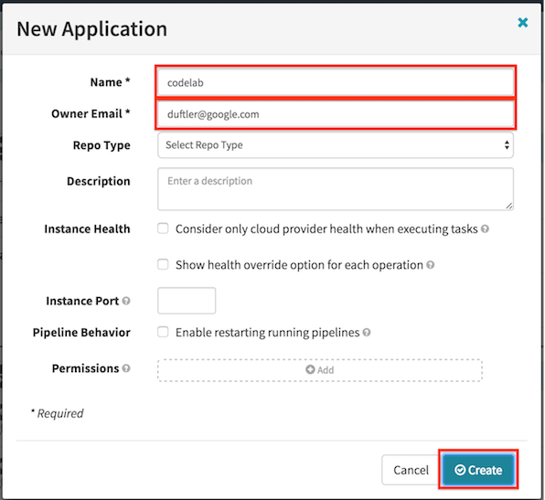

* Enter “codelab” for *Name*.
* Enter your email for *Owner Email*.
* Click the *Create* button.

### Create Kubernetes Load Balancers

First we create 2 load balancers ("LoadBalancer" type services), one for our
*stage* environment and another for our *prod* environment.

Navigate to the [LOAD BALANCER](http://localhost:9000/#/applications/codelab/loadBalancers)
page. Click the *Create Load Balancer* button, choose the kubernetes provider,
and click *Next*.

In the *Create New Load Balancer dialog*:

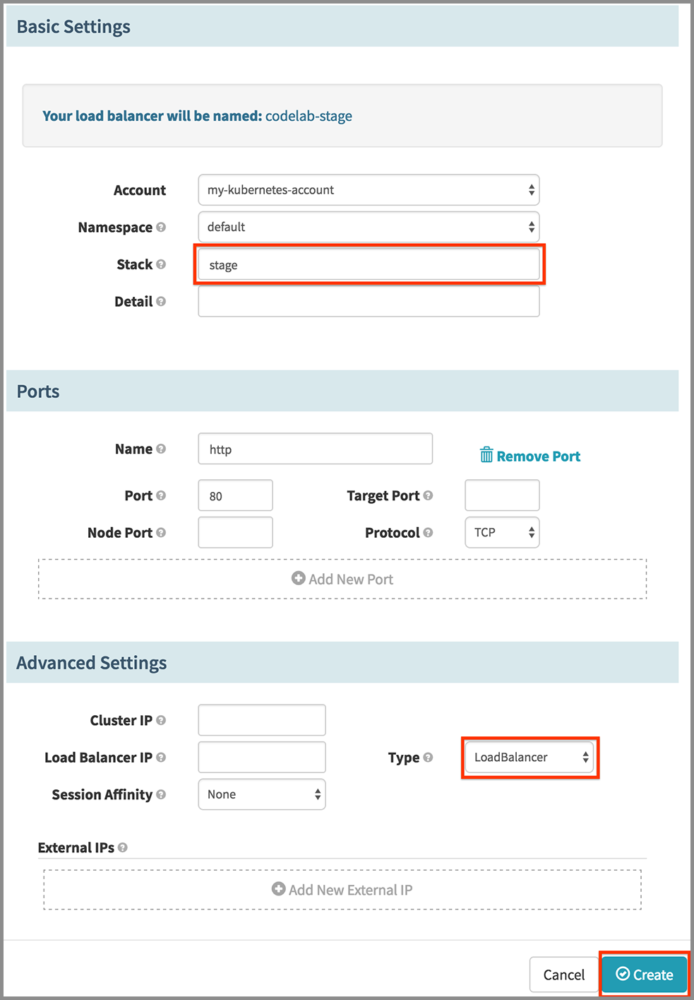

* Under *Basic Settings* section, enter "stage" for *Stack*.
* Under *Advanced Settings* section, select "LoadBalancer" in the *Type* drop
down.
* Click the *Create* button.

Create a second load balancer, specifying "prod" for *Stack*.

### Pipeline: Deploy to Stage

The purpose of this pipeline is to deploy the container that was built to a
staging environment. We want this pipeline to be kicked off when a new image
tag is pushed to the container registry for our app.

Navigate to the [PIPELINES](http://localhost:9000/#/applications/codelab/executions)
page and click the *Create* button. Name it "Deploy to Stage" and click the
*Create Pipeline* button.

* Under the *Automated Triggers* heading, click *Add Trigger*.

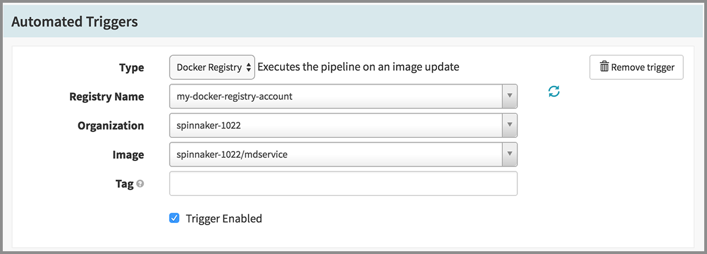

* Select "Docker Registry" in the *Type* drop down.
* Select "my-docker-registry-account" for *Registry Name*.
* Select your project for *Organization*.
* Select "{YOUR_GCP_PROJECT_ID}/gcp-cd-codelab" for *Image*.
* Leave the tag blank.

Take the image that triggered this pipeline and deploy to "stage" environment:

* Click *Add Stage*.
* Select "Deploy" in the *Type* drop down.
* Under the *Deploy Configuration* section, click *Add server group*.
* Choose the kubernetes provider and click *Next*.
* In the *Template Selection* dialog that appears, click the *Continue without
a template* button.

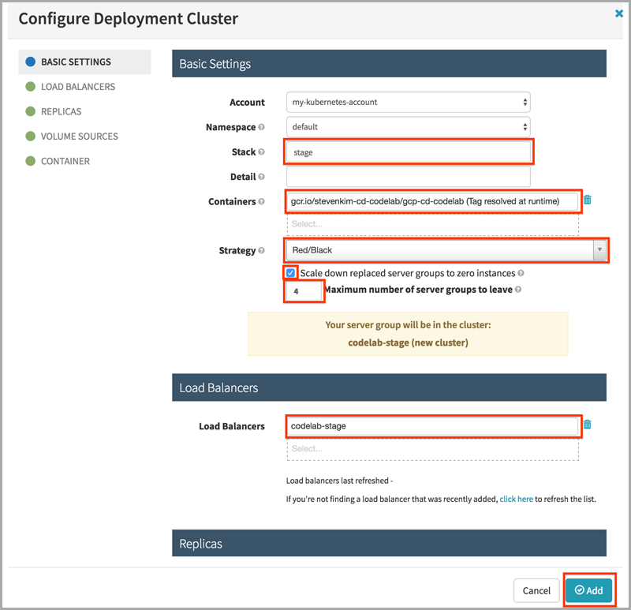

* In the *Configure Deployment Cluster* dialog:
  * Enter "stage" for *Stack*.
  * For *Containers*, choose the image that is marked "(Tag resolved at
runtime)".
  * Select "Red/Black" in the *Strategy* drop down.
  * Check on the *Scale down replaced server groups to zero instances* checkbox.
  * Enter "4" for *Maximum number of server groups to leave*.
  * Click in the *Load Balancers* field and select "codelab-stage".
  * Click the *Add* button.

Save the pipeline by clicking the *Save Changes* button at the bottom right.

### Pipeline: Validate

This pipeline is a simple manual judgment pipeline for user validation of the
stage deployment. We want this pipeline to kick off when the "Deploy to Stage"
pipeline completes successfully.

From the [PIPELINES](http://localhost:9000/#/applications/codelab/executions)
page, click the *Create* button. Name it "Validate" and click the *Create Pipeline*
button.

* Under the *Automated Triggers* heading, click *Add Trigger*.

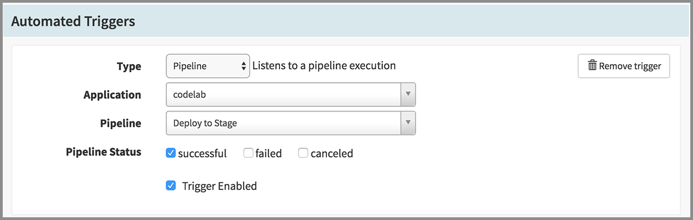

* Select "Pipeline" in the *Type* drop down.
* Select "codelab" for *Application*.
* Select "Deploy to Stage" for *Pipeline*.
* Check on "successful" for *Pipeline Status*

Ask the user for manual verification:

* Click *Add Stage*.


* Select "Manual Judgment" in the *Type* drop down.

Save the pipeline by clicking the *Save Changes* button at the bottom right.

### Pipeline: Promote to Prod

This promotion pipeline takes what was previously deployed and validated in
"stage" and makes a deployment out to prod. We want this pipeline to kick off
when the "Validate" pipeline completes successfully.

From the [PIPELINES](http://localhost:9000/#/applications/codelab/executions)
page, click the *Create* button. Name it "Promote to Prod" and click the *Create
Pipeline* button.

* Under the *Automated Triggers* heading, click *Add Trigger*.

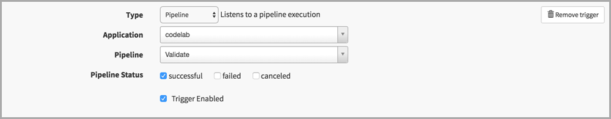

* Select "Pipeline" in the *Type* drop down.
* Select "codelab" for *Application*.
* Select "Validate" for *Pipeline*.
* Check on "successful" for *Pipeline Status*

Find the image that was last deployed in "stage":

* Click *Add Stage*.

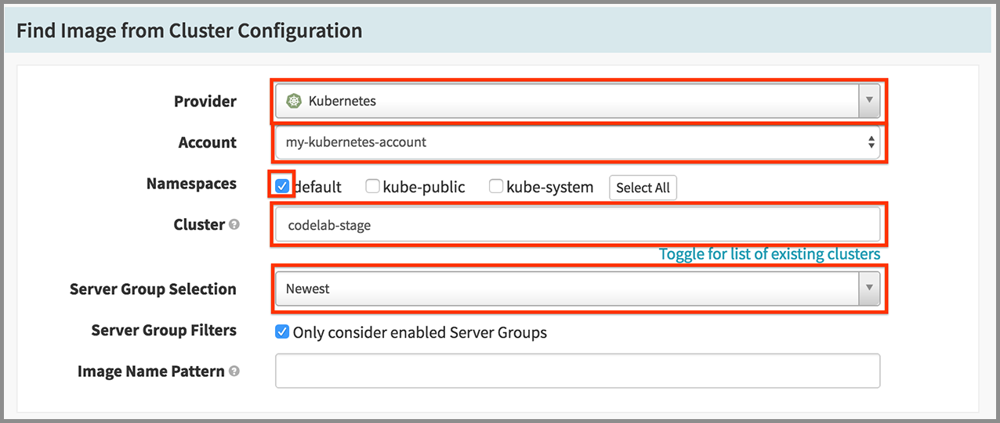

* Select "Find Image from Cluster" in the *Type* drop down.
* Select "Kubernetes" in the *Provider* drop down.
* Check on "default" for *Namespaces*.
* Enter "codelab-stage" for *Cluster*, where we'll look for our image to deploy.
* Select "Newest" in the *Server Group Selection* drop down, since we want what
was last deployed there.

Deploy this image to "prod":

* Click *Add Stage*.
* Select "Deploy" in the *Type* drop down.
* In the *Server Groups* section, click *Add server group*.
* Choose the kubernetes provider and click *Next*.
* In the *Template Selection* dialog that appears, click the *Continue without a
template* button.

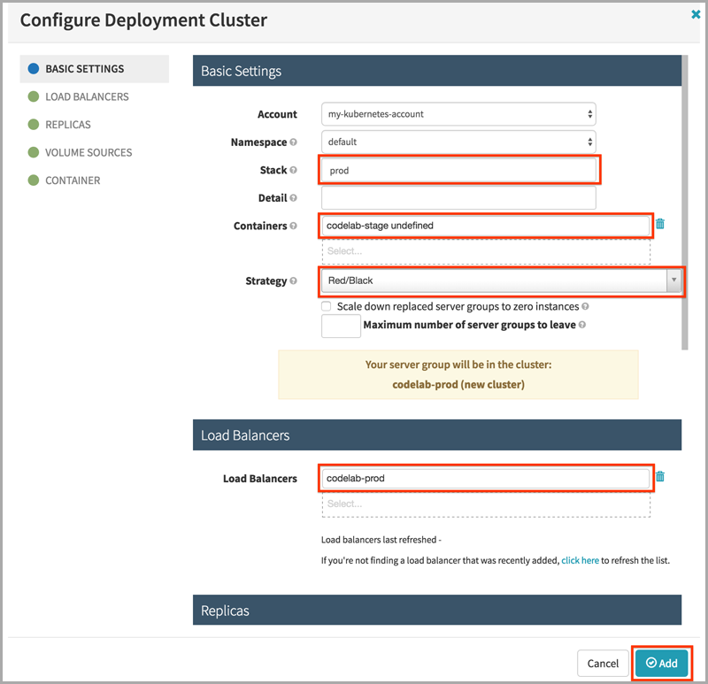

* In the *Configure Deployment Cluster* dialog:
  * Enter "prod" for *Stack*.
  * Select "codelab-stage undefined" for *Containers*.
  * Select "Red/Black" in the *Strategy* drop down.
  * Click in the *Load Balancers* field and select "codelab-prod".
  * Click the *Add* button.

Wait for a bit..

* Click *Add Stage*.

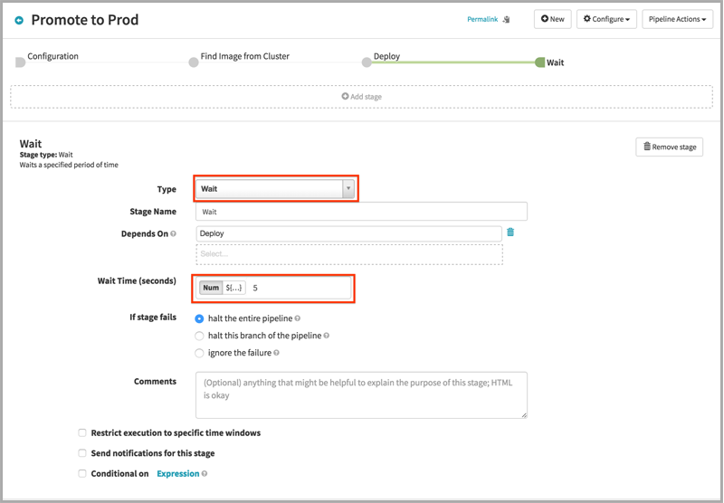

* Select "Wait" in the *Type* drop down.
* Enter "5" for *Wait Time (seconds)*.

Scale down the old prod (but don't destroy it yet):

* Click *Add Stage*.

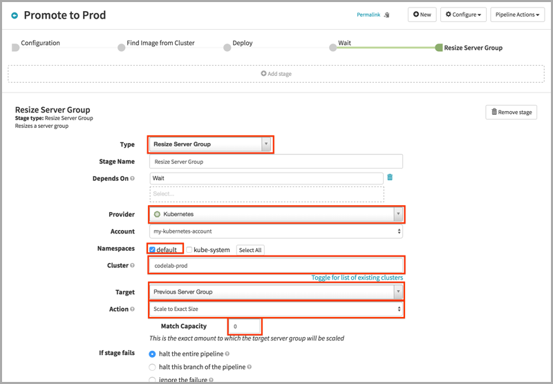

* Select "Resize Server Group" in the *Type* drop down.
* Select "Kubernetes" in the *Provider* drop down.
* Check on "default" for *Namespaces*.
* Enter "codelab-prod" for *Cluster*.
* Select "Previous Server Group" in the *Target* drop down.
* Select "Scale to Exact Size" in the *Action* drop down.
* Enter "0" for *Match Capacity*.

Wait for a bit again...

* Click *Add Stage*.

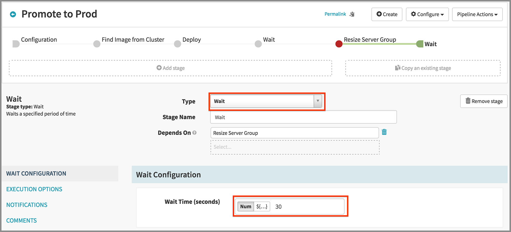

* Select "Wait" in the *Type* drop down.
* Enter "30" for *Wait Time (seconds)*.

Finally, destroy the old prod altogether:

* Click *Add Stage*.

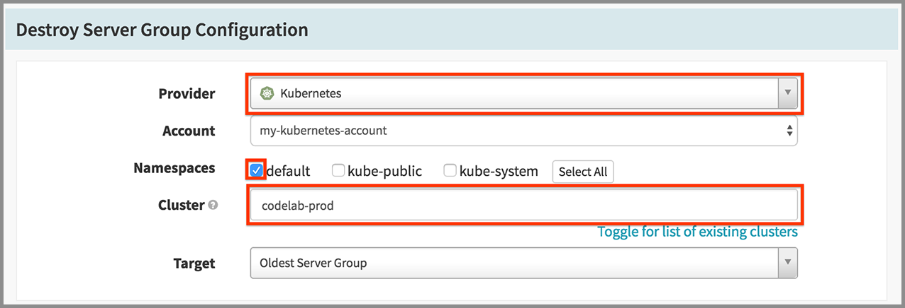

* Select "Destroy Server Group" in the *Type* drop down.
* Select "Kubernetes" in the *Provider* drop down.
* Check on "default" for *Namespaces*.
* Enter "codelab-prod" for *Cluster*.
* Select "Oldest Server Group" in the *Target* drop down.

Save the pipeline by clicking the *Save Changes* button at the bottom right.

## Part 3: Run Your Setup

### Promote code by pushing to a release branch in GitHub

Edit `main.go` and update the message:

```
package main

import (
	"io"
	"net/http"
)

func hello(w http.ResponseWriter, r *http.Request) {
	io.WriteString(w, "Hello GCP CD!")
}

func main() {
	http.HandleFunc("/", hello)
	http.ListenAndServe(":80", nil)
}
```

Push to the `release` branch:

```
git checkout release
git add main.go
git commit -m "New hello message"
git push origin release
```

### Google Container Registry triggers a container build

This will trigger an automatic build by GCR. You can check the status of your
build by navigating to the [Cloud Console Build history section](https://console.cloud.google.com/gcr/builds).

When the build completes, a new container image will be added to your registry,
tagged with the git hash of the last commit. Navigate to Cloud Console
Container Registry to see.

### Spinnaker pipeline deploys the container to a staging environment

A new tag will trigger the Spinnaker "Deploy to Stage" pipeline to trigger,
resulting in the creation of a new Spinnaker Server Group, which corresponds
to a Kubernetes replica set.

### Validate the deployment in the staging environment

Naviate to Spinnaker's [CLUSTERS](http://localhost:9000/#/applications/codelab/clusters)
page, where you should see a "codelab-stage" cluster with one server group
deployed to it. Next to the server group, click the load balancer icon (blue
upside-down pitchfork thing). An info pane on the right will contain a link,
"Ingress IPs". Clicking on it will open a new page with your recent code changes
included.

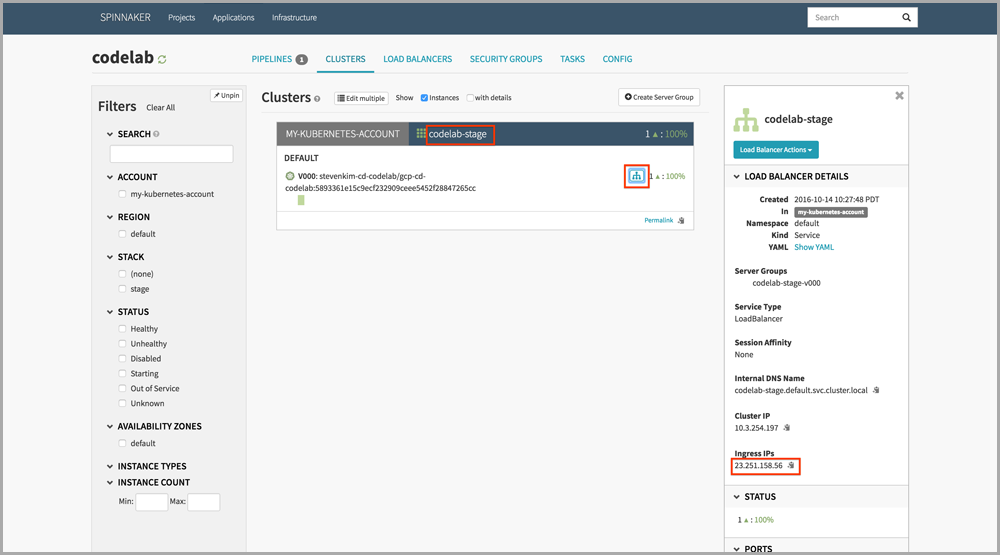

If you don't see your new message, the princess is in another castle. Start
over at the top of this codelab.

When your new change has been validated, navigate back to the
[PIPELINES](http://localhost:9000/#/applications/codelab/executions) tab,
click on the pending stage of the "Validate" pipeline (yellow bar) and click
the "Continue" button.

### Spinnaker pipeline promotes the container to the production Kubernetes
environment

You'll see the "Promote to Prod" pipeline kick off. The first time that you run
this, the "Resize Server Group" stage will fail, as past deployments don't
exist. This is normal, and if you'd like to see the full effect you can run
through this section ([Part 3](#part-3-run-your-setup)) again. Also, various
stages can take a while (no longer than 5 minutes), so be patient!

## Part 4: Tear Down

### Destroy your server groups

Click on each server group and use the context menu to destroy it:

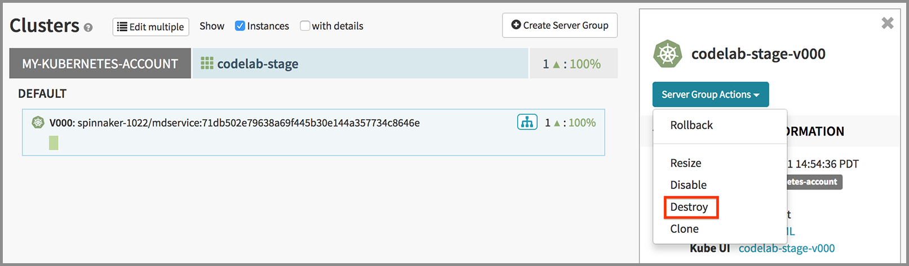

### Delete your load balancers

Click on each load balancer and use the context menu to delete it:

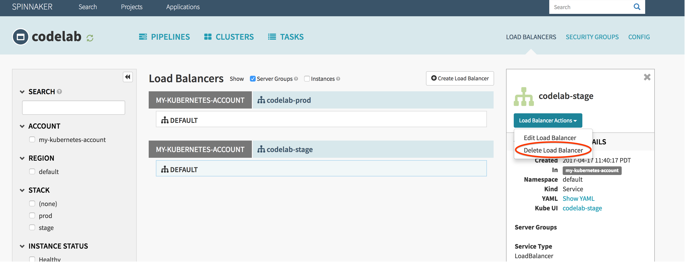

### Delete the Cloud Launcher Deployment

Delete the Deployment and associated GCE VM provisioned by Cloud Launcher:
[spinnaker-cd-codelab deployment](https://pantheon.corp.google.com/deployments/details/spinnaker-cd-codelab)

### Delete the GCS bucket

Delete the GCS [bucket](https://console.cloud.google.com/storage). Should have a
name like `spinnaker-{GCP_PROJECT_ID}`.
