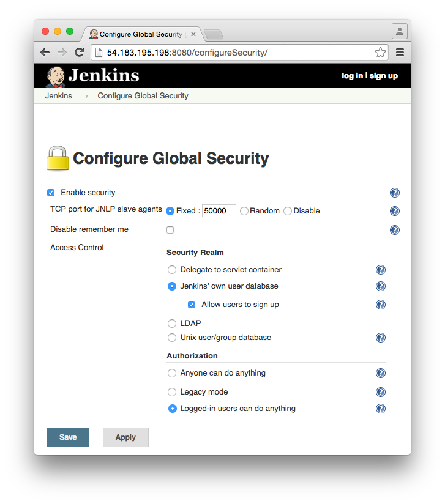
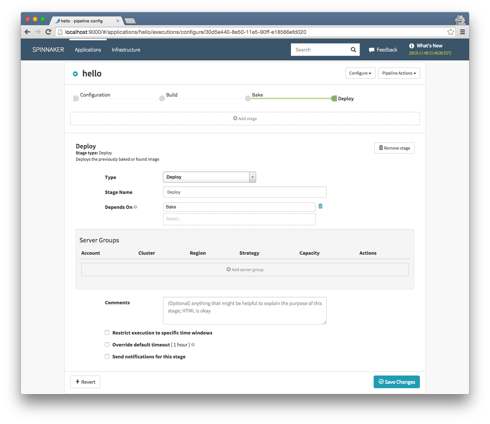



This guide will run through the workflow of setting up an example application deployment with 
Spinnaker. It assumes you already have Spinnaker up and running on AWS or 
GCE. A guide for installation can be found [here](/setup/install/).

Below is a diagram of the workflow we will setup.


## Setup Jenkins

Jenkins is a powerful continuous integration server that allows us to do several important things:

* Poll our Github repository for changes so Spinnaker knows when to run a pipeline.
* Compile and build our example application into a .deb package so Spinnaker can bake it on an 
image. Spinnaker expects all applications to be deployed as deb packages.

### Installing Jenkins

If you already have a Jenkins server, you can skip this step. However be sure that port 9999 on the 
server is open to the internet if you plan to host your deb repository there. Also be sure that your
 Jenkins port is accessible by your Spinnaker instance.

SSH into your instance and run the following:

```
$ sudo apt-get update
$ sudo apt-get upgrade
$ sudo apt-get install openjdk-8-jdk
$ wget -q -O - https://jenkins-ci.org/debian/jenkins-ci.org.key | sudo apt-key add -
$ sudo sh -c 'echo deb http://pkg.jenkins-ci.org/debian binary/ > /etc/apt/sources.list.d/jenkins.list'
$ sudo apt-get update
$ sudo apt-get install jenkins git
$ sudo service jenkins start
```

Visit port :8080 on your instance and you should see Jenkins startup and present the dashboard.

### Enable Jenkins API

Spinnaker communicates with Jenkins by using its REST API. However the API is not enabled by 
default. To enable it we first must enable global security (which is a good idea anyway). Click 
"Manage Jenkins" then "Configure Global Security". Under Access Control check "Jenkins own database"
 and "allow users to sign up". Under authorization check "Logged-in users can do anything" and save.



You will now be presented with a login screen. Click the "Create an account" link to register. Take 
note of your username and password, Spinnaker will need them later. Now you can turn off allowing 
users to register as you can add them manually from the control panel. The Jenkins API is now 
enabled.

### Setup deb repo

There are several options you can use to setup your private deb repo. This involves leveraging a 
tool to create the file structure and format for your .deb packages. You will also need to serve 
them publicly on the internet so they can be installed.

##### deb-s3

[deb-s3](https://github.com/krobertson/deb-s3) is a ruby gem that allows you to create a publish 
your packages directly to an s3 bucket. The nice part about this is that you do not have to concern 
yourself with setting up ports or configuring a web server. S3 handles everything for us.

First create a new s3 bucket to hold your packages, take note of the name and region.

Next edit the properties of your bucket and turn on static website hosting.


We will now install deb-s3 on our Jenkins server.

Log in to your Jenkins user (you may need to add it to your sudoers file) and install Ruby and 
bundler:

```
$ sudo apt-get install software-properties-common
$ sudo apt-add-repository ppa:brightbox/ruby-ng
$ sudo apt-get update
$ sudo apt-get install build-essential ruby2.2 ruby2.2-dev zlib1g-dev liblzma-dev
$ sudo gem install bundler
```
now install the deb-s3 gem globally
```
$ sudo gem install deb-s3
```
The address of your repo will now be `http://BUCKET-NAME.s3-website-REGION-NAME.amazonaws.com trusty main`


#### Aptly

[Aptly](http://www.aptly.info/) is a tool that easily allows us to manage and publish the packages 
to the local filesystem. After we install and configure the tool, nginx will host the repository on 
our jenkins server so it can be consumed during the bake process. Since nginx will run on port 9999 
it is important that this port on your Jenkins server will be accessible from the internet.

The following will install aptly to the jenkins user home directory so our jobs can easily use it. 
We will also create our repo so the jobs can easily add packages.

```
$ sudo su - jenkins
$ cd ~
$ wget https://dl.bintray.com/smira/aptly/0.9.5/debian-squeeze-x64/aptly
$ chmod +x aptly
```

Create our repo named "hello"

```
$ ./aptly repo create hello
```

We will now publish our (currently empty) repo and setup nginx to host it on port 9999.

```
$ ./aptly publish repo -architectures="amd64" -component=main -distribution=trusty -skip-signing=true hello
```
### Setup Nginx to serve aptly deb repo
Install and configure nginx

```
$ sudo apt-get install nginx
$ sudo vim /etc/nginx/sites-enabled/default
```

Contents of /etc/nginx/sites-enabled/default:

```
server {
        listen 9999 default_server;
        listen [::]:9999 default_server ipv6only=on;
        root /var/lib/jenkins/.aptly/public;
        index index.html index.htm;
        server_name localhost;
        location / {
                try_files $uri $uri/ =404;
        }
}
```

Start nginx `sudo service nginx start`

the address of the repo will be `http://JENKINS-SERVER:9999 trusty main`

### Fork example application

We have set up an example application with a gradle.build ready to package your app for spinnaker 
deployment. Fork [https://github.com/kenzanlabs/hello-karyon-rxnetty](https://github.com/kenzanlabs/hello-karyon-rxnetty) 
via the github UI so you can make changes and see them flow through the Spinnaker pipeline.

### Create Jenkins jobs

We will now setup our Jenkins jobs for spinnaker to use.

1. Polling job

The first is a simple job that polls our git repo for changes. Spinnaker has no knowledge of our 
repo location, so it needs a way to trigger a pipeline automatically when code is pushed. 
(A pipeline is a set of actions that handle the application delivery) Spinnaker will poll our 
polling job and kick off a pipeline when it detects a fresh run.

* Ensure the Jenkins git plugin is enabled and create a new freesyle Project named "Hello Poll".
* Add your app fork git address.
* Under build triggers check "Poll SCM" and enter `* * * * *` for Jenkins to poll once a minute. You
 can now save the job.


2. Build and publish job

This job will be responsible for building and publishing our package, along with passing the package
 and version name to Spinnaker.

* Create a new freestyle job named "HelloBuild".
* Add the git url for your application fork
* Add a build step for "execute shell"
* In the textbox, cleanup prior builds and execute the packDeb task `./gradlew clean packDeb`
* If you used deb-s3 for your repo, add the following: 
  * `deb-s3 upload --bucket BUCKETNAME --arch amd64 --codename trusty --preserve-versions true build/distributions/*.deb`
* If you used aptly for your repo, add the following: 
 > `~/aptly repo add -force-replace hello build/distributions/*.deb
 > ~/aptly publish update -force-overwrite -architectures="amd64" -skip-signing=true trusty`
* Add a post-build action: "Archive the artifacts" with `build/distributions/*.deb` as the 
directory. This allows our deb package name to be passed to spinnaker.


## Configure Spinnaker

SSH to your Spinnaker instance by tunneling the needed ports. Tunneling ensures that Spinnaker is 
not accessible from the internet outside of your ssh connection. This is **very important** because 
anyone who has access to Spinnaker can do anything your cloud account can do.

The ports needed:

* 9000: html/js UI (Deck)
* 8084: API entrypoint (Gate)
* 8087: Image bakery (Rosco)

```
ssh -i yourkey.pem -L 9000:127.0.0.1:9000 -L 8084:127.0.0.1:8084 ubuntu@instanceip
```

Spinnaker will be accessible on [http://localhost:9000](http://localhost:9000).

### Jenkins integration

Before we can begin setting up our workflow, we need to edit the Spinnaker configuration to allow 
it to communicate with our Jenkins server.

Begin by shutting down Spinnaker. Spinnaker configuration is stored in memory so we need to reload 
it every time we make a change. You can now edit the master configuration file:

```
# stop spinnaker
# vim /opt/spinnaker/config/spinnaker-local.yml
```

Scroll down to jenkins section and add your url, username and password from above

```
  jenkins:
    defaultMaster:
      name: Jenkins # The display name for this server
      baseUrl: http://jenkins-server:8080
      username: jenkinsuser
      password: jenkinspassword
```

You also need to enable igor, the service that communicates with the jenkins api.

```
igor:
    enabled: true
```

### Deb repository

The last configuration step is to add our deb repository address to the Rosco config. When Spinnaker 
is baking the application image, it will add this address to the sources list so it can 
`apt-get install` the deb package. For this reason it is important that port 9000 is open on our 
Jenkins server which hosts the repo.

```
# vim /opt/rosco/config/rosco.yml
```
Add your repo address from above. For example if we used deb-s3:

```
debianRepository: http://BUCKET-NAME.s3-website-REGION-NAME.amazonaws.com trusty main
```
We can now start Spinnaker and start configuring our workflow. `# start spinnaker`

## Create Spinnaker application and resources

The concept of an application allows us to group our resources and pipelines in a logical way. This 
makes it easy to manage our app in a single place instead of searching for items buried in menus.

* Visit http://localhost:9000 and click the actions button -> create application.
* Fill out the information, naming it "hello" and click save. We are now ready to add resources to 
our app.


### Create security group

Now we will create a security group to allow access to our application. Spinnaker only allows you to
 attach ingress sources based on another security group, so we first must create a base security 
 group via the aws console to allow traffic on port 8080.


Now we can use this group as an inbound rule for our application security group. Click the security 
groups tab and add a new group.


Select our group as ingress source


### Create load balancer

The load balancer will be the entry-point to our application scaling group. Click the load balancers
 tab and add it.


## Setup Spinnaker pipeline

We now have the necessary resources to begin pipeline creation. A pipeline is a group of actions 
that handle the complete lifecycle of our deployment. It is also a great centralized place to 
monitor the status of each stage instead of hopping between jenkins or the aws console.

Our pipeline is triggered by polling our Jenkins server to see if our code has updated. We then 
create two stages.

Click the pipelines tab and add a new pipeline.

### Pipeline trigger

Add a trigger and select "jenkins job" then we can select our jenkins server and choose the "hello 
poll" job. Spinnaker will poll jenkins for a successful run of this job. We know that if it ran then 
there is new code to deploy from github


### Build and package stage

The first stage in our pipeline will be to build and package our app. This also published our deb to
 our repository for baking. Choose Jenkins for type and select our "hellobuild" job.


### Bake stage

The next stage will bake our application. "Baking" refers to booting up an instance, installing our 
application package, and saving the os image for launching. All of this is handled by 
[packer](http://packer.io). Because our build stage returns the name of our deb artifact and knows 
our repo address, we simply need to select the region(s) and add our application package name. We 
can also take advantage of the async features of spinnaker and do a multi-region bake.


### Deploy stage

Spinnaker will automatically pass our baked image id to the deploy stage. This is where we set up 
our server group to be deployed to a cluster.




Click "add server group" and configure the server group.


Our app is fairly lightweight so t2.micro will be fine for instance type.


Choose two instances so we can be sure they our load balanced correctly. Our application will 
display the instance id so we can easily confirm this.


## Triggering the pipeline

We can trigger our pipeline several ways. The first way is to simply push to our github repo. 
Jenkins will detect this and run our polling job, which Spinnaker will detect and kick off our 
pipeline.


We then can see our pipeline progress to the bake stage.


Finally we reach our deploy stage where our server group is created.


We can also manually trigger the pipeline by clicking the "start manual execution" button. Then we 
can select a specific build of our app from Jenkins for Spinnaker to use.


