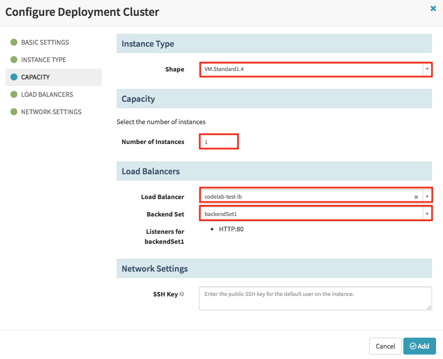



In this codelab, you will create a cohesive workflow which takes source code and builds, tests, and promotes it to production.

Building the binary from the source code is done outside of Spinnaker, typically in a CI system such as Jenkins, Travis, or Wercker. Spinnaker is integrated with three CI systems.  Workflows can be triggered by jobs in these CI systems.  The easiest binary form for Spinnaker to produce machine image is debian or rpm packages.

To simplify this tutorial, we will use tomcat8 debian package as a starting point.  It is assumed your CI jobs build and publish packages such as tomcat8 and your CI jobs will be used to trigger the Spinnaker workflow.

This tutorial covers the workflow which takes a package and bakes a machine image and then deploys, tests, and promotes it to production.

This will be accomplished via 3 pipelines:

* Bake & Deploy to Test
* Validate Test
* Promote to Prod


## Part 0: Set up environment

### Create a compute instance

Create a compute instance on Oracle Cloud Infrastructure (OCI) to host Spinnaker by following [this instructions](https://docs.cloud.oracle.com/iaas/Content/Compute/Tasks/launchinginstance.htm).  Spinnaker supports Ubuntu 16.04.

### Install and configure Spinnaker

SSH onto the compute instance you previously created.  `IP` is its public ip address.

```bash
ssh ubuntu@IP
```

* Install Halyard

```bash
curl -O https://raw.githubusercontent.com/spinnaker/halyard/master/install/debian/InstallHalyard.sh
sudo bash InstallHalyard.sh -y
```

* Set up Oracle Object Storage as your Spinnaker storage by following these steps: [Adding Oracle Object Storage to Spinnaker](/setup/install/storage/oracle/).

* Set up your Oracle Cloud provider account by following these [Adding Oracle Cloud Provider Account to Spinnaker](/setup/install/providers/oracle/) steps.

* Set up your Oracle Bakery by following these [Configuring Oracle Cloud Infrastructure Bakery](/setup/bakery/oracle/) steps.

<span class="begin-collapsible-section"></span>

Note that Oracle-provided images have a default set of firewall rules which allow only SSH access.  To bake an image that allows HTTP access like in this tutorial, you need a custom bake template like this one to place in ~/.hal/default/profiles/rosco/packer/codelab.json.

```json
{
  "variables": {
    "oracle_availability_domain": null,
    "oracle_region": null,
    "oracle_base_image_id": null,
    "oracle_compartment_id": null,
    "oracle_image_name": null,
    "oracle_instance_shape": null,
    "oracle_ssh_user_name": null,
    "oracle_subnet_id": null,
    "oracle_tenancy_id": null,
    "oracle_user_id": null,
    "oracle_fingerprint": null,
    "oracle_ssh_private_key_file_path": null,
    "oracle_pass_phrase": "",

    "appversion": "",
    "build_host": "",
    "build_info_url": "",
    "repository": "",
    "package_type": "",
    "packages": "",
    "upgrade": "",
    "configDir": null
  },
  "builders": [
    {
      "type": "oracle-oci",
      "availability_domain": "{{user `oracle_availability_domain`}}",
      "region": "{{user `oracle_region`}}",
      "base_image_ocid": "{{user `oracle_base_image_id`}}",
      "compartment_ocid": "{{user `oracle_compartment_id`}}",
      "image_name": "{{user `oracle_image_name`}}",
      "shape": "{{user `oracle_instance_shape`}}",
      "ssh_username": "{{user `oracle_ssh_user_name`}}",
      "subnet_ocid": "{{user `oracle_subnet_id`}}",
      "tenancy_ocid": "{{user `oracle_tenancy_id`}}",
      "user_ocid": "{{user `oracle_user_id`}}",
      "fingerprint": "{{user `oracle_fingerprint`}}",
      "key_file": "{{user `oracle_ssh_private_key_file_path`}}",
      "pass_phrase": "{{user `oracle_pass_phrase`}}"
    }
  ],
  "provisioners": [
    {
      "type": "shell",
      "script": "{{user `configDir`}}/install_packages.sh",
      "environment_vars": [
        "repository={{user `repository`}}",
        "package_type={{user `package_type`}}",
        "packages={{user `packages`}}",
        "upgrade={{user `upgrade`}}"
      ],
      "pause_before": "30s"
    },
    {
      "type": "shell",
      "inline": [
       "sudo iptables -I INPUT 1 -p tcp -m state --state NEW -m tcp --dport 8080 -j ACCEPT",
       "sudo netfilter-persistent save",
       "sudo systemctl restart netfilter-persistent.service"
      ]
    }
  ]
}
```

<span class="end-collapsible-section"></span>

* Set up Spinnaker version.  To complete this tutorial, Spinnaker version has to be at least 1.11.x.

```bash
hal config version edit --version $SPINNAKER_VERSION
```

* Execute the following commands to complete the installation:

```bash
hal config deploy edit --type localdebian 
sudo hal deploy apply
sudo systemctl daemon-reload
```

### Accessing Spinnaker

By default, the Spinnaker UI runs on port 9000. You can use an SSH tunnel to access this from your workstation.

```bash
ssh -A -L 9000:localhost:9000 -L 8084:localhost:8084 ubuntu@IP
```

Now Spinnaker UI is available at [http://localhost:9000](http://localhost:9000).

## Part 1: Bake & deploy to test

In this first exercise, you’ll set up a pipeline, named Bake & Deploy to Test, which builds an image, deploys it as a server group to a test cluster, then destroys the previous server group in that cluster (also called the "Highlander" strategy). 

The workflow is shown in the figure below.


### Create a Spinnaker application

Navigate to Spinnaker at [http://localhost:9000](http://localhost:9000).

From the Spinnaker home page, create a new Spinnaker Application by clicking on the *Actions* drop down at the upper right and clicking on *Create Application*.

In the *New Application* dialog:

* Enter "codelab" for *Name*.
* Enter your email for *Owner Email*.
* Add "oracle" to *Cloud Providers*.  If "oracle" is the only provider configured, there is no *Cloud Providers* field and "oracle" is the default provider.
* Click the *Create* button.


### Set up Virtual Cloud Network

Log into the OCI console and create a Virtual Cloud Network “codelabVCN” with "PLUS RELATED RESOURCES" option.

Take all the defaults for “codelabVCN”, with a couple of additions to the Ingress Rules in the “Default Security List for codelabVCN”.
* the instance to be deployed uses port 8080, add an Ingress Rule to allow TCP traffic for port 8080.
* the load balancer to be created in this tutorial listens on port 80, add an Ingress Rule to allow TCP traffic for port 80.

The Oracle Cloud Infrastructure Documentation on [Security Lists](https://docs.cloud.oracle.com/iaas/Content/Network/Concepts/securitylists.htm) has more details.

### Create a load balancer for test cluster

Navigate to the "Load Balancers" tab in Spinnaker and click the *Create Load Balancer* button:

* Enter “test” for *Stack*.
* Enter "lb" in the *Detail* field.
* Select your preferred load balancer shape in the *Shape* dropdown.
* Check *Private Load Balancer* only if you want to isolate your load balancer from the internet.
* Select your preferred account in the *Account* dropdown.
* Select your preferred region in the *Region* dropdown.
* Select “codelabVCN” in the *Virtual Network* dropdown.
* Add Subnets.  A public load balancer requires two subnets, each in a separate availability domain.


* Edit the *Backend Sets* section with “8080” for port.
* Edit the *Listeners* section to use the Backend Set just created on Listening Port “80”.
* Click the *Create* button.


### Set up pipeline: “Bake & Deploy to Test” pipeline

The purpose of this pipeline is to generate an image from a package, and then deploy the image on server groups in the test cluster. We want this pipeline to be kicked off every time the continuous integration job completes.

Create a new pipeline by navigating to the PIPELINES tab and clicking the link *Configure a new pipeline*

* Name the pipeline “Bake & Deploy to Test”.
* Click the *Create* button. 


#### Configure the pipeline

In reality, we would set up the pipeline with an automated trigger that will kick off the pipeline.  Assuming the package is built in CI (Jenkins/Travis/Wercker), in the Automated Triggers section of the pipelines form, you would add Jenkins/Travis/Wercker Trigger for your job so that every time these job completes the pipeline would start automatically.

To simplify this tutorial, we will skip the trigger and use tomcat8 package.

#### Set up Bake stage

The purpose of our “Bake” stage is to create an image with the package that was built by the CI job that triggered this pipeline.  It is tomcat8 in this tutorial.

* Click *Add stage*.
* Select “Bake” in the *Type* drop down.
* Select your preferred account in the *Oracle Account* field.
* Select your preferred region in the *Regions* field.
* Select your preferred base image as in the *Base Image* field.
* Enter “codelab” in the *Image Name* field.
* Enter “tomcat8” in the *Package* field.
* Enter “codelab.json” in the *Template File Name* field in the *Advanced Options*.
* Click the "Save Changes" button.


#### Set up Deploy stage for test cluster

The purpose of the “Deploy” stage is to take the image constructed in the “Bake” stage and deploy it into a test environment.

* Click *Add stage*.
* Select “Deploy” in the *Type* drop down.
* In the *Deploy Configuration* section, click *Add server group*.
* In the dialog that appears, click *Continue without a template*.
* In the Basic Settings section, select “codelabVCN” in the *VCN* drop down, select desired *Availability Domain* and *Subnet*, and enter “test” in the *Stack* field.


* In the Instance Type section, choose your preferred shape in the drop down.
* In the Capacity section, enter your preferred number of instances.
* In the Load Balancers section, select the load balancer and the Backend Set we created earlier.



* Click the "Add" button.
* Save this stage of the pipeline.

#### Destroy previous server group

In this tutorial use case, on successive deployments of new server groups to the test cluster, we don’t need the previous server group anymore.

* Click *Add Stage*.
* Select “Destroy Server Group” for *Type*.
* Check the region of the previous test server group that you want to destroy.
* Enter “codelab-test” for the *Cluster*.
* Select “Previous Server Group” for *Target*.
* Click *Save Changes*.


The pipeline is now complete. Take a moment to review the stages of this pipeline that you just built.

### Trying it out

Now let’s run this pipeline. We trigger it by manually triggering from the PIPELINES tab (click *Start Manual Execution*).

The first time this pipeline is run, the Destroy Server Group stage will fail, because the selector for “Previous Server Group” will find nothing (no server groups presently in the test cluster). The Deploy stage, however, does succeed, so a test cluster will be created.

Try running it again. It will succeed all the way, and your pipeline execution details will look like below:


You can now see in the CLUSTERS tab that a new server group (codelab-test-v001) has been deployed to the test cluster, and the previous server group (codelab-test-v000) is destroyed (i.e. does not exist).


## Part 2: Validate test

The second pipeline, named “Validate Test”, is a simple one-stage placeholder to represent some gating function before pushing to prod.


Furthermore, we configure the prod deployment to implement the red/black strategy (a.k.a. blue/green), which means that upon verifying health of the new server group it will immediately disable the previous server group in the same cluster. Here we disable rather than destroy, so that rollbacks can be quickly accomplished simply by re-enabling the old server group.

### Set up pipeline: “Validate Test”

Create a new pipeline by navigating to the PIPELINES tab and clicking *Configure*, then *Create Pipeline or Strategy*

* Name the pipeline “Validate Test”.
* Click the *Create Pipeline* button.


#### Configure the pipeline

We want this pipeline to kick off when the Bake & Deploy to Test pipeline completes.

* Click *Add Trigger*.
* Select “Pipeline” from the drop down menu for *Type*.
* Select your application.
* Select the “Bake & Deploy to Test” pipeline.
* Check “successful”.


#### Set up Manual Judgment stage

We stop and wait for human confirmation to continue:

* Click *Add stage*.
* Select “Manual Judgment” in the *Type* drop down.
* Specify *Instructions*, for example “Validate the test cluster”.
* Click *Save Changes*.


## Part 3: Promote to prod

The third pipeline, “Promote to Prod”, takes the image that was deployed in the test cluster, and deploys that image to the prod environment, thereby promoting it.

### Create a load balancer for prod cluster

We create a load balancer for the prod cluster. Navigate to the LOAD BALANCERS tab and click the *Create Load Balancer* button.  Everything is the same as [the "codelab-test-lb" load balancer](#create-a-load-balancer-for-test-cluster) created before.  The only exception is to use “prod” instead of “test” for *Stack*.

### Set up pipeline: “Promote to Prod” pipeline

Create a new pipeline by navigating to the PIPELINES tab and clicking *Configure*, then *Create New ...*

* Name the pipeline “Promote to Prod”.
* Click the *Create Pipeline* button.


#### Configure the pipeline

We want this pipeline to kick off when the Validate Test pipeline completes.

* Click *Add Trigger*.
* Select “Pipeline” from the drop down menu for *Type*.
* Select your application.
* Select the “Validate Test” pipeline.
* Check “successful”.


#### Set up Find Image stage

In this stage, we select the image that was deployed in the test cluster.

Click the *Add stage* button:

* Select “Find Image from Cluster” for the stage *Type*.
* Check the region of the test server group to pick the image from.
* Enter “codelab-test” for the *Cluster*.
* Choose “Newest” for the *Server Group Selection*.


#### Set up Deploy stage for prod cluster

We deploy the image that was picked, to the prod cluster.

* Click *Add stage*.
* Select “Deploy” in the *Type* drop down.
* In the *Server group* section, click *Add server group*.
* In the dialog that appears, click *Continue without a template*.
* In the Basic Settings section, everything is the same as [the “codelab-test” server group](#set-up-deploy-stage-for-test-cluster) created before.  The only exception is to use “prod” instead of “test” for *Stack*.
* In the Load Balancers section, add the “codelab-prod-lb” Load Balancer and the Backend Set previously created.
* Click the *Add* button.
* Click *Save Changes* to save your prod pipeline.


### Trying it out

Now let’s run through it all. Run a "Start Manual Execution" in Bake & Deploy to Test pipeline.

When the Bake & Deploy to Test pipeline completes, the Validate Test pipeline will trigger and wait for user input.


Click *Continue*. This will trigger the Promote to Prod pipeline:


In the CLUSTERS tab, you can see that a server group has been deployed to the prod cluster.


