

In this codelab, you will create a cohesive workflow which takes source code and builds, tests, and promotes it to production. This will be accomplished via 3 pipelines:

* Bake & Deploy to Test
* Validate Test
* Promote to Prod

## Part 0: Set up environment
We are assuming you have completed [configuring Spinnaker](http://www.spinnaker.io/v1.0/docs/target-deployment-configuration#section-openstack) with OpenStack. In this example, we will be using Jenkins to trigger our pipelines.

## Part 1: Bake & deploy to test

In this first exercise, you’ll set up a pipeline, named Bake & Deploy to Test, which builds an OpenStack image, deploys it as a server group to a test cluster, then destroys the previous server group in that cluster (also called the "Highlander" strategy). We will be triggering this pipeline with a Jenkins continuous integration job.

The workflow is shown in the figure below.

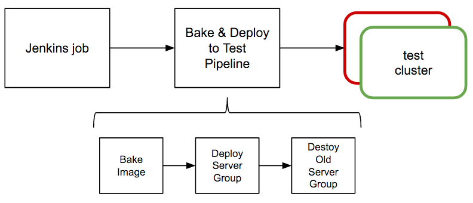

### Create a Spinnaker application

Navigate to Spinnaker at [http://localhost:9000](http://localhost:9000).

From the Spinnaker home page, create a new Spinnaker Application by clicking on the *Actions* drop down at the upper right and clicking on *Create Application*.

In the *New Application* dialog:

* Enter "codelab" for *Name*.
* Enter your email for *Owner Email*.
* Click the *Create* button.

### Create a security group
First we create a security group for your cluster. Navigate to the "SECURITY GROUPS" tab and click the *Create Security Group* button:

* Enter "test" for *Stack*.
* Enter "http" for *Detail*.
* Enter a relevant description for *Description*.
* Enter your preferred region for *Region*.
* Enter your preferred port forwarding specifications in the *Ingress* section.
* Click the *Create* button.

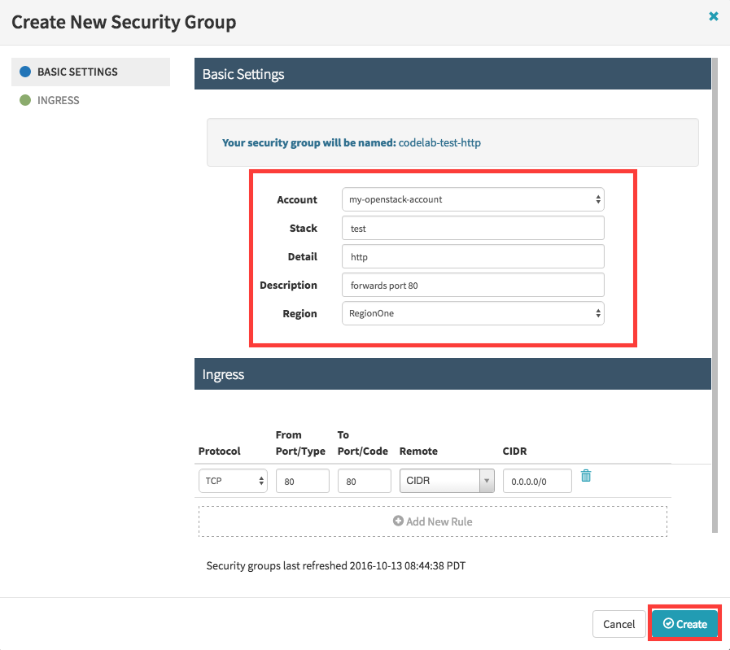

### Create a load balancer

Navigate to the "Load Balancers" tab and click the *Create Load Balancer* button:

* Enter “test” for *Stack*.
* Enter "lb" in the *Detail* field.
* Select your preferred subnet in the *Subnet* dropdown.
* Select your preferred network in the *Network* dropdown.
* Select "codelab-test-http" in the *Security Groups* dropdown.

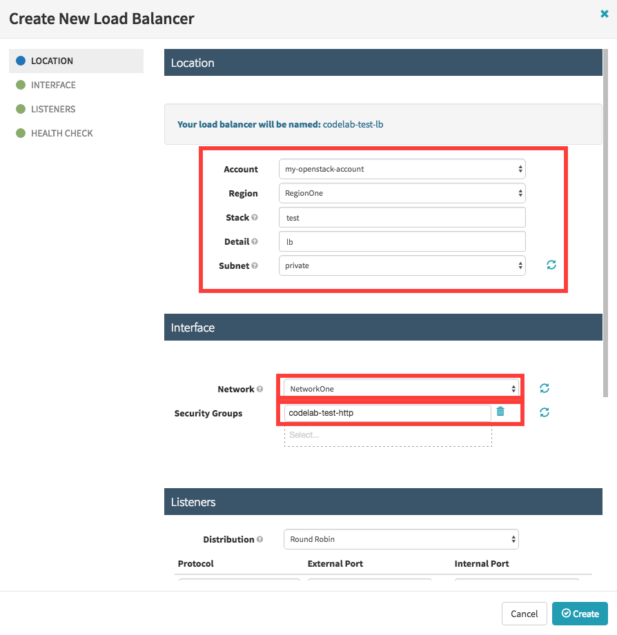

* Edit the *Listeners* section to your preference.
* Click the *Create* button.

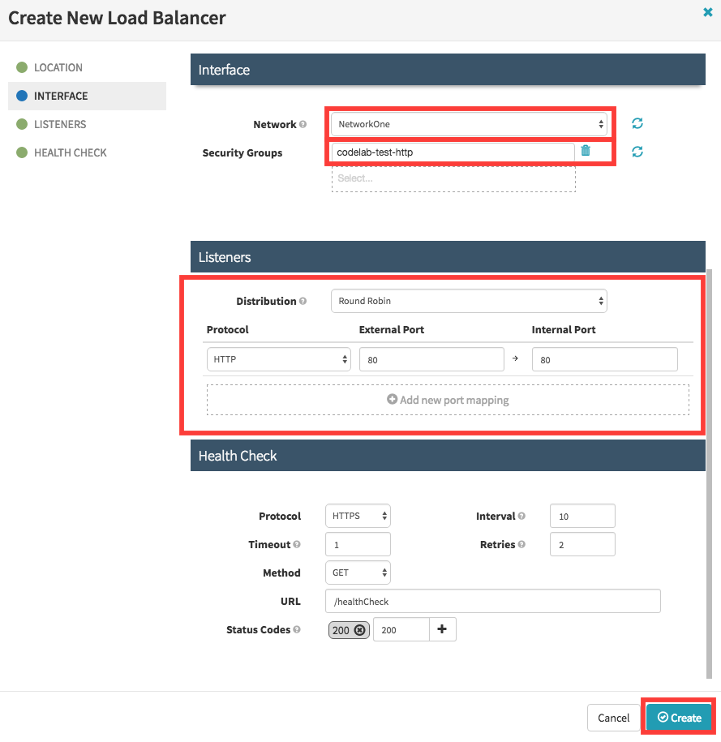

### Set up pipeline: “Bake & Deploy to Test” pipeline

The purpose of this pipeline is to generate a OpenStack image from a package, and then deploy the image on server groups in the test cluster. We want this pipeline to be kicked off every time the Jenkins continuous integration job completes.

Create a new pipeline by navigating to the PIPELINES tab and clicking the *New* button

* Name the pipeline “Bake & Deploy to Test”.
* Click the *Create Pipeline* button. 

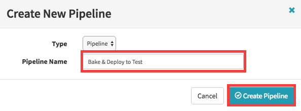

#### Configure the pipeline

The first step in setting up a pipeline is to configure the pipeline. In particular, we need to specify an automated trigger that will kick off the pipeline. We will be using Jenkins.

We want this pipeline to kick off every time our Jenkins job completes. In the Automated Triggers section of the pipelines form:

* Click *Add Trigger*.
* Select “Jenkins” from the drop down menu for *Type*.
* Specify your Jenkins instance for the *Master* field.
* Specify your job name for the *Job* field.

Refer to the figure below for an illustration of what the pipeline’s Configuration form looks like when we’re done.

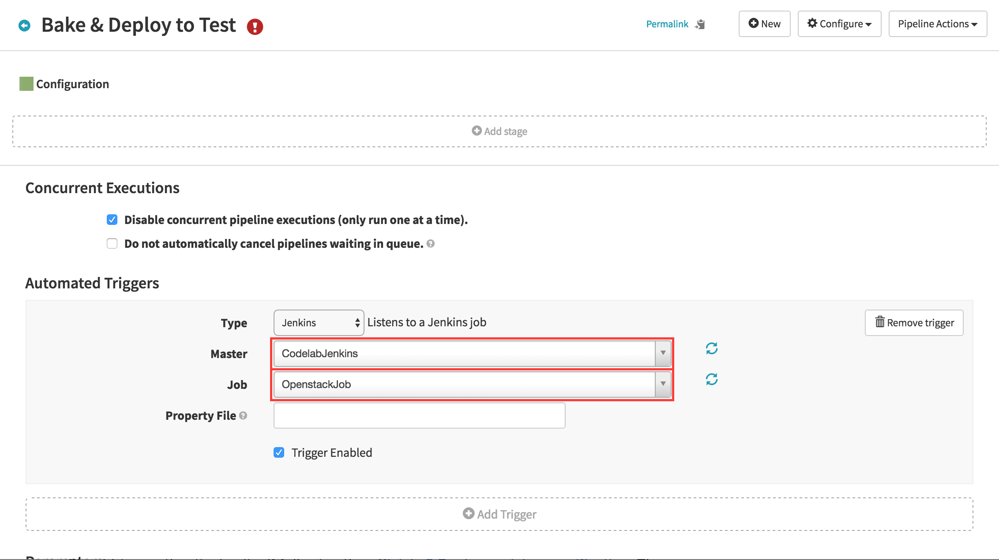

#### Set up Bake stage

The purpose of our “Bake” stage is to create a OpenStack image with the package that was built by the Jenkins job that triggered this pipeline.

* Click *Add stage*.
* Select “Bake” in the *Type* drop down.
* Select your preferred region in the "Regions" field.
* Enter the package you wish to include in the *Package* field.
* Select your preferred base image as in the *Base OS* field.
* Click the "Save Changes" button.

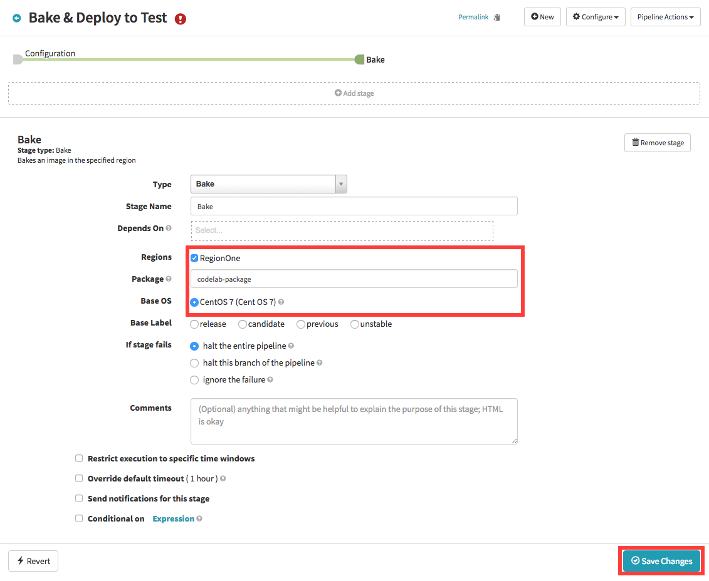

#### Set up Deploy stage

The purpose of the “Deploy” stage is to take the OpenStack image constructed in the “Bake” stage and deploy it into a test environment.

* Click *Add stage*.
* Select “Deploy” in the *Type* drop down.
* In the *Server group* section, click *Add server group*.
* In the dialog that appears, click *Continue without a template*.
* In the Location section, enter “test” in the *Stack* field.
* In the Instance Settings section, choose your preferred type in the drop down.
* In the Cluster Size section, enter your size preferences.

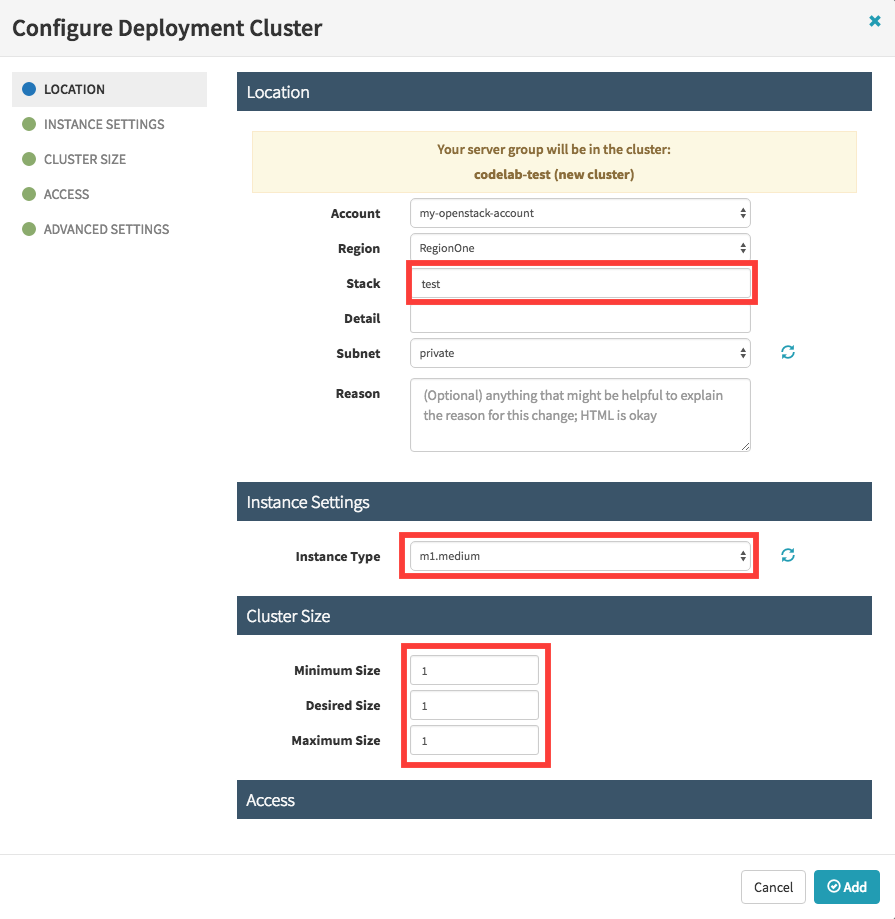

* In the Access section, input the load balancer and security group we created earlier.
* Click the "Add" button.
* Save this stage of the pipeline.

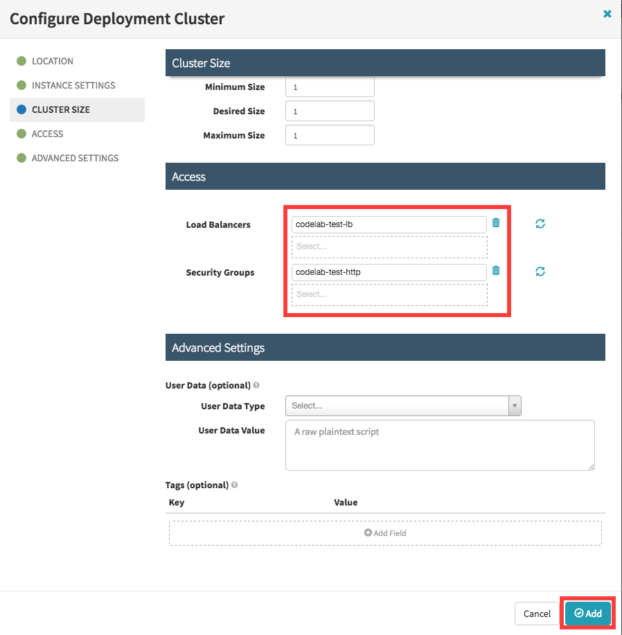

#### Destroy previous server group

In this tutorial use case, on successive deployments of new server groups to the test cluster, we don’t need the previous server group anymore.

* Click *Add Stage*.
* Select “Destroy Server Group” for *Type*.
* Check the region of the previous test server group that you want to destroy.
* Enter codelab-test for the *Cluster*.
* Select “Previous Server Group” for *Target*.
* Click *Save Changes*.

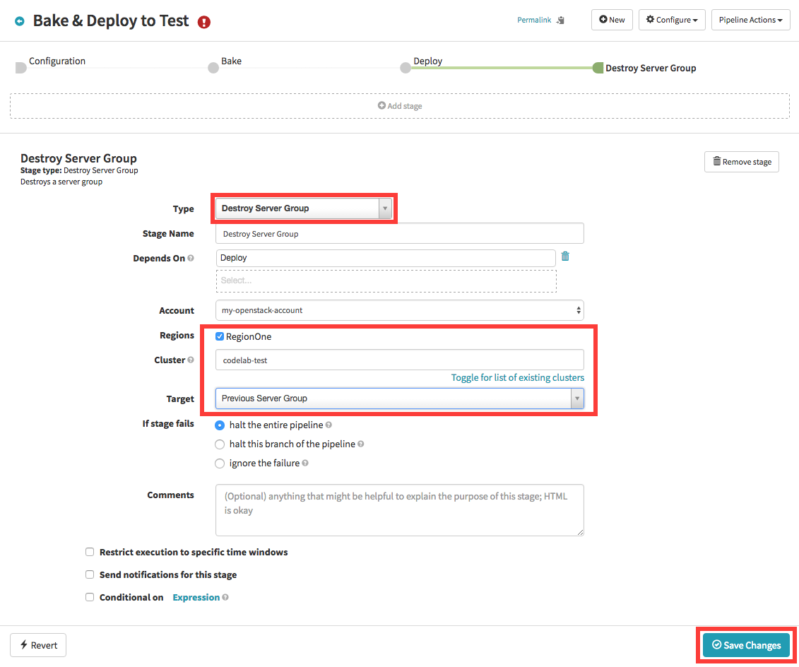

The pipeline is now complete. Take a moment to review the stages of this pipeline that you just built.

### Trying it out

Now let’s run this pipeline. We trigger it by manually running a Build of the Jenkins job.

* Navigate to your Jenkins console.
* Click on the your previously configured job.
* Click *Build Now*.

It may take a while for the polling to trigger the job, but soon in the PIPELINES tab you can see progress, status and details.

The first time this pipeline is run, the Destroy Server Group stage will fail, because the selector for “Previous Server Group” will find nothing (no server groups presently in the test cluster). The Deploy stage, however, does succeed, so a test cluster will be created.

Try running it again, either by running another Build of the Jenkins job, or by manually triggering from the PIPELINES tab (click *Start Manual Execution*). It will succeed all the way, and your pipeline execution details will look like below:

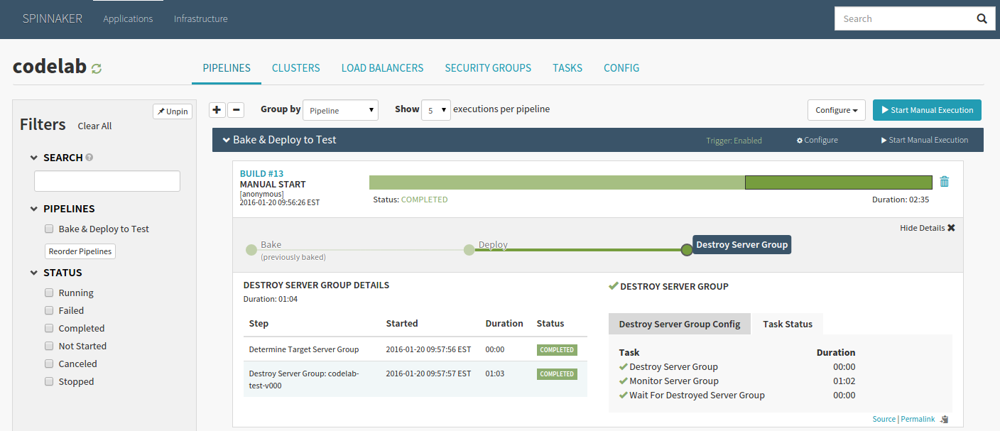

You can now see in the CLUSTERS tab that a new server group has been deployed to the test cluster, and the previous server group is destroyed (i.e. does not exist).

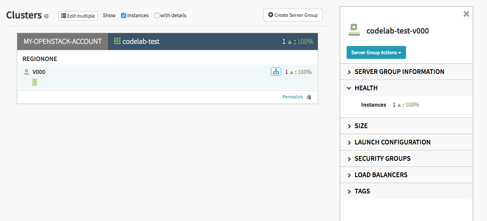

## Part 2: Validate test

The second pipeline, named “Validate Test”, is a simple one-stage placeholder to represent some gating function before pushing to prod.

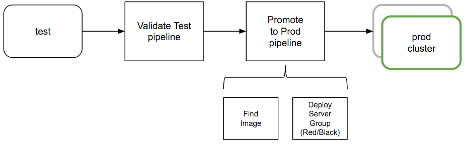

Furthermore, we configure the prod deployment to implement the red/black strategy (a.k.a. blue/green), which means that upon verifying health of the new server group it will immediately disable the previous server group in the same cluster. Here we disable rather than destroy, so that rollbacks can be quickly accomplished simply by re-enabling the old server group.

### Set up pipeline: “Validate Test”

Create a new pipeline by navigating to the PIPELINES tab and clicking *Configure*, then *Create New ...*

* Name the pipeline “Validate Test”.
* Click the *Create Pipeline* button.

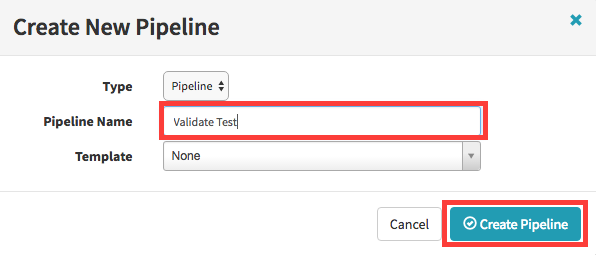

#### Configure the pipeline

We want this pipeline to kick off when the Bake & Deploy to Test pipeline completes.

* Click *Add Trigger*.
* Select “Pipeline” from the drop down menu for *Type*.
* Select your application.
* Select the “Bake & Deploy to Test” pipeline.
* Check “successful”.

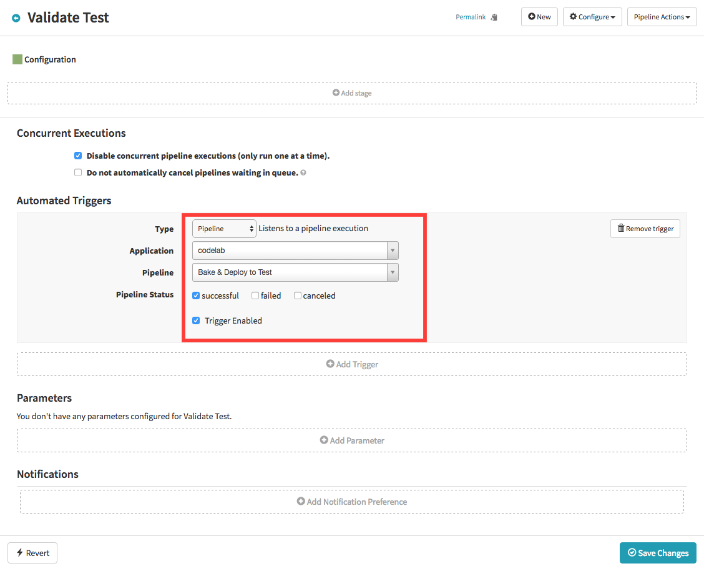

#### Set up Manual Judgment stage

We stop and wait for human confirmation to continue:

* Click *Add stage*.
* Select “Manual Judgment” in the *Type* drop down.
* Specify *Instructions*, for example “Validate the test cluster”.
* Click *Save Changes*.

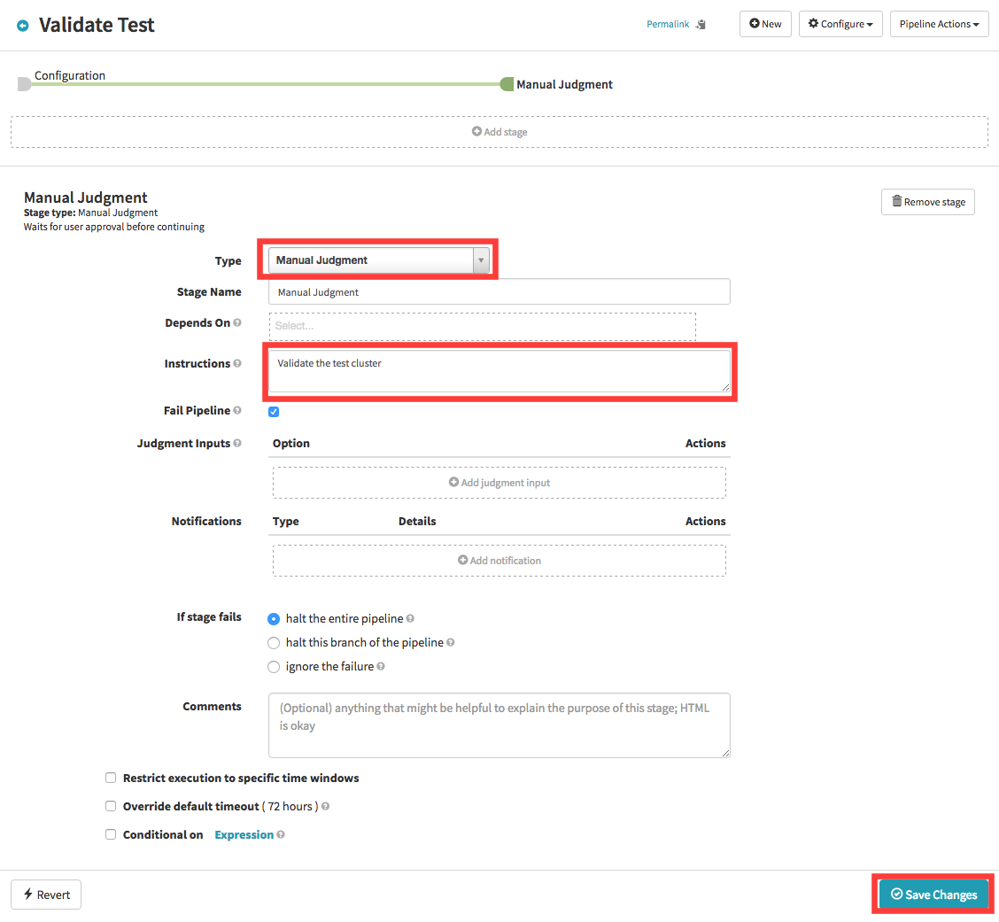

## Part 3: Promote to prod

The third pipeline, “Promote to Prod”, takes the image that was deployed in the test cluster, and deploys that image to the prod environment, thereby promoting it.

### Create a load balancer

We create a load balancer for the prod cluster. Navigate to the LOAD BALANCERS tab and click the *Create Load Balancer* button:

* Enter “prod” for *Stack*.
* Enter "lb" for *Detail*.
* Select your preferred subnet in the Subnet dropdown.
* Select your preferred network in the Network dropdown.
* Select "codelab-test-http" in the Security Groups dropdown.
* Click the *Create* button.

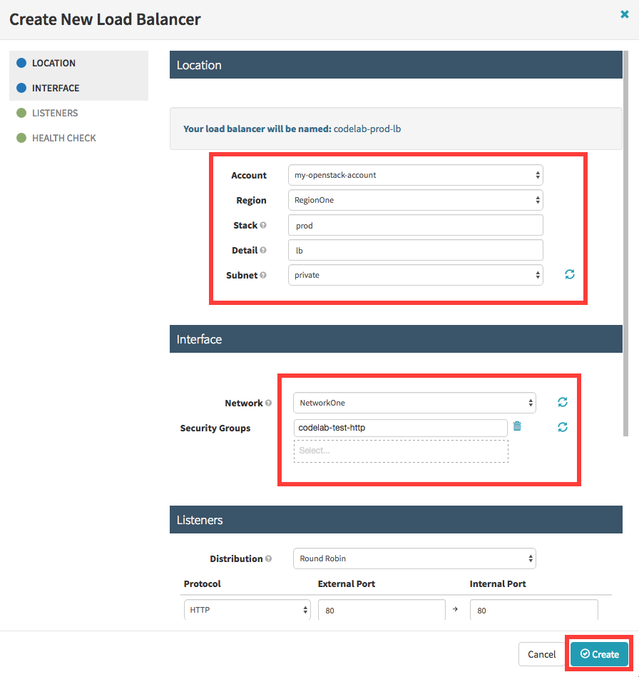

### Set up pipeline: “Promote to Prod” pipeline

Create a new pipeline by navigating to the PIPELINES tab and clicking *Configure*, then *Create New ...*

* Name the pipeline “Promote to Prod”.
* Click the *Create Pipeline* button.

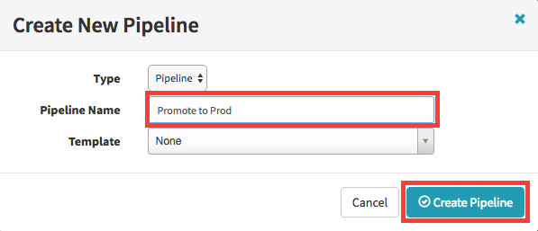

#### Configure the pipeline

We want this pipeline to kick off when the Validate Test pipeline completes.

* Click *Add Trigger*.
* Select “Pipeline” from the drop down menu for *Type*.
* Select your application.
* Select the “Validate Test” pipeline.
* Check “successful”.

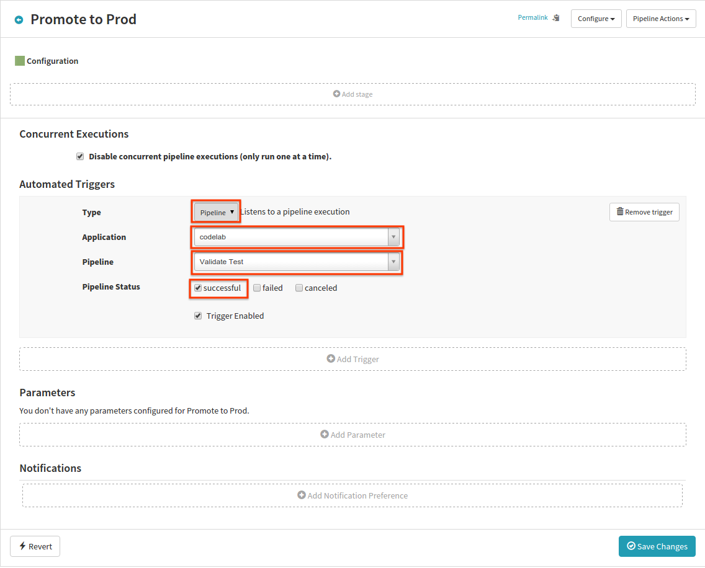

#### Set up Find Image stage

In the “Find Image from Cluster” stage, we select the image that was deployed in the test cluster.

Click the *Add stage* button:

* Select “Find Image from Cluster” for the stage *Type*.
* Check the region of the test server group to pick the image from.
* Enter codelab-test for the *Cluster*.
* Choose “Newest” for the *Server Group Selection*.

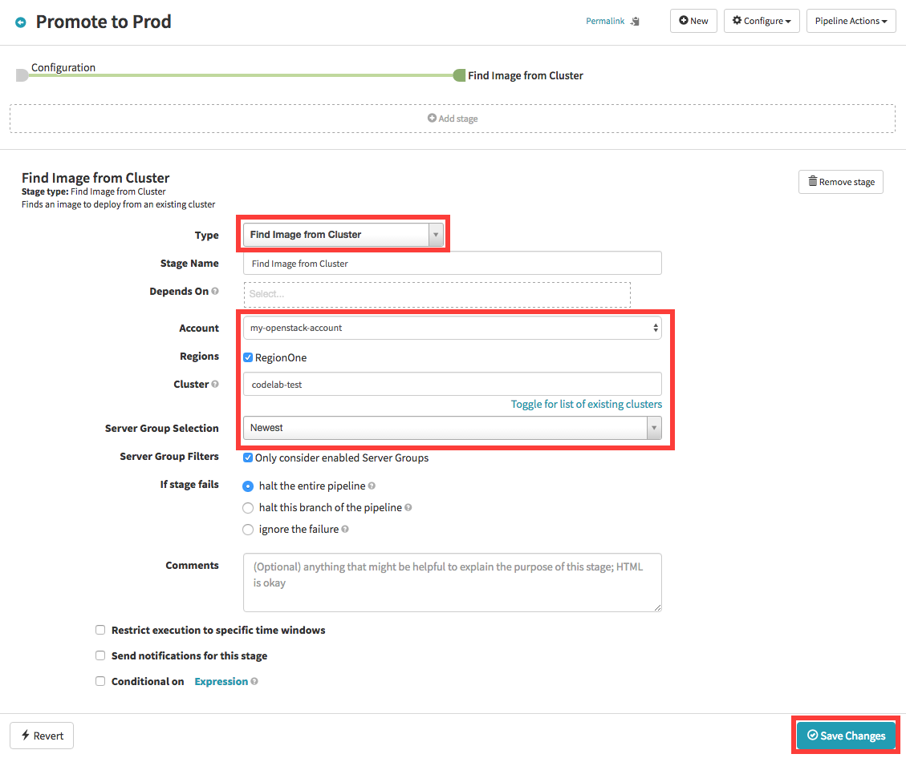

#### Set up the Deploy stage

We deploy the image that was picked, to the prod cluster.

* Click *Add stage*.
* Select “Deploy” in the *Type* drop down.
* In the *Server group* section, click *Add server group*.
* In the dialog that appears, click *Continue without a template*.
* In the Basic Settings section, enter “prod” in the *Stack* field.
* (Optional) Select a deployment strategy. Default is none.
* Select your preferred option in the Instance Type drop down.
* In the Access section, add the prod load balancer and the security group we previously created.
* Click the *Add* button.
* Click *Save Changes* to save your prod pipeline.

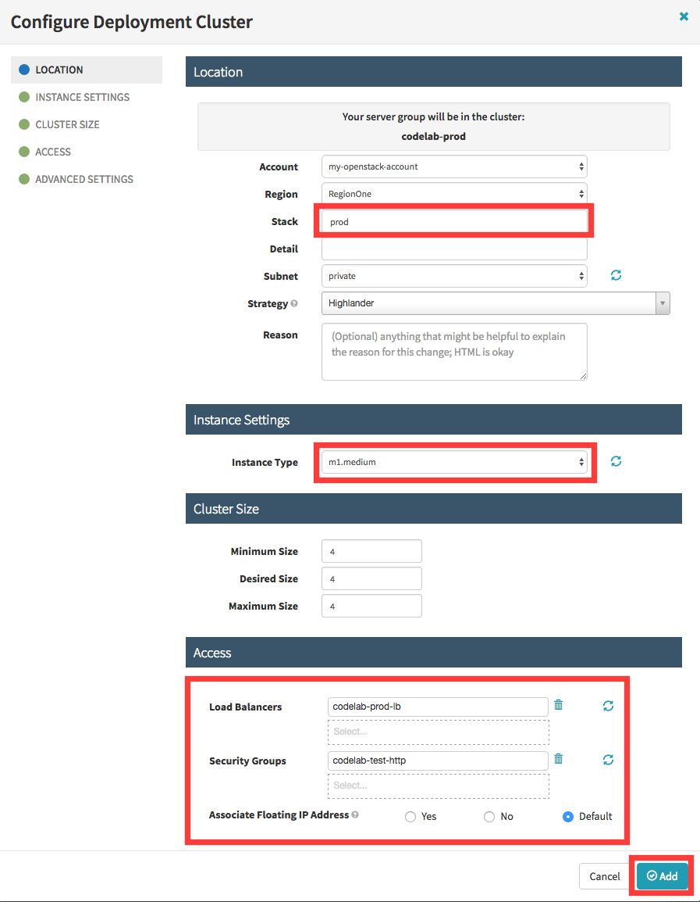

### Trying it out

Now let’s run through it all. Run a Build in Jenkins.

When the Bake & Deploy to Test pipeline completes, the Validate Test pipeline will trigger and wait for user input.

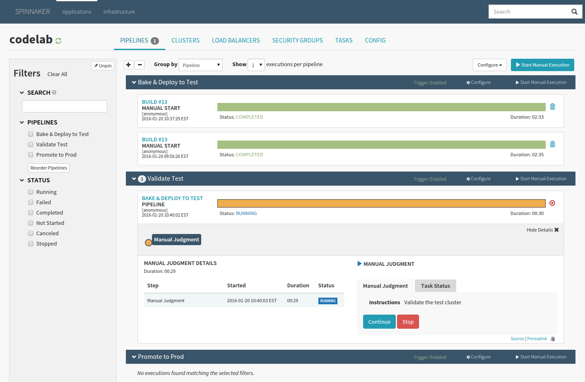

Click *Continue*. This will trigger the Promote to Prod pipeline:

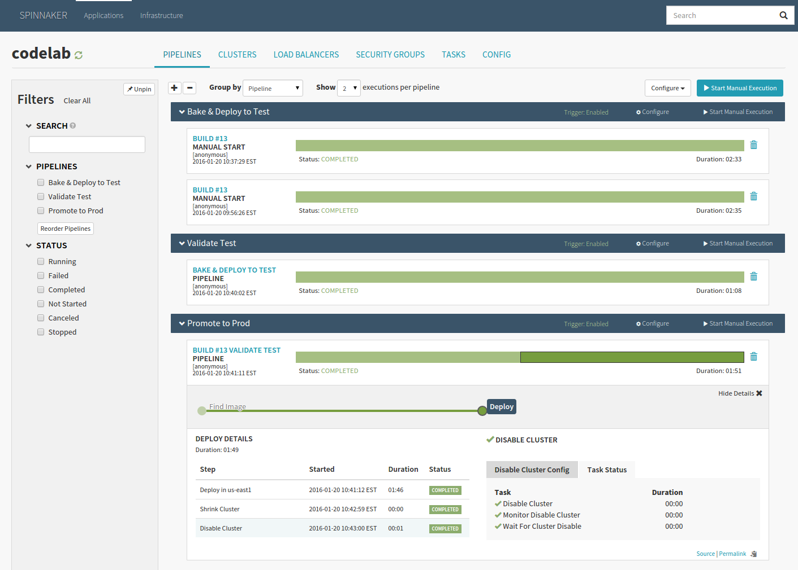

In the CLUSTERS tab, you can see that a server group has been deployed to the prod cluster.

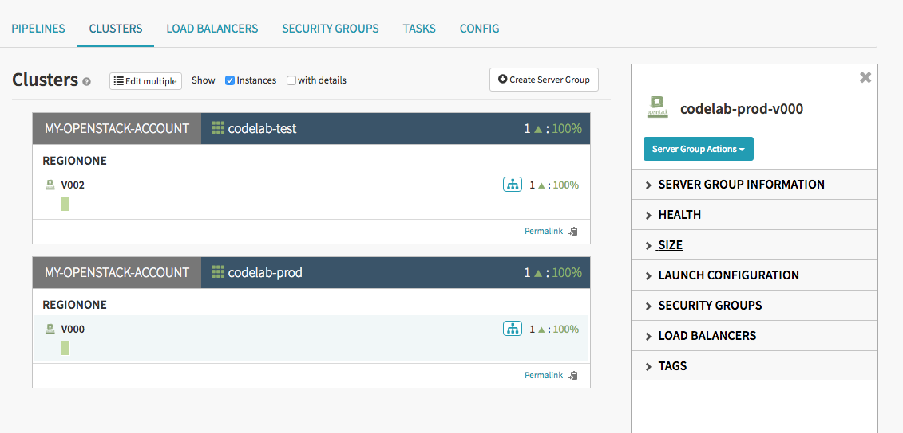
