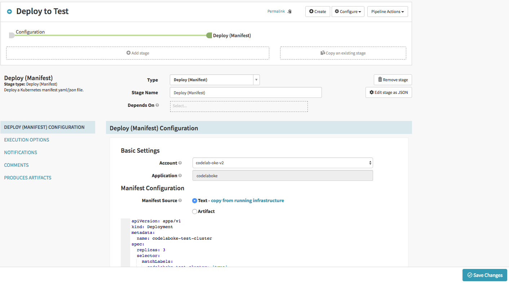



In this codelab you will configure a Spinnaker pipeline to deploy an application from Kubernetes manifest files targeting Kubernetes on Oracle Cloud Infrastructure Container Engine (OKE).

# Prerequisites

Before we begin, we need to do the following:

### Configure Kubernetes

If you don't already have a cluster for this purpose, you can follow [this tutorial](https://www.oracle.com/webfolder/technetwork/tutorials/obe/oci/oke-full/index.html) until a Kubernetes cluster on OKE is created.

### Create a compute instance

Create a compute instance on Oracle Cloud Infrastructure (OCI) to host Spinnaker by following [this instructions](https://docs.cloud.oracle.com/iaas/Content/Compute/Tasks/launchinginstance.htm).  Spinnaker supports Ubuntu 16.04.

### Install and configure Spinnaker

SSH onto the compute instance you previously created.  `IP` is its public ip address.

```bash
ssh ubuntu@IP
```

* Install Halyard

```bash
curl -O https://raw.githubusercontent.com/spinnaker/halyard/master/install/debian/InstallHalyard.sh
sudo bash InstallHalyard.sh -y
```

* Set up Oracle Object Storage as your Spinnaker storage by following these steps: [Adding Oracle Object Storage to Spinnaker](/setup/install/storage/oracle/).

* Set up your Kubernetes Cloud provider by following these steps: [Setting up OKE](/setup/install/providers/kubernetes-v2/oke/).

* Set up Spinnaker version.  To complete this tutorial, Spinnaker version has to be at least 1.11.x.

```bash
hal config version edit --version $SPINNAKER_VERSION
```

* Execute the following commands to complete the installation:

```bash
hal config deploy edit --type localdebian 
sudo hal deploy apply
sudo systemctl daemon-reload
```

### Accessing Spinnaker

By default, the Spinnaker UI runs on port 9000. You can use an SSH tunnel to access this from your workstation.

```bash
ssh -A -L 9000:localhost:9000 -L 8084:localhost:8084 ubuntu@IP
```

Now Spinnaker UI is available at [http://localhost:9000](http://localhost:9000).

# 1: Create a Spinnaker application

In this exercise, you’ll set up a pipeline to deploy a tomcat8 from Kubernetes manifest file to OKE. 

Navigate to Spinnaker at [http://localhost:9000](http://localhost:9000).

From the Spinnaker home page, create a new Spinnaker Application by clicking on the *Actions* drop down at the upper right and clicking on *Create Application*.

In the *New Application* dialog:

* Enter "codelaboke" for *Name*.
* Enter your email for *Owner Email*.
* Add "kubernetes" to *Cloud Providers*.
* Click the *Create* button.


# 2: Create a load balancer

Navigate to the "Load Balancers" tab and click the *Create Load Balancer* button, enter the following yaml in the *Manifest*:

```yaml
kind: Service
apiVersion: v1
metadata:
  name: codelaboke-test-lb
  annotations:
    service.beta.kubernetes.io/oci-load-balancer-shape: 400Mbps
spec:
  type: LoadBalancer
  selector:
    load-balancer-codelaboke-test-lb: 'true'
  ports:
  - protocol: TCP
    port: 80
    targetPort: 8080
```
The service annotation “service.beta.kubernetes.io/oci-load-balancer-shape” determines the load balancer's total pre-provisioned maximum capacity (bandwidth) for ingress plus egress traffic. Available shapes include 100Mbps, 400Mbps, and 8000Mbps.


Click *Create*. This will create the load balancer shown below.


# 3: Create a "Deploy to Test" pipeline

### Create the pipeline

Create a new pipeline by navigating to the PIPELINES tab and clicking the *New* button

* Name the pipeline “Deploy to Test”.
* Click the *Create* button. 

### Set up Deploy stage

There are multiple ways to deploy Kubernetes manifests using the Kubernetes Provider V2.  More details can be found in this [Deploying Kubernetes Manifests](/guides/user/kubernetes-v2/deploy-manifest/) guide.

It is preferred to use artifacts as manifests.  However, in this tutorial, the manifest is supplied statically to a pipeline as text for simplicity.

* Click *Add stage*.
* Select “Deploy (Manifest)” in the *Type* drop down.
* In the *Deploy (Manifest) Configuration* section, enter the following yaml as *Text* for *Manifest Source*.

```yaml
apiVersion: apps/v1
kind: Deployment
metadata:
  name: codelaboke-test-cluster
spec:
  replicas: 3
  selector:
    matchLabels:
      codelaboke-test-cluster: 'true'
  template:
    metadata:
      labels:
        codelaboke-test-cluster: 'true'
        load-balancer-codelaboke-test-lb: 'true'
    spec:
      containers:
        - image:  tomcat:8.0
          name: tomcat8
          ports:
            - containerPort: 8080
          readinessProbe:
            httpGet:
              path: /
              port: 8080
```



* Save the pipeline.

# 4. Deploy

Run a "Start Manual Execution" in "Deploy to Test" to Test pipeline.


Navigate to the Clusters tab, and you will see this.


You can test the application by visiting the ingress ip address of the Load Balancer "codelaboke-test-lb".  In this example, the Load Balancer listens to HTTP on port 80.
