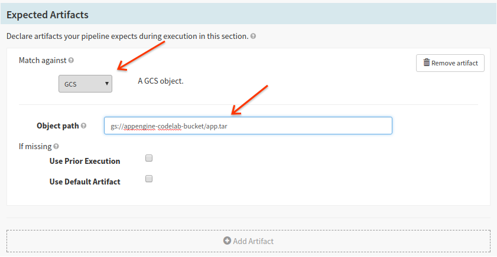
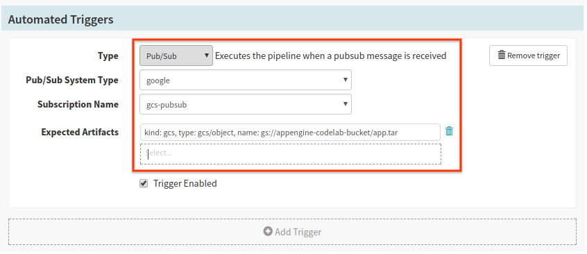
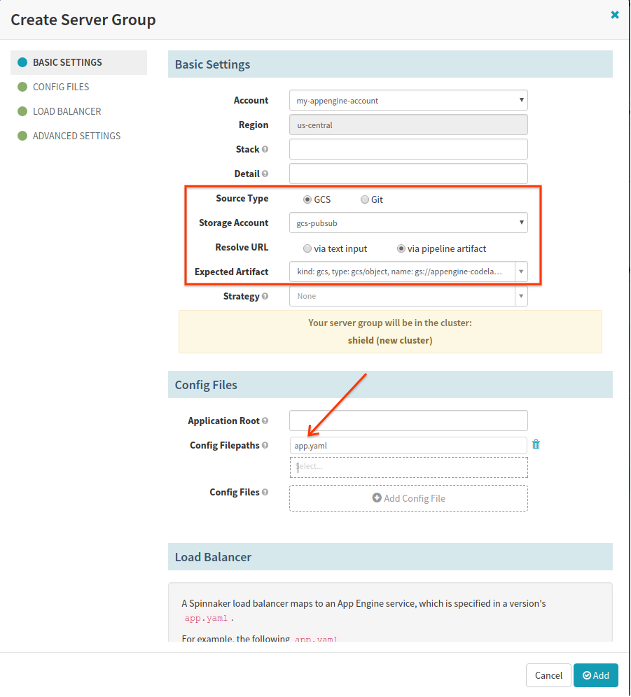



In this codelab, you will deploy artifacts to Google App Engine (GAE) via a Spinnaker pipeline
configured to trigger on pubsub messages from a GCS bucket serving as an artifact repository.
The pubsub messages from the GCS bucket will contain contextual information that will allow
Spinnaker to parse and deploy the stored artifacts.

This codelab is estimated to take an hour.

## Overview

The end goal of this codelab is to set up an environment where a GCS upload of a tarball
(containing a GAE application) triggers a pipeline that will deploy that application to
GAE. The mechanism we'll use to inform the pipeline about the application is a pubsub message
sent from GCS and ingested by Spinnaker.

## Prerequisites

This codelab assumes you have a billing-enabled GCP project.

## Set Up Your Environment

### Create a GCS Bucket to store Artifacts

In the environment where you have `gcloud` installed, run the following commands:

```
$ export BUCKET_NAME=gs://<some_name> && export PROJECT_ID=<project_id>
$ gcloud auth login
$ gsutil mb -p $PROJECT_ID $BUCKET_NAME
```

### Set up Google Cloud Pubsub to listen to bucket object changes

The steps to configure GCS to publish pubsub messages are laid out [in the docs](https://cloud.google.com/storage/docs/reporting-changes), but we'll summarize the steps here.

1. Enable the Cloud Pubsub API.

2. `export TOPIC_NAME=<topic>` and `export SUBSCRIPTION_NAME=<subscription>`.

3. `gsutil notification create -t $TOPIC_NAME -f json $BUCKET_NAME`.

4. Verify with `gsutil notification list $BUCKET_NAME`.

5. Create a "pull subscription" with `gcloud beta pubsub subscriptions create $SUBSCRIPTION_NAME --topic $TOPIC_NAME`.

## Configure and Deploy Your Spinnaker instance

### Configure Spinnaker to deploy to GAE

If Spinnaker is not yet configured, follow the Halyard documentation starting [here](https://www.spinnaker.io/setup/quickstart/halyard-gce/). 

In addition, configure the [GAE cloud provider](https://www.spinnaker.io/setup/providers/appengine/).

### Configure Spinnaker to listen to the Google Cloud Pubsub subscription

Configure your GCS artifact provider.

1. `hal config features edit --artifacts true`.

2. `hal config artifact gcs enable`.

3. `hal config artifact gcs account add --json-path <key> <artifact_account>`.

Configure Spinnaker to receive messages from your Google Cloud Pubsub subscription.

1. `hal config pubsub google enable`.

2. Create a json file and add the following contents to the file:

    ```
    [
      {
        "reference": "{{ bucket }}/{{ name }}",
        "name": "gs://{{ bucket }}/{{ name }}",
        "type": "gcs/object"
      }
    ]
    ```

    This is a [Jinja](http://jinja.pocoo.org/docs/2.9/) template that defines the tranformation between the pubsub message structure and the artifact format
    Spinnaker understands. The json snippet above defines the mapping specific to the GCS pubsub message, but these are entirely
    user-supplied and can specify any valid Jinja transformation.

    Make sure the file permissions on the template file are configured so that Spinnaker can read the file: `sudo chown spinnaker <template>`.

3. `hal config pubsub google subscription add --project $PROJECT_ID --json-path <key> --subscription-name $SUBSCRIPTION_NAME --template-path <template> <subscription_name>`.

### Deploy Spinnaker with Halyard

Run `hal deploy apply`. Wait a few minutes for the deploy to complete.

## Configure Your Pipeline

1. Declare your application tarball as an expected artifact in the "Expected Artifacts" section.



2. Add a pubsub trigger to your pipeline, select the "Pub/Sub System Type", "Subscription Name", and add the tarball as an expected
artifact.



3. Add a deploy stage with one server group.

    - Select "Source Type" GCS

    - Select your configured "Storage Account" from the dropdown.

    - Select "via pipeline artifact" for "Resolve URL"

    - Select your configured "app.tar" expected artifact.



## Package and upload your application to GCS

### Acquire a "Hello World" application and upload to GCS

1. Clone a sample GAE application: `git clone https://github.com/GoogleCloudPlatform/python-docs-samples.git`.

2. Package your application as a tarball: `cd python-docs-samples/appengine/standard/hello_world tar -cvf app.tar *`.

3. Upload the tarball to the GCS bucket: `gsutil cp app.tar $BUCKET_NAME`.
