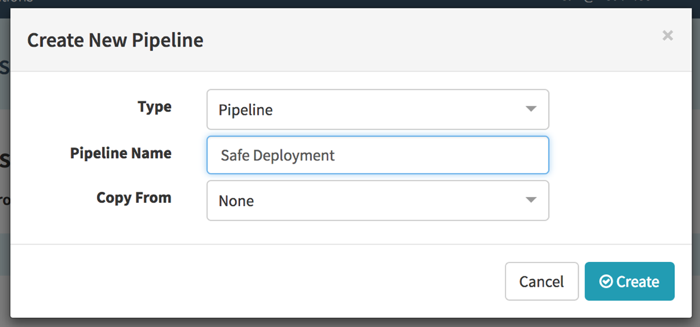



In this codelab you will improve a deployment process by adding safeguards to your deployments.

This codelab is a continuation of the Kubernetes: code to prod codelab. It assumes you have an application set up and ready to deploy.

# Setup

Please follow the steps in the Kubernetes Source to Prod guide to create a deployed Spinnaker cluster.

# Making manual operations safer 

## Using the Rollback action

The rollback action automates the process of restoring back to the previous good known server group. This feature enhances a traditionally manual operation by ensuring that the restored cluster is fully taking traffic before disabling the current server group.

Go to the clusters screen for your application and make sure you have at least one cluster with one server group with an attached load balancer. 

If you don't have an existing server group, click on _Create Server Group_, select your deployment details ( pick an image name and load balancer ) and click on _CREATE_ .

Clone this server group:

1. Select the server group
1. Click on _actions_, then select _clone server_ group in the drop down.
1. In the new dialog, select _Red/Black push_ as the strategy. 
1. Click _CREATE_.

Wait for the task to finish. You should now have at least two server groups in your cluster, with the previous one disabled and the new one enabled. 

Rollback the deployment:

1. Select the new server group
2. Click on _actions_, then select _rollback_ in the drop down.

3. In the new dialog, select the previous server group from the dropdown.

4. Click _OK_

You should see a task window and the deployment being rolled back safely and automatically. The previous server group should be eneabled and the current one disabled. 

# Making a Deployment Pipeline Safer

## Creating your deployment Pipeline

Go to the Pipelines screen and select _Create New_

Select Pipeline as the type and name it _Safe Deployment_

Under Configuration, add a _Docker Registry_ trigger

Point it to your docker registry and image

Add a new stage of type _Deploy_

Add a new cluster, select copy configuration from an existing template.

Select your cluster.

Click `Use this template`.

You should see the details for your cluster filled in.

Select `Add`

Save the pipeline

## Adding a execution window to deployment pipelines

Execution windows allow you to restrict the times of the day or week when deployments can happen. By using execution windows, you can ensure that deployments don't interfere with times where your service is at peak demand. You can also use execution windows to make sure that there is always someone in the office ready to manually intervene or rollback your pipeline.

Let's modify our existing pipeline to add a deployment window.

Navigate to the deploy stage of your pipeline,

Check the `Restrict execution to specific time windows` checkbox

Click on `add an execution window`

Enter a start time and end time that will block the deployment if deployed right now.

Save the pipeline

Go to the pipeline screen by clicking on the back arrow next to the pipine name

Click on `Start Manual Execution` for your pipeline.

You see see a warning that your deploy stage is under an execution window.

You can click on `Skip Execution Window` to start the stage right away.

Go back and modify the execution window so your stage falls within the current window.

Execute your pipeline again, you should see your deployment continue without waiting.

## Adding a Manual Judgment to deployment pipelines

Manual Judgments serve as a gates for your pipeline. You can add manual judment stages to interrupt the pipeline execution to run a manual check. This is great for teams that have a manual or out of bound QA process. 

Let's modify our pipeline by adding a manual judgment stage.

Click on Configuration and select _Add new stage_

Enter "please approve this pipeline" in the instructions

Click on _Add Notification Preference_. 

In the popup dialog:

1. select type _Email_ 
2. Enter an email address  
3. Select to notify when _This stage is awaiting judgment_.

Click _Update_

Go to your deploy stage 

Select _Manual Judgment_ in the Depends On field

Your pipeline view should look like this.

Save this pipeline and run it.

Check your email, you should see one that says that your pipeline is awaiting judgment.

Click on the link in your email and you should see the manual judgment awaiting approval.

Click on _Continue_

Your pipeline should run now. 

### Changing pipeline behavior based on selected judgment

Manual Judgments can also be used to run a rollback task based on some input. 

Go to your Manual Judgement stage and add type in "continue" as an input option.

Click on _Add Judgment Input_ and enter "rollback"

Add a new stage called _Rollback_ of type _Wait_

In the new stage, check the _Conditional on Expression_ checkbox and enter `${ #judgment("Manual Judgment").equals("rollback")}`. In this step, we're telling Spinnaker to only run this stage if the rollback option was selected.

Select the deploy stage, check the _Conditional on Expression_ checkbox and enter `${ #judgment("Manual Judgment").equals("continue")}`. 

Save your pipeline and run it. 

In the manual judgment stage, select `rollback` as your input. 

You should see that the deploy stage is skipped while the rollback stage runs.

Run your pipeline again, this time selecting `continue` as your input. 

The rollback stage should not run

## Creating a automatic rollback pipeline

You can also create a pipeline to run in case a deployment fails. 

For this exercise, we're simply going to create a pipeline that will trigger if a deployment pipeline fails.

We're going to make a parent pipeline that will allow us to decide its success status based on a parameter.

### Create a new pipeline called _Parent Pipeline_

Under _Configuration_ add a new Parameter. 

1. Name it `Pipeline Successful`
2. Give it a description and default value true
3. Click `Show Options`
4. Enter `true` as an option
5. Click on _Add New Option_
6. Enter `false` as another option.

Add a new stage of type check preconditions.

Add a new Precondition:

1. Set _Check_ to _Expression_
2. Enter `${ parameters["Pipeline Successful"].equals("true") }` as the expression.

3. Click _Update_

Save your pipeline

### Create a rollback pipeline.

Create a new pipeline called 'Child Pipeline'

Under _Configuration_, add a new automated trigger of type `Pipeline`

1. Set your application to be the same as your parent pipeline
2. Set pipeline name to be _Parent Pipeline_
3. Click on Pipeline Status `failed`

Add a new stage of type wait

Save your child pipeline

### Test your rollback

Go to the pipelines screen and select `Start Manual Execution` on your _Parent Pipeline_

In the popup dialog, select `false` as the choice for _Pipeline Successful_

You should see the pipeline fail, and the Child Pipeline run the rollback

If you click on the `Parent Pipeline` link in the child pipeline, it should take you the the failed execution.

Now run the Parent Pipeline again, this time selecting true.

The child pipeline should not run

## Learn More

Hopefully this codelab has given you a taste of the built-in mechanisms for safe deployment in Spinnaker. An almost complete list of safe deployment features in Spinnaker can be found in this [blog post](https://blog.spinnaker.io/can-i-push-that-building-safer-low-risk-deployments-with-spinnaker-a27290847ac4).