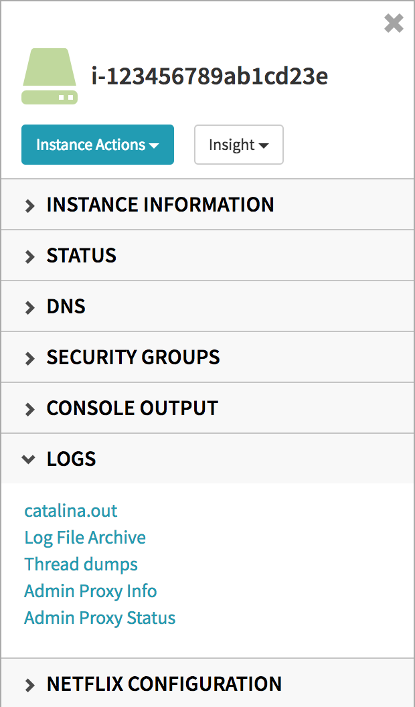



Spinnaker makes it easy to give users links to common features of their applications (logs, health, etc.), which are accessible from the instance details panel:



There are two basic approaches to customizing links: organization-wide links (i.e. links that apply to every instance managed by Spinnaker), and application-specific links (i.e. links that are common to every instance of your application).

## Default Links

At Netflix, we use a common base server, which adds a number of default endpoints to every running instance. These are configured in Deck's `settings.js` file:

```
window.spinnakerSettings = {
  // ...
  defaultInstanceLinks: [
        {
            title: 'Logs',
            links: [
                { title: 'catalina.out', path: ':7000/Logs/catalina.out'},
                { title: 'Log File Archive', path: ':7000/Logs/all'},
                { title: 'Thread dumps', path: ':7000/Logs/threadDumps'},
                { title: 'Admin Proxy Info', path: ':7000/ProxyInfo'},
                { title: 'Admin Proxy Status', path: ':7000/ProxyStatus'},
                { title: 'GC Visualization', path: ':7000/GCVisualization'},
            ]
        },
        {
            title: 'Netflix Configuration',
            links: [
                { title: 'Properties Console', path: ':8088/props'},
                { title: 'Libraries Console', path: ':8088/libraries'},
                { title: 'Machine Readable Properties', path: ':8088/machineProperties'},
                { title: 'Manifest', path: '/manifest'},
            ]
        }
    ]
  // ...
};
```

When users create a new application, these links are available in each instance in Spinnaker with no additional input from the application owner.

## Customizing Application Links

These links are customizable via the application's Config tab in Spinnaker. If configured in `settings.js`, the default links are displayed. Users can then customize the links for their particular application.

Links support templating based on the instance's attributes by wrapping the value in two curly braces, e.g. `{{id}}`. Common attributes available in templates are listed below. Note that templating only applies to the path portion of the link - the title must be a hard-coded value.

Most links will be endpoints on your running server. These will be resolved using the public IP address of the instance if available, falling back to the private IP address. If you've specified an instance port in the application attributes, that will be used to generate the link. If the link should point to a different port, the `path` should start with a colon, then the port.

If no instance port is configured for the application, port 80 will be used for links (unless the path starts with a colon).

Some example paths:
*An application configured with a default port of 9000, and an instance (id: 'i-1234') with an IP address of 104.156.81.74*

path | result
-- | --
/help | http://104.156.81.74:9000/help
:9001/admin | http://104.156.81.74:9001/admin
https://my.company/trafficFrom?instance={{id}} | https://my.company/trafficFrom?instance=i-1234
https://{{publicIpAddress}}:9090/secureAdmin | https://104.156.81.74:9090/secureAdmin

## Available Template Fields

This is not a comprehensive list of fields - just the most common ones. Not all fields will be available for every instance, as some are VPC-only, and some depend on subnet, launch configuration, and other factors. Trial and error is a good way to figure out what's going to work for your application.

### AWS

name | description | example
-- | -- | --
account | account owner of the instance | prod
availabilityZone | zone where instance resides | us-east-1a
cloudProvider | "aws" | "aws"
clientToken | see AWS Documentation | (string)
id | instance ID | i-12345678
imageId | ID of the AMI running on this instance | ami-123456
instanceId | same as id | i-12345678
instanceType | AWS instance type | m3.medium
keyName | See AWS Documentation | my-keypair-for-this-account
launchTime | timestamp of when instance launched | 1486146739000
privateDnsName | internal DNS name associated by AWS to this instance | ip-104-156-81-74.ec2.internal
privateIpAddress | internal IP address (within AWS) | 104.156.81.74
publicDnsName | external DNS name (for instances in external subnets only) | ip-104-156-81-74.ec2.external
region | region where instance resides | us-east-1
serverGroup | ASG name | myapp-v002
subnetId | subnet where instance resides | subnet-1abcde2f
vpcId | vpc where instance resides | vpc-1234567
zone | alias of availabilityZone | us-east-1c

### Google Compute Engine

name | description | example
-- | -- | --
account | account owner of the instance | prod
availabilityZone | zone where instance resides | us-central1-f
cloudProvider | cloud provider abbreviation | gce
externalIpAddress | external IP address | 104.156.81.74
id | instance id | app-stack-detail-v000-e20p
instanceType | GCE instance type | f1-micro
internalDnsName | internal DNS name associated by GCE to the instance | app-stack-detail-v000-e20p
internalIpAddress | internal IP address (within GCE) | 104.156.81.74
launchTime | timestamp of when instance launched | 1485801280421
network | network where instance resides | default
region | region where instance resides | us-central1
serverGroup | name of Spinnaker server group (GCE managed instance group) where instance resides | app-stack-detail-v000
subnet | subnet where instance resides | default-b13fe48693219e49
