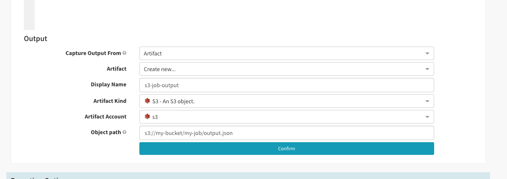

The `Run Job (Manifest)` stage can be used to execute a Kubernetes Job as part of your pipeline. This stage will deploy a `Job` manifest and wait until it completes, allowing you to gate your pipeline's continuation on the job's success or failure.

For example use cases, check out [this post](https://blog.spinnaker.io/extending-spinnaker-with-kubernetes-and-containers-5d16ec810d81) on the Spinnaker blog!

## Viewing execution logs

As with any job runner, logs are the primary form of feedback and it's important that viewing them is a first-class experience within Spinnaker. Since users of Spinnaker are all at various stages of Kubernetes adoption we've provided 2 ways to view logs within Spinnaker.


### Link to external system

Most Kubernetes deployments will have some utility for forwarding logs from containers and into external systems for log analysis. If you're using one of these platforms, you can configure your `Job` with the annotation `job.spinnaker.io/logs` and a templated URL to your logging system. This value of this annotation will be used to render a link in the UI.

To make it easier to pinpoint the specific job, the annotation value can be templated with values from the deployed `Job` manifest. To use templates, use `{{ "{{ templateKey "}} }}` where `templateKey` is the path to the value you wish to use. The deployed manifest will be passed into the template as JSON. This functionality mirrors that of the [Annotation Driven UI](/guides/user/kubernetes-v2/annotations-ui/).

For example, if your `Job` is deployed with name `myjob-12345`, the annotation...

```
job.spinnaker.io/logs: 'https://internal-logging/jobs/{{ "{{ manifest.metadata.name "}}}}'
```

...will result in the value

```
https://internal-logging/jobs/myjob-12345
```

### Within Spinnaker

You can still view the logs of your `Job` within Spinnaker even if your Kubernetes deployment doesn't forward them to an external system. In the absense of the `job.spinnaker.io/logs` annotation, Spinnaker fetches the deployed manifest and displays logs directly in the UI. These logs are only be available for a short period following the job's completion because Kubernetes only stores events about an object for a short amount of time. If you'd like to view your logs for longer than this timeframe, it's recommended that you use a tool like [Fluentd](https://www.fluentd.org) to forward logs to a more persistent platform like Elasticsearch or Datadog.


## Capturing output

In most cases, jobs are meant to do some work and provide feedback in the form of an output, such as structured JSON. This output can then be used to influence downstream stages via [SpEL](/guides/user/pipeline/expressions). There are 2 ways of doing this with the `Run Job (Manifest)` stage: [using logs](#logs) and [using artifacts](#artifacts).

### Logs

_Note: Some Jobs output a massive amount of data which can be expensive to process. If your job outputs megabytes or gigabytes of log data it may be best to utilize the artifact based approach outlined in the [Artifacts](#artifacts) section._

The easiest and most accessible way of capturing output from your jobs is to output data to your logs by writing to `stdout`. When a job completes, the log data is captured and analyzed for 2 different markers. These markers are as follows:

#### `SPINNAKER_PROPERTY_*`

`SPINNAKER_PROPERTY_*=*` can be used to provide single key/value pairs, similar to Jenkins `build.properties` files. Everything after `SPINNAKER_PROPERTY_` is captured as a key/value. For example, given the following log output

```
Checkout spinnaker/spinnaker source code...
Latest tag is: 1.1.0.
Tag spinnaker/spinnaker with next minor version...
Uploading release...
Release uploaded.

SPINNAKER_PROPERTY_RELEASE=1.1.1
SPINNAKER_PROPERTY_URL=https://github.com/spinnaker/spinnaker/releases/tag/1.1.1
```

the captured output would be in the following format

```
{
    "RELEASE": "1.1.1",
    "URL": "https://github.com/spinnaker/spinnaker/releases/tag/1.1.1"
}
```


#### `SPINNAKER_CONFIG_JSON`

`SPINNAKER_CONFIG_JSON` can be used to provide complex or structured data. In this case, anything following `SPINNAKER_CONFIG_JSON=` on a single line of `stdout` is directly consumed and parsed as JSON. Using the previous example, notice how the output has changed.

```
Checkout spinnaker/spinnaker source code...
Latest tag is: 1.1.0.
Tag spinnaker/spinnaker with next minor version...
Uploading release...
Release uploaded.

SPINNAKER_CONFIG_JSON={"RELEASE": "1.1.1", "URL": "https://github.com/spinnaker/spinnaker/releases/tag/1.1.1"}
```

Again, using this solution would result in the following format:

```
{
    "RELEASE": "1.1.1",
    "URL": "https://github.com/spinnaker/spinnaker/releases/tag/1.1.1"
}
```

If `SPINNAKER_CONFIG_JSON` is found multiple times within the log then each is parsed and added to the resulting output. If multiple keys are the same, for example the key `foo` is contained in multiple instances of `SPINNAKER_CONFIG_JSON`, then the _last one_ wins. The results of multiple occurrences _are not merged_.

If you source JSON from a file (`SPINNAKER_CONFIG_JSON=$(cat file.json)`), be sure that the file content does not introduce newline characters since each `SPINNAKER_CONFIG_JSON` is only parsed from one line in the log file.


### Artifacts

[Artifacts](/reference/artifacts) are a mechanism within Spinnaker that enables pipelines to reference resources stored in external systems. Artifacts can be anything &mdash; Docker images, Kubernetes manifests, and in this case, data produced by the Run Job stage. As mentioned above, if your job is producing so many logs that parsing them for output data would be an expensive operation, utilizing artifacts would be the best solution.

In order to use artifacts to capture output data, your job needs to push output to one of Spinnaker's [supported artifact stores](/reference/artifacts/types/overview). This output is captured at the end of the job execution and injected into the pipeline for use in downstream stages via SpEL. Artifacts captured as output must be in JSON format.

As an example, let's imagine you are running a job which pushes output into an S3 bucket at the end of its execution.

```
...
Operation completed successfully.
Publishing output to S3.
Output published to s3://my-bucket/my-job/output.json
```

In order to capture this output, you'll want to configure the `Run Job (Manifest)` stage to capture the output from an Artifact.




## Cleaning up old Jobs

Spinnaker uses the [recreate strategy](https://spinnaker.io/reference/providers/kubernetes-v2/#strategy) in the `Run Job (Manifest)` stage.  That means that if a `Job` exists with the same name, Spinnaker deletes it before deploying the new one.  Note that using [metadata.generateName](https://kubernetes.io/docs/reference/using-api/api-concepts/#generated-values) means that Kubernetes generates jobs with unique names each time.  In this case, in order to clean up old `Jobs` you should implement some type of garbage collection so as not to overrun your Kubernetes deployment with a massive amount of old `Jobs`.

As of Kubernetes 1.12, [automatic `Job` cleanup](https://kubernetes.io/docs/concepts/workloads/controllers/jobs-run-to-completion/#clean-up-finished-jobs-automatically) is an alpha feature, available behind the `TTLAfterFinished` feature flag. This flag must be enabled on the API server when it's started. To verify if your deployment has this feature enabled, check with your Kubernetes administrator.
