

## What are pipeline expressions?

Pipeline expressions allow you to put a placeholder value that gets filled in when you run your pipeline. 

A pipeline expression in Spinnaker looks like this:

`${ execution.stages[0].name }`

For example, let's say I have a field called `command` that I want to be able to change every time I manually execute a pipeline. When I configure the pipeline, instead of a normal string, I can enter the expression `${ parameters.command }`,


I can now set up my pipeline to take a `command` parameter, when I manually execute my pipeline, it will ask me to enter the value for `command`. 

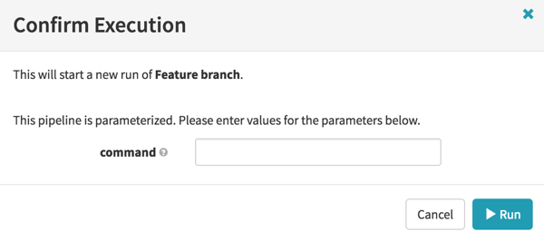

When the pipeline runs, it resolves the expression to what I’ve entered for `command`.

## Where can I use pipeline expressions in Spinnaker?

> **Warning**
>
> Sometimes adding an expression stops your ability to use the UI. For example, if you use a parameter for the account field in a cluster deployment stage, you will see a spinning loader from the UI when you try to edit this cluster.

You can usually type in a value in the text fields of the Pipeline stages in Spinnaker. 

[comment]: <> 
 

In the following example, we're using pipeline expressions as parameters being passed into a Jenkins stage:

> **Expressions and Pipeline Configuration**
>
> Because expressions are evaluated per stage before each stage starts, you cannot use expressions in the configuration at the pipeline level. For example, an expression in the job name of a trigger for the pipeline does not work because no expressions have been evaluated yet.

### Turning a stage on or off

You can use expressions to turn an individual stage on or off. 

To do so, select the 'Conditional on Expression' checkbox. 

Enter an expression:


When this pipeline runs, it will evaluate the expression to decide if the stage can be skipped. This is useful for adding optional stages to your pipeline. 

### Preconditions stage

To use expressions to gate multiple stages, you can use the the 'check Preconditions' stage. When this stage is configured, it will gate the execution of subsequent stages. In other words, the stages that follow this stage will only run if the precondition evaluates to true.

Add a new stage and set it to be of type *Check Preconditions*.


You can add one or more preconditions by clicking on *Add Precondition*. 

You can add expressions to be checked here by selecting *Expression* from the Check dropdown and entering an expression. 


When the pipeline runs, if this expression evaluates to true, the pipeline will continue as is. If not, the stages following this stage will not run. 

### Sometimes you can't use an expression

There are often cases where the value you want to replace doesn't allow typing, such as specifying a list of security groups or wanting to dynamically control the behavior of a checkbox. For these cases, you should edit the pipeline JSON directly.

You can edit the pipeline JSON by selecting Pipeline Actions -> Edit as Json


In the popup screen, you can now edit the fields that match the fields you want to substitute. 

[comment]: <> 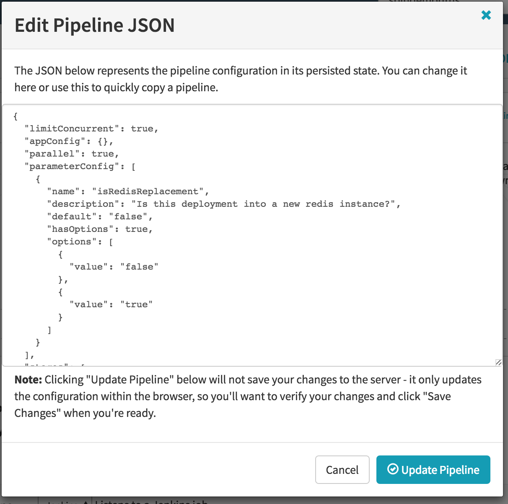
 

## What kind of data can I put in pipeline expressions?

In this section, we will describe the numerous sources of data for a pipeline expression in Spinnaker and how to access them.  Expressions are evaluated against the currently running pipeline. To see all the available attributes in a pipeline, you can view the source JSON. The easiest way to view this JSON is as follows,

* Go to an execution of your pipeline.
* Click on `Details` to expand the pipeline.
* Click on the `source` link under the pipeline execution:

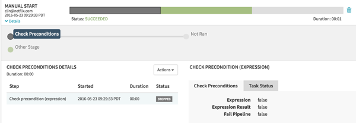

This will take you to a JSON file that contains the details of your pipeline execution.

### Pipeline execution

The current running pipeline is available within Pipeline Expressions as `execution`.  

From there, you can navigate to different parts of the pipeline. For example, to reference the name of the first stage you can use `${ execution.stages[0]['name'] }`.

### The current stage

Values for the current stage context are available by their variable name. In the execution JSON, they will be defined under the context object.

For example, if I look at the JSON for a bake stage execution, I will see something like this:

```
{
	"id": "e980c921-b1f3-4b04-adda-b5c50ea1797a",
	"type": "bake",
	"name": "Bake",
	"startTime": 1464024188808,
	"endTime": null,
	"status": "RUNNING",
	"context": {
		"cloudProviderType": "aws",
		"regions": ["us-west-1"],
		"user": "clin@netflix.com",
		"vmType": "hvm",
		"storeType": "docker",
		"baseOs": "trusty",
		"baseLabel": "release",
		"package": "mypackage",
		"amiSuffix": "20160523172307" ... 
```

This means that if I reference a field in my expression like `${ package }`, it will resolve to the package for that stage.

### Other stages

You can also access the value of other stages by doing a lookup by name using the [#stage( stage name )](#stagestring) helper method. To access stage attributes, you can call `${ #stage('stage name')['id']}`. To access the values passed into the stage, use `${ #stage('stage name')['context']['baseAmiName']}`.

### Pipeline parameters

The configuration screen of your pipeline lets you specify parameters. Parameters to the pipeline can also come from upstream pipelines that have configured a Pipeline stage.

You can access values of parameters within expressions by referencing the `parameters` array. This is a shortcut for `execution.parameters`. For example, `${ parameters['run canary'] }` will evaluate to the value of the parameter called *run canary*. 

### Trigger values

You can reference values in the pipeline trigger via the `trigger` property. This value is available in the execution JSON under the trigger object. 

The `trigger.buildInfo` field in jenkins triggers will contain details about the jenkins execution. To access the version hash of the git commit in Jenkins, for example, we can ask for `${ trigger.buildInfo.scm[0]['sha1'] }`.

### Property files

A feature of the Jenkins trigger is the ability to specify a properties file. Spinnaker will read the contents of this artifact ( it can be a Java .properties file, yml or json ) and add it into the pipeline context. 

To specify a property file, make sure you're archiving it in your jenkins job, then provide the name of the file, i.e `mypropertyfile.properties` ( not the absolute path i.e, `workspace/build/mypropertyfile.properties` ).


The contents of this file will now be available as a map under the trigger and accessible via `trigger.properties`. 

For example, if my property file looked like this:

```
BUILD_STACK=bojack
BUILD_ANIMAL=horseman
```

I can then access the value from the property file as `${ trigger.properties['BUILD_ANIMAL']}` to get `horseman`.

If you're adding property files from a Jenkins or Script *STAGE* ( not Trigger ), then you can omit the `trigger.properties` field as the stage. Any stage that runs after will be able to access these parameters as normal context fields. If we created a new stage and ran the same Jenkins job as above, then `${ BUILD_ANIMAL }` will resolve to `horseman`.

> **Using the same field names**
>
> If you have multiple Jenkins jobs, they can clobber the same properties. A way around this is to reference the particular stage. `${ #stage( 'first jenkins job' )['context']['BUILD_ANIMAL'] }`

### Manual Judgment choices

The manual judgment stage allows you to specify options when you approve a stage. Under Judgement Inputs, you can enter a choice.

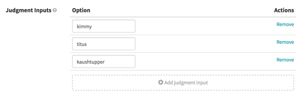

When your stage executes, you will see a dropdown with the provided choice. 


In subsequent stages, you can reference the choice provided via the [#judgment( stage Name ) ](#judgmentstring) helper method `${ #judgment( 'manual judgment stage name' )}`. 

### External sources

You can also read from external sources via the [#fromUrl( url )](#fromurlstring) and [#jsonFromUrl( url )](#jsonfromurlstring) helper methods. 

## Pipeline expression language reference

The Pipeline Expression syntax is implemented with the Spring Expression Language ( SpEL ). You can learn more about SPeL by following this [link](http://docs.spring.io/spring/docs/current/spring-framework-reference/html/expressions.html).

### Writing expressions

A pipeline expression is started by `${` and terminated by `}` : 

`${ expression here }`

You can interpolate expressions and strings, so

`${expressionA}-randomString-${expressionB}` 

will evaluate to `Kimmy-randomString-Schmidt` when expressionA is `Kimmy` and expressionB is `Schmidt`.

In Spinnaker, if an expression cannot be evaluated, it will return the expression entered. 

### Strings

You can enter String in expressions: `${ 'this is a String' }` will evaluate to `this is a String`.

### Lists

You can reference entries in lists: `${ stages[0] }` will return the value of the first stage.

### Maps

And you can reference values in maps based on their keys: `${ trigger['properties']['value1']}`

**Using a dot (.) vs square brackets [ 'value' ]**

Spinnaker supports both a dot notation for accessing values and a square bracket notation. However, there are a few places where the dot notation doesn't work as expected --- for example after a filter operation or getting nested JSON values from an URL. Generally, it's recommended to use the square bracket notation for referencing map values as this is most predictable. I.e, prefer `trigger['properties']['value']` instead of `trigger.properties.value`.

### Math

Arithmetic operations such as `${ trigger.buildInfo.number * 2 }` are supported.

### Comparisons

The expression language also allows you to specify rational operators, such as `${ instance.size > 400 }` or `${ params.runCanary == true }`.

Note that you may need to coerce or transform some values for the comparisons to work properly.  For example, the `status` attribute of a stage is actually an enum internally, not a string (although it shows up as a string in the JSON).  To compare the status to a string, you'll need to call `.toString()` on the result.  For example:

```
#stage('Validation')['status'].toString() == 'SUCCEEDED'
```

### Functions

There are a few [helper functions](#helper-functions-in-spinnaker) available within Spinnaker. These can be accessed via `#functionName( params )`. For example, `#fromUrl( 'http://www.netflix.com' )`.

### Code

You can execute java code within the expression language. This can be useful for string manipulation or to create more exotic data fields.

You can use methods available to existing types like String - `${ 'this is a long string'.substring(0,5)}`

You can also declare new classes. Note that package names need to be fully qualified. In the following expression, we're getting the current date as MM-dd-yyyy format: `${ new java.text.SimpleDateFormat('MM-dd-yyyy').format(new java.util.Date()) }`

Whitelisted java methods can be found [here](https://github.com/spinnaker/orca/blob/fc87a8e99ec59a4e129646026987aa5adbde2d31/orca-core/src/main/java/com/netflix/spinnaker/orca/pipeline/expressions/whitelisting/InstantiationTypeRestrictor.java#L25).

### Some useful things to know

### #Default values#

You can set a default value within expressions by using `?:`. For example, `${ parameters.region ?: 'us-east-1'}`.

###Filtering maps#

The expression language allows you to filter maps by using the `.?` expression. For example, to filter a list of stages by type, you can use the expression `${ execution.stages.?[ type == 'bake' ] }`

###Lists as parameters

Sometimes you want to enter a list of values as a parameter. For example, a list of regions or security groups. A useful tip here is to ask the user to enter them as a list of comma separated values `us-east-1,us-west-1,eu-west-1` and then use the `split()` method to make these into a map. Your expression would look like this `parameters.regions.split(',')`.

### #root

Sometimes you want to reference another variable in an expression. You can do this by prepending `#root` in front of the expression name. In the following expression, I can set a value depending on the baseLabel field: `${ #root.baseLabel ?: 'noBaseLabelValue' }`

## Helper properties in Spinnaker

There are a few attribute shortcuts that you can use in Spinnaker:

* `execution` : refers to the current pipeline execution.
* `parameters` : pipeline parameters
* `trigger` : pipeline trigger
* `scmInfo` : this is a shortcut to the git details of either the trigger or the last executed jenkins stage. `scmInfo.sha1` will give you the hash of the last build. `scmInfo.branch` will give you the branch name.
* `deployedServerGroups` : this is a reference to the server group that was created by the last deploy stage. Here is an example of the contents of a deployedServerGroups : ```[{account=prod,capacity={desired=1, max=1, min=1}, parentStage=23452655-c6de-4aac-b529-55e1357dfee7, region=us-west-1, ami=ami-575eb013, amiSuffix=201505190020, baseLabel=release, baseOs=trusty, package=rush, storeType=ebs, vmType=pv, serverGroup=rush-prestaging-v049}]```

# Helper functions in Spinnaker

The following section outlines the currently available helper functions in Spinnaker. 

### #alphanumerical( String )

Returns the String value of a string passed in with non A-Z or digits stripped out. This is useful if you want to have a valid stack or details field in Spinnaker, as some provides don't allow special characters in them.

### #readJson(String)

Converts a JSON String into a Map that can then be processed further. This is useful if a jenkins property file has a complex value that you want to pass into Spinnaker. This is also used by the #jsonFromUrl( ) function under the hood. 

```
"instanceType": "${#readJson('{\"prod\": \"r3.8xlarge\"}')[#root.parameters['environment']]}",
```

### #fromUrl(String)

Returns the contents of the specified URL as a String.

### #jsonFromUrl(String)

Retrieves the contents of the given URL and converts it into either a map or a list. This is useful to fetch information from the Spinnaker API or other sources.

### #judgment(String)

Gets the selected judgment value from the stage with the name asked for. I.,e `${#judgment('my manual judgment stage')}` will return the selected judgmentInput from the stage called `my manual judgment`.

### #propertiesFromUrl(String)

Retrieves the contents of the properties file at the given URL and converts it into a map. This is useful to fetch information from jenkins properties files or other similar endpoints.

### #stage(String)

A shortcut to get the stage by name. I.e, `${#stage( 'bake' )}`. Be careful that the values for the stage are still under the context, so accessing a property would be via `${#stage('bake')['context']['valuePassedIn']}`.

### #toBoolean(String)

Converts a value to a boolean.

### #toFloat(String)

Converts a value to a floating point number.

### #toInt( String )
Converts a value to an integer.

### #toJson(Object)
Converts a Map into a JSON String. This is useful when you want to pass values from Spinnaker to another system. For example, I can use ${#toJson( deployedServerGroups )} to pass the details of the recently deployed server groups to a jenkins job.

## Sample use cases

### Create a stack based on the committed git branch

In this use case, we're going to create a different cluster for each branch that gets triggered in Jenkins.

1. Set up a jenkins trigger for the pipeline.

2. Add a deploy stage and use an expression for my cluster name that uses the scmInfo value in the branch. `${ #alphanumerical( scmInfo.branch ) }`:


The deploy stage should look like this:

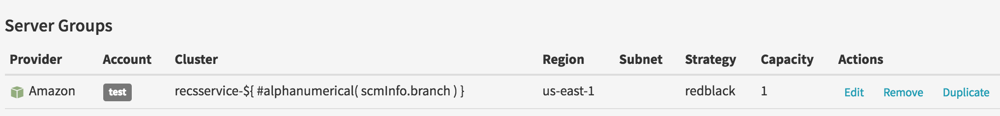


When the pipeline runs, it will replace the expression with the name of the branch, creating a new cluster:

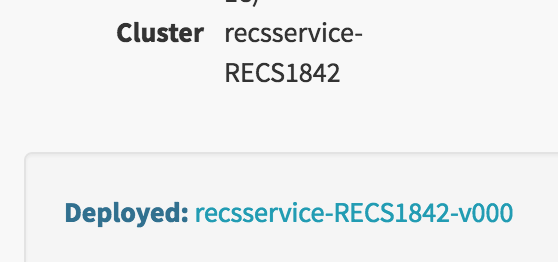

### Conditionally execute pipeline behavior based on manual input

For this use case, we're going to set up a pipeline with 3 conditions, and gate these conditions with a manual judgment stage.

1. First, add a manual judgment stage and add three options.

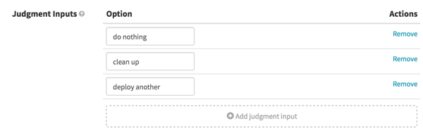

2. Now that I have these inputs set up, I create a new precondition stage. I add an expression to check that the input was 'clean up'


My precondition stage should look like this.

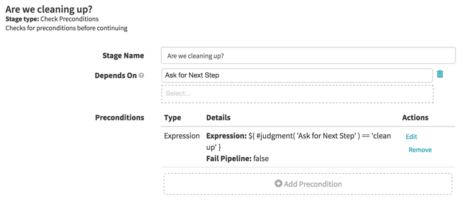

> **Fail pipeline**
>
> For these type of workflows, you want to set *Fail Pipeline* as false when you're setting up your expression.

3. Add stages that you want to execute based on this precondition. 

4.  I do the same for the 'deploy another' input.

5. My pipeline now looks like this:


6. Go to the executions screen and run my pipeline. I should see the options show up in the Manual Judgment stage:


If I select 'do nothing', which matches no preconditions, my pipeline should just stop:

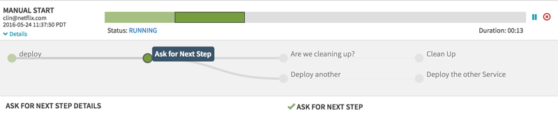

If I choose 'deploy another', I can see that the stages gated by deploy another are executed. 

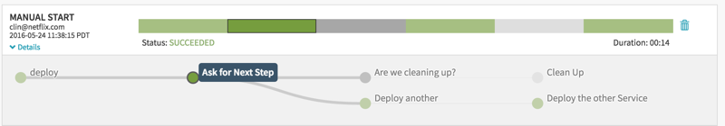

Similarly, you can see that when I chose 'cleaning up', that pipeline branch is the one that runs. 

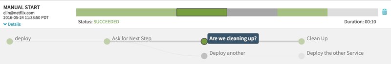

## Expression autocomplete

Spinnaker has autocompleted functionality within the context of a pipeline configuration.

**TLDR;**
Here are the character triggers that will invoke the autocomplete
**$** = Adds the **${ }** to the text field and starts the expression building
**#** = Displays a list of all the **helper functions**
**?** = Displays a list of **helper parameters** and **stages** for the pipeline

In any text field, you can start autocompleting by typing a **dollar sign($)**. 
Doing so will display this:


Hit enter and the opening and closing braces of the expression will be added to the text field.

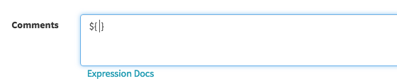

### Helper functions and stages

Within the **curly braces ${ }**,  adding a **question mark (?)** will display a list of all the helper properties that are relevant to the stage config that you are in as well as a list of all the stages in the pipeline.


Once the list is displayed you can start typing to narrow down the list and hitting enter will add the helper property or stage name to the expression.

If a helper property is added to the expression you can then hit any of the meta-keys (Shift, Comand, Alt, Control) to pop up a list of all the pipeline config context relevant to that selected helper property.

Here is an example of what context of the 'deployedServerGroups' helper property will show.

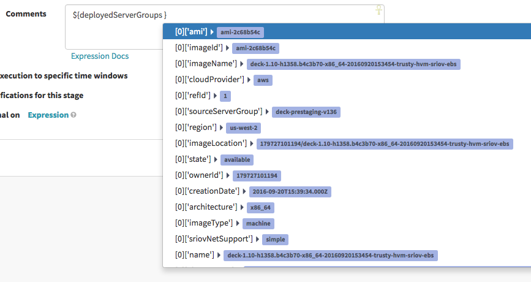

The list will show the available context attributes on the left and the previous values highlighted on the right. The list can also be narrowed by typing a few characters, and selecting on by hitting **ENTER**.


### Helper functions

Also within the **curly braces (${ })**,  adding a **pound sign (#)** will display a list of all the helper functions that are available.

Here is an example of selecting the '#stage' helper function. 

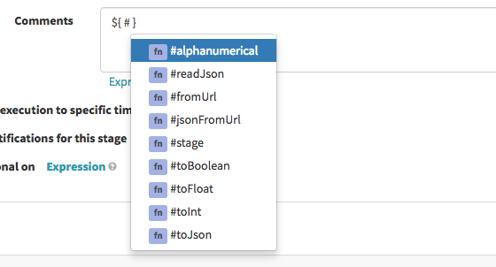

Selecting the function will add it to the expression and place the cursor between the single quotes

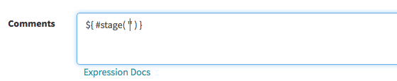

From here we can enter a **question mark (?)** to pull up the list of stages.

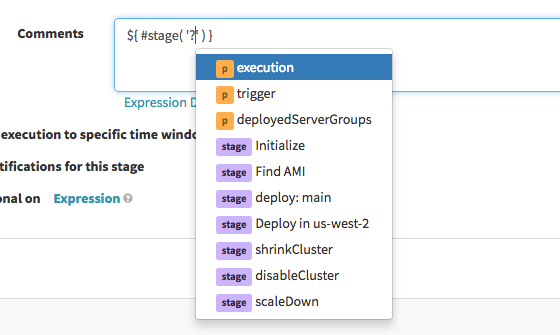

Once the stage name is selected it will be added to the expression.  


From here you can move the cursor to the end of the closing paren of the function, and a list of context values for that stage will be presented for your choosing.


# Source code

The expression language support can be found in the orca codebase and pretty much encapsulated in the [ContextParameterProcessor](https://github.com/spinnaker/orca/blob/master/orca-core/src/main/groovy/com/netflix/spinnaker/orca/pipeline/util/ContextParameterProcessor.groovy) class.
