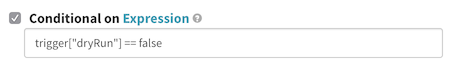



Pipeline expressions allow you to dynamically set and access variables during
pipeline execution. You can use an expression in almost any text field in a
Spinnaker pipeline stage. Pipeline expressions help you use arbitrary values
about the state of your system in the execution of your pipelines. You can use
them to turn on or off particular stages or branches of your pipeline,
dynamically name your stack, check the status of another stage, and perform
other operations.

This guide explains how and where to use expressions, and provides some examples
of what you can do with them. For a list of available functions, see the
[reference guide](/reference/pipeline/expressions/).

## What does a pipeline expression look like?

A pipeline expression is made up of `$` followed by opening/closing brackets:
`${ }`. For example:

```
${expression here}
```

If an expression can't be evaluated, Spinnaker simply returns the expression.
The above example would return "expression here."

You also can interpolate expressions and strings. For example if
`expressionA` evaluates to _Hello_ and `expressionB` evaluates to _world_,

```
 ${expressionA}-randomString-${expressionB}
```

evaluates to _Hello-randomString-world_.

Note that expressions can't be nested: `${ expression1 ${expression2} }` won't
be evaluated.

## How do I use a pipeline expression?

### Where can I use pipeline expressions?

You can use pipeline expressions any place in the UI where you can enter
free-form text, with the exception of the pipeline **Configuration** stage.
However, expressions can be used with Expected Artifacts, just enable "Use
Default Artifact" and write the expression in the Object path.

If you want to set the value of a field using a pipeline expression but there is
no text box available, you can use the [Edit as
JSON](/guides/user/pipeline/managing-pipelines/#edit-a-pipeline-as-json)
pipeline feature.

### When are pipeline expressions evaluated?

Spinnaker evaluates the expressions for a given stage at the beginning of that
stage. You can't use pipeline expressions during the pipeline **Configuration**
stage, because Spinnaker doesn't begin evaluating expressions until after the
**Configuration** stage has finished.

## What tools do I have for writing pipeline expressions?

### Helper functions

There are several built-in [helper functions](/reference/pipeline/expressions/#helper-functions)
to simplify some common use cases. These functions allow you to do things like
access a particular stage by name, strip non-alphanumerical characters out of a
string, or parse JSON.

Adding a pound sign (`#`) within your pipeline expression displays a list of all
the helper functions that are available.


### Helper properties

[_Helper properties_](/reference/pipeline/expressions/#helper-properties)
are variables which refer to global information about the current pipeline
execution. For example, `execution` is a variable which refers to the current
pipeline execution, whereas `trigger` lets you access information
about the pipeline trigger. For example, if you've set up a Jenkins trigger and
want to know which build triggered the current pipeline, you could access that
information with the expression `${trigger["buildInfo"]["number"]}`.

To quickly list available helper properties and stages, you can enter a question
mark (`?`) into your pipeline expression. Once the list is displayed, you can
start typing to narrow down the list, or press enter to add the selected helper
property or stage name to the expression.

Typing a helper property into an expression displays a list of the values that
are available to you:


Once a helper property is added to the expression you can use any of the meta
keys (Shift, Command, Alt, Control) to bring up a list of all the pipeline
context that is relevant to the selected helper property.

### Context values

_Context values_ are similar to helper properties, except that they are specific
to a particular stage. This includes the stage name, status, start or end time,
and so on. You can use context values in combination with the `#stage` helper
function to access properties of a particular stage. For example,
`${#stage("Deploy to Prod")["type"]}` returns the stage type (in this case,
deploy).

To see the available variables for a given pipeline, you can view the pipeline
execution JSON. The easiest way to do this is:

1. Go to an execution of your pipeline.
2. Click on _Details_ to expand the pipeline.
3. Click on the source link under the pipeline execution, which opens a new tab
    containing the JSON details of your pipeline execution.

    

### Property files

You can use Jenkins jobs to pass property files to your pipeline. A _property
file_ is a file containing a list of variables that you would like to pass to
your pipeline. The file can be a Java .properties file, YML, or JSON. Spinnaker
reads the contents of this file and adds the specified variables to the pipeline
context.

To specify a property file:

1. Archive it in your Jenkins job.
2. Specify the name of the file in the pipeline configuration. Note that this
    is just the name of the file, not the absolute path —
    `mypropertyfile.properties` rather than
    `workspace/build/mypropertyfile.properties`.
    

If you upload a property file via a Jenkins trigger, you can access the
variables via `trigger["properties"]`. However, if you're using property files
in Jenkins or Script pipeline _stages_, they are added directly to the stage
context. Within the stage itself you can access them directly, and future stages
can access them via the stage context.

For example, consider a property file containing this:

```
version='0.1.0'
```

If this was uploaded by a Jenkins trigger, you could access the value of
_version_ using the expression `${trigger["properties"]["version"]}`.

If it was uploaded in a Jenkins or Script stage, you would access it in that
stage directly: `${version}`. Successive stages could access the variable
using the stage context: `${#stage("Jenkins job")["context"]["version"]}`.

Be careful when using property files in pipelines with multiple Jenkins jobs. If
both jobs upload property files with the same variables specified, they may
overwrite one another.

### #root

`#root` returns the current stage context — the _context_ map contained in each
stage. For example, each Bake stage has a _package_ value which returns the name
of the package that it installed. To access that value within the stage, you can
use the expression `${#root["package"]}`.

Note that if you are running an expression against the [testing
endpoint](#how-do-i-test-a-pipeline-expression), `#root` returns the entire
pipeline context, because the expression isn't tied to a particular stage.

### Special characters

#### Set default values

You can use pipeline expressions to set a default value for a field with the
characters `?:`. For example, `${parameters["region"] ?: 'us-east-1'}` sets the
region to _us-east-1_ unless otherwise specified.

#### Filter maps

You can filter maps using `.?`. For example, return a list of all of the bake
stages in your pipeline, use the expression
`${execution["stages"].?[type == "bake"]}`.

### Autocomplete

Pipeline expressions auto-complete as you begin typing. Type `$` into any text
field and hit enter, and `${ }` – enclosing braces for an expression – are
automatically added for you. You can also use `#` to display helper functions,
or `?` to display a list of helper parameters and stages in your pipeline.

## How do I test a pipeline expression?

Spinnaker provides an API endpoint that allows you you to test an expression
before plugging it into your pipeline. To use the endpoint, you need a running
instance of Spinnaker and the ID of a previous pipeline execution that you want
to use in the test.

You can find the pipeline execution ID through the execution JSON:
1. Expand the **Details** of a particular execution.
2. Click **Source** in the lower right corner, which opens a new tab containing
the pipeline execution JSON.

    

3. The execution ID is the value of the top-level **id** field in the JSON, and
looks something like _01CGYV7Q4PMEBDYS146CCED0M6_.

You can use `curl` to pass an expression to the testing endpoint:

```
PIPELINE_ID=[your_pipeline_id]
curl http://api.my.spinnaker/pipelines/$PIPELINE_ID/evaluateExpression \
       -H "Content-Type: text/plain" \
       --data '${ #stage("Deploy").status.toString() }'
```

This example outputs the status of your Deploy stage:

```
{"result": "SUCCEEDED"}
```

If Spinnaker cannot evaluate the expression, the result includes error details.
For example, if you forget the closing bracket in the example above, it outputs
the following:

```
{
  "detail":
    {
      "{ #stage(\"Deploy\").status.toString() ":
        [
          {
            "description":
              "Failed to evaluate [expression] Expression
              [{ #stage( #root.execution, \"Deploy\").status.toString() ]
              @0: No ending suffix '}' for expression starting at character 0:
              { #stage( #root.execution, \"Deploy\").status.toString() ",
            "exceptionType":"org.springframework.expression.ParseException",
            "level":"ERROR",
            "timestamp":1531254890849
         }
        ]
   },
  "result":"${#stage(\"Deploy\").status.toString() "
}
```

Note that [Gate](https://github.com/spinnaker/gate) is the microservice that
provides access to the Spinnaker API. If you're accessing Spinnaker via the
default `localhost:9000`, make sure you're sending your API requests to Gate
(defaults to `localhost:8084`).

Note also that pipeline expressions may not behave exactly the same against the
testing endpoint and in your pipeline. In your pipeline, each expression is
evaluated against the context of the particular stage in which it was declared.
When using the testing endpoint, your expression is evaluated against the
entire pipeline at the end of its execution. Because of this, you need to access
all variables from the top level when using the testing endpoint. For example,
to check the type of a particular stage, you need to use the expression
`${#stage("My Stage")["type"]}`, whereas within "My Stage" you can use the
expression `${#root["type"]}`.

## Examples

### Dynamically skip a stage

Each stage has a _Conditional on Expression_ checkbox in the _Execution Options_
section of its configuration. If you select _Conditional on Expression_ and
enter an expression, the stage only runs if the expression evaluates to true.

For example, if you input the expression `trigger["dryRun"] == false`, the
stage will be skipped during dry runs.  Note: expressions in this field do not
need to be wrapped in `${}`.



Note that only the specific stage containing this expression will be skipped.
Stages that depend on it will still run.

### Create a stack named after a committed git branch

In this example, you use pipeline expressions to dynamically name the stack that
you're deploying to.

1. Set up a pipeline that bakes an image from a Jenkins trigger. Make sure that
the Jenkins build is triggered by a git commit.

    

2. Add a deploy stage to the pipeline. In the _stack_ field, you'll use the
expression `${#alphanumerical(scmInfo.branch)}` rather than a static value.
`#alphanumerical` strips out all special characters from the input string, which
is important because some providers don't allow stack names with special
characters. `scmInfo` is a helper property which provides details about the most
recently executed Jenkins job.

    

    Once saved, the deploy configuration should look like this:

    

3. Commit to a git branch in the repo you've connected to Jenkins in order to
trigger your pipeline. When the pipeline runs, it replaces the expression with
the name of the branch, creating a new cluster. The screenshot below shows what
happens when you push commits to both the _master_ branch and a branch called
_new-release_. Note that the dash was stripped out of _new-release_, creating
the _newrelease_ cluster.

    

### Use preconditions to choose pipeline paths

You're going to set up a pipeline with three conditions, and gate these
conditions with a manual judgment stage. The screenshots below show a pipeline
that receives and bakes a binary from a Jenkins trigger, but you can work
through this example with any pipeline that's able to deploy an image.

1. Create a pipeline and add a Manual Judgment stage named 'Ask for next
step' with three input options: **do nothing**, **deploy another**, and
**clean up**.

    

2. Create a new _Check Precondition_ stage. Use the expression
`${#judgment("Ask for next step") == 'clean up'}` to check that the input was
**clean up** before proceeding. Make sure that you uncheck _Fail pipeline_.

    

    The `judgment` function checks the output of a Manual Judgment stage whose name
    matches the input string.  Note that the input is case-sensitive. Since the name
    of the Manual Judgment stage is 'Ask for next step', attempting to find it using
    `#judgment("ask for next step")` would fail.

    Now you have a branch of your pipeline that only executes if you decide to clean
    up. Add any stages you want to execute based on this precondition. For example,
    you may want to add a stage that disables the oldest Server Group.

    

3. Repeat the last few steps for the **deploy another** input:
      1. Add an expression to check that the input was **deploy another** before
       proceeding
      2. Add the other stages for this pipeline branch (for example, a second deploy
        stage)

    At this point, the pipeline looks like this:

    

4. Run your pipeline. The options show up in the Manual Judgment stage:

    

    If you select **do nothing**, which matches no preconditions, the pipeline just
    stops:

    

    If you select **deploy another**, the stages gated by **deploy another** are
    executed:

    

    Finally, if you select **cleaning up**, only the cleanup stages run:

    
