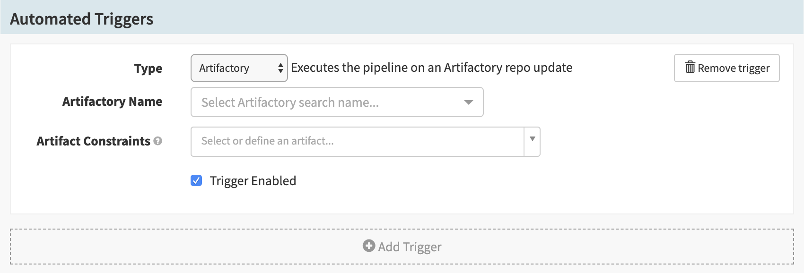
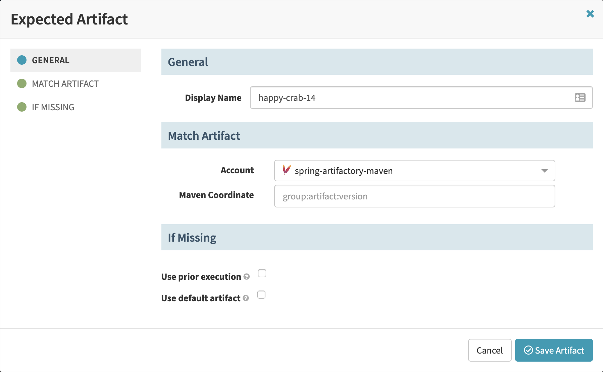



> This guide assumes that you have enabled the `artifactsRewrite` feature flag.
> See [Prerequisites](#prerequisites).

This guide explains how to add a [JFrog
Artifactory](https://jfrog.com/artifactory/) trigger to your pipeline.

# Prerequisites

This guide assumes you have the following:

* An Artifactory search configured in Spinnaker (see the [documentation for the
  `hal config repository artifactory` Halyard
commands](/reference/halyard/commands/#hal-config-repository-artifactory))

* A Maven account configured in Spinnaker (see the [documentation for the `hal
  config artifact maven` Halyard
commands](/reference/halyard/commands/#hal-config-artifact-maven))

* The `artifactsRewrite` feature flag enabled in Spinnaker. In
  `~/.hal/$DEPLOYMENT/profiles/settings-local.js` (where `$DEPLOYMENT` is
  typically `default`), add the line
  `window.spinnakerSettings.feature.artifactsRewrite = true;`.

# Adding an Artifactory Trigger

1. Create a pipeline.

1. In the __Configuration__ stage of your new pipeline, add a trigger.

1. In the __Type__ menu, select __Artifactory__. This brings up the following
screen:

    

1. In the __Artifactory Name__ menu, select an Artifactory search.

1. In the __Artifact Constraints__ menu, select __"Define a new artifact..."__.
This brings up the following screen:

    

1. Enter a name in the __Display Name__ field, or leave the autogenerated
default.

1. In the __Account__ menu, select a Maven account.

1. In the __Maven Coordinate__ field, enter the Maven coordinates of the
artifact.

1. Click __Save Artifact__.

