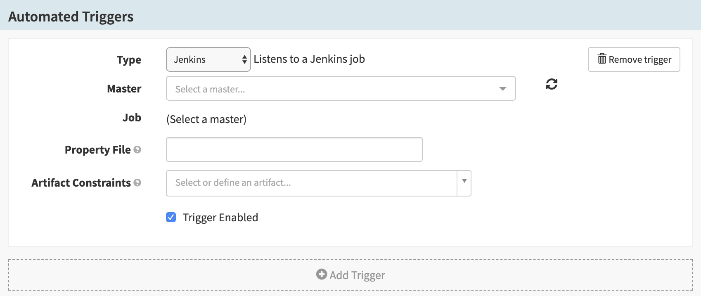



> This guide assumes that you have enabled the `artifactsRewrite` feature flag.
> See [Prerequisites](#prerequisites).

This guide explains how to add a [Jenkins](https://jenkins.io/){:target="\_blank"}
trigger to your pipeline.

## Prerequisites

* [Set up Jenkins](/setup/ci/jenkins/) as a continuous integration system in
    your Spinnaker deployment.
* Enable the `artifactsRewrite` feature flag in Spinnaker. In
  `~/.hal/$DEPLOYMENT/profiles/settings-local.js` (where `$DEPLOYMENT` is
  typically `default`), add the line
  `window.spinnakerSettings.feature.artifactsRewrite = true;`.

## Adding a Jenkins trigger

1.  [Create a pipeline](/guides/user/pipeline/managing-pipelines/#create-a-pipeline).
1.  In the **Configuration** stage of your new pipeline,
    [add a trigger](/guides/user/pipeline/managing-pipelines/#add-a-trigger).
1.  Select **Jenkins** from the **Type** menu, which brings up the following
    screen:

    

1.  Select a Jenkins master from the **Master** drop-down menu, then select a job from
    the **Job** drop-down.
1.  Add a property file, if desired. See the [property
    files](/guides/user/pipeline/expressions/#property-files) section of the
    Pipeline Expression Guide for more information about how to specify and use
    property files.
