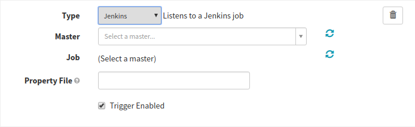



This guide explains how add a [Jenkins](https://jenkins.io/){:target="\_blank"}
trigger to your pipeline.

## Prerequisites

*   [Set up Jenkins](/setup/ci/jenkins/) as a continuous integration system in
    your Spinnaker deployment

## Adding a Jenkins trigger

1.  [Create a pipeline](/guides/user/pipeline/managing-pipelines/#create-a-pipeline).
1.  From the **Configuration** stage of your new pipeline,
    [add a trigger](/guides/user/pipeline/managing-pipelines/#add-a-trigger).
1.  Select **Jenkins** as from the **Type** menu, which brings up the following
    screen:
    
1.  Select a Jenkins master from the **Master** drop-down menu, and a job from
    the **Job** drop-down. These will be automatically populated if you have set
    up Jenkins correctly.
1.  Add a property file, if desired. See the documentation
    [here](/guides/user/pipeline/expressions/#property-files) for more
    information about how to specify and use property files.
