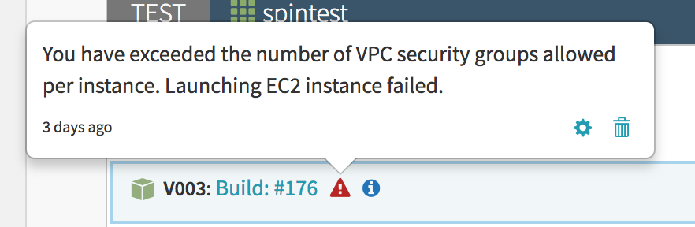



<h1 style="margin-top: 0; font-size: 25px;"><span style="color: red">Release Candidate</span> (2017-01-13)</h1>

This guide provides an introduction to the provider-agnostic tagging capabilities of Spinnaker, otherwise referred to as _Entity Tags_.

# Requirements

This is an *optional* feature of Spinnaker that requires
- **Elasticsearch** (tested with 2.3.3)
- **Front50** (backed by S3 or GCS)

See [appendix](#appendix) for specific configuration details.

# Overview

Spinnaker provides a provider-agnostic way of attaching additional attributes (*key/value pairs*) to any managed entity.

> **Managed Entities**
>
> Any object that is maintained (_or visualized_) by Spinnaker.
>
> Includes (*but is not limited to*):
> - Applications
> - Server Groups
> - Load Balancers
> - Instances
> - Clusters

There are no restrictions on the size or quantity of these tags (*unlike limitations imposed by native cloud provider tags*).

## Current limitations
- Completely separate from any tag support on the underlying cloud provider
  - *Callers must make an additional API call to retrieve entity tags*
- Limited lifecycle support
  - *Only server groups have a delete hook that will cleanup associated tags*

> These limitations will be addressed on an as needed basis.
>
> If they are blocking a particular use-case, please file an [issue](https://github.com/spinnaker/spinnaker/issues).

## Common use cases
- Server Group Alerts and Notices
- Server Group Attribution (*what pipeline / user created this server group*)
- Security (*restricting when particular IAM roles can be used*)

# Tag namespaces

All tags have an associated namespace (_`default` will be used if unspecified_) that provides a means of grouping tags by a logical owner.

Tag names can be re-used across namespaces.

Eventually Spinnaker will allow permissions to be defined per-namespace (ie. certain namespaces can only be modified by particular users or groups).

# Implementation details

These provider-agnostic tags are stored in S3 or GCS (*via Front50*) and indexed via Elasticsearch.

They are made up of:
- An `Identifier`
- An `EntityRef`
- 1..* Tags (`key`/`value` pairs with the `value` being either a literal or object)
- 1..* Tag Metadata (*last modified timestamps per tag*)

## Identifier

A unique identifier representing a tagged entity:
`{cloudProvider}:{entityType}:{entityId}:{accountId}:{region}`

## EntityRef

`cloudProvider` The identifier of the cloud provider associated with this entity
`accountId` The identifier of the account associated with this entity (supports `*` wildcard)
`region` The identifier of the region associated with this entity (supports `*` wildcard)
`entityType` The type of entity being tagged
`entityId` The identifier of the entity being tagged
`application` The identifier of the application associated with this entity

> Supported Entity Types
>
> Spinnaker has native support for the following:
> - `application`
> - `servergroup`
> - `iamrole`

#### tags structure
```
    {
      "id": "aws:servergroup:myservergroup-v001:100000000001:us-west-2",
      "tags": [
        {
          "name": "spinnaker_ui_alert:autoscaling:ec2_instance_launch_error",
          "namespace": "my_namespace",
          "value": {
            "message": "Insufficient capacity. Launching EC2 instance failed.",
            "type": "alert"
          },
          "valueType": "object"
        }
      ],
      "tagsMetadata": [
        {
          "name": "spinnaker_ui_alert:autoscaling:ec2_instance_launch_error",
          "lastModified": 1484162291500,
          "lastModifiedBy": "unknown",
          "created": 1484161809699,
          "createdBy": "unknown"
        }
      ],
      "entityRef": {
        "cloudProvider": "aws",
        "accountId": "100000000001",
        "region": "us-west-2",
        "entityType": "servergroup",
        "entityId": "myservergroup-v001",
        "application": "app"
      }
    }
```

# API

The following APIs are exposed in `gate` but are subject to change given the current **release candidate** status.

## GET /tags

Fetch all tags. Parameters are case-sensitive.

Parameter Name | Description | Examples
-- | -- | --
entityType | Filter by Entity Type | ?entityType=servergroup
entityId | Filter by Entity Id | ?entityId=myservergroup-v001
application | Filter by Application | ?application=app
tag | Filter by Tag (specific value)<br/>Filter by Tag (any value) | ?tag:my_tag=my_value<br />?tag:my_tag=*
maxResults | Maximum # of results to return (defaults to 100) | ?maxResults=1000

## POST /tags

Parameter Name | Description | Examples
-- | -- | --
entityType | Entity Type | ?entityType=servergroup
entityId | Entity Id | ?entityId=myservergroup-v001
application | application | ?application=app
account | Account Name | ?account=production<br/>?account=* (wildcard)
region | Region | ?region=us-west-2<br/>?region=* (wildcard)
cloudProvider | cloudProvider | ?cloudProvider=aws<br/>?cloudProvider=* (wildcard)

#### Upsert tags
```
    curl -X "POST" "http://gate/tags?entityId=myservergroup-v001&entityType=servergroup&account=production&region=us-west-2&cloudProvider=aws&application=app" \
         -H "Content-Type: application/json" \
         -d $'[
      {
        "name": "spinnaker_ui_alert:autoscaling:ec2_instance_launch_error",
        "namespace": "my_namespace",
        "value": {
          "message": "Insufficient capacity. Launching EC2 instance failed.",
          "type": "alert"
        },
        "valueType": "object"
      }
    ]'
```

## POST /tasks

This API provides backwards compatibility with traditional Spinnaker tasks and can be used interchangeably with the `POST /tags` API.

#### Upsert tags
```
    curl -X "POST" "http://gate/tasks" \
         -H "Content-Type: application/json" \
         -d $'{
      "application": "spinnaker",
      "job": [
        {
          "type": "upsertEntityTags",
          "tags": [
            {
              "name": "spinnaker_ui_alert:autoscaling:ec2_instance_launch_error",
              "namespace": "my_namespace",
              "value": {
                "message": "Insufficient capacity. Launching EC2 instance failed.",
                "type": "alert"
              },
              "valueType": "object"
            }
          ],
          "entityRef": {
            "cloudProvider": "aws",
            "entityType": "servergroup",
            "entityId": "myservergroup-v001",
            "region": "us-west-2",
            "account": "production",
            "application": "app"            
          }
        }
      ],
      "description": "Updating tags"
    }'
```

## DELETE /tags/:id/:tagName

#### Delete tags
```
    curl -X "DELETE" "http://gate/tags/myservergroup-v001:100000000001:us-west-2/spinnaker_ui_alert:autoscaling:ec2_instance_launch_error" \
         -H "Content-Type: application/json" \
         -d $'{}'
```

# FEATURE: Server group alerts and notices

*Server Group Alerts and Notices* is a new Spinnaker feature is built upon entity tags.



#### Add alert
```
    curl -X "POST" "http://gate/tags?entityId=spintest-v003&entityType=servergroup&account=test&region=us-west-2&cloudProvider=aws&application=app" \
         -H "Content-Type: application/json" \
         -d $'[
      {
        "name": "spinnaker_ui_alert:autoscaling:ec2_instance_launch_error",
        "namespace": "my_namespace",
        "value": {
          "message": "You have exceeded the number of VPC security groups allowed per instance. Launching EC2 instance failed.",
          "type": "alert"
        },
        "valueType": "object"
      }
    ]'
```

#### Add notice
```
    curl -X "POST" "http://gate/tags?entityId=spintest-v003&entityType=servergroup&account=test&region=us-west-2&cloudProvider=aws&application=app" \
         -H "Content-Type: application/json" \
         -d $'[
      {
        "name": "spinnaker_ui_notice:my_favorite_notice",
        "namespace": "my_namespace",
        "value": {
          "message": "This is an example notice!",
          "type": "notice"
        },
        "valueType": "object"
      }
    ]'
```

#### Delete alert (or notice)
```
    curl -X "DELETE" "http://gate/tags/aws:servergroup:spintest-v003:100000000001:us-west-2/spinnaker_ui_alert:autoscaling:ec2_instance_launch_error" \
         -H "Content-Type: application/json" \
         -d $'{}'
```

# Appendix

#### clouddriver-local.yml
```
elasticSearch:
  activeIndex: "tags_v2"
  connection: http://my-elastic-search-cluster:9200
```

#### deck/settings-local.js
```
window.spinnakerSettings.entityTags = {};
window.spinnakerSettings.feature.entityTags=true;
```

#### elasticsearch index template

Make a POST request to http://my-elastic-search-cluster:9200/_template/entityTags with the following template.

```
{
  "order": 0,
  "template": "tags_v*",
  "settings": {
    "index": {
      "number_of_shards": "6",
      "number_of_replicas": "2",
      "refresh_interval": "1s"
    }
  },
  "mappings": {
    "_default_": {
      "dynamic": "false",
      "dynamic_templates": [
        {
          "tags_template": {
            "path_match": "tagsMetadata",
            "mapping": {
              "index": "no"
            }
          }
        },
        {
          "entityRef_template": {
            "path_match": "entityRef.*",
            "mapping": {
              "index": "not_analyzed"
            }
          }
        }
      ],
      "properties": {
        "entityRef": {
          "properties": {
            "accountId": {
              "index": "not_analyzed",
              "type": "string"
            },
            "entityType": {
              "index": "not_analyzed",
              "type": "string"
            },
            "cloudProvider": {
              "index": "not_analyzed",
              "type": "string"
            },
            "entityId": {
              "index": "not_analyzed",
              "type": "string"
            },
            "region": {
              "index": "not_analyzed",
              "type": "string"
            },
            "account": {
              "index": "not_analyzed",
              "type": "string"
            },
            "application": {
              "index": "not_analyzed",
              "type": "string"  
            }
          }
        },
        "tags": {
          "type": "nested",
          "properties": {
            "valueType": {
              "index": "not_analyzed",
              "type": "string"
            },
            "name": {
              "index": "not_analyzed",
              "type": "string"
            },
            "namespace": {
              "index": "not_analyzed",
              "type": "string"
            },
            "value": {
              "index": "not_analyzed",
              "type": "string"
            }
          }
        }
      }
    }
  },
  "aliases": {}
}
```
