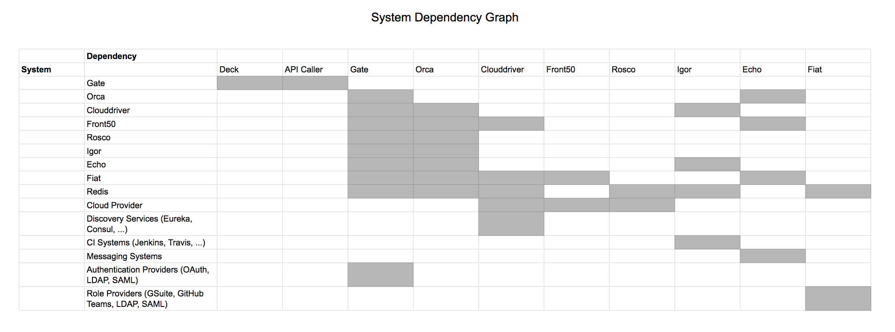



## Spinnaker microservices

Spinnaker is composed of a number of independent microservices:

* [Deck](https://github.com/spinnaker/deck) is the browser-based UI.

* [Gate](https://github.com/spinnaker/gate) is the API gateway.

  The Spinnaker UI and all api callers communicate with Spinnaker via Gate.

* [Orca](https://github.com/spinnaker/orca) is the orchestration engine.
  It handles all ad-hoc operations and pipelines.
  Read more on the [Orca Service Overview](/guides/developer/service-overviews/orca).

* [Clouddriver](https://github.com/spinnaker/clouddriver) is responsible for all
mutating calls to the cloud providers and for indexing/caching all deployed
resources.

* [Front50](https://github.com/spinnaker/front50) is used to persist the
metadata of applications, pipelines, projects and notifications.

* [Rosco](https://github.com/spinnaker/rosco) is the bakery. It produces immutable 
VM images (or image templates) for various cloud providers.

  It is used to produce machine images (for example [GCE
    images](https://cloud.google.com/compute/docs/images),
    [AWS AMIs](http://docs.aws.amazon.com/AWSEC2/latest/UserGuide/AMIs.html),
    [Azure VM images](https://docs.microsoft.com/en-us/azure/virtual-machines/linux/classic/about-images)).
    It currently wraps [packer](https://www.packer.io/), but will be expanded to
    support additional mechanisms for producing images.

* [Igor](https://github.com/spinnaker/igor) is used to trigger pipelines via
continuous integration jobs in systems like Jenkins and Travis CI, and it allows
Jenkins/Travis stages to be used in pipelines.

* [Echo](https://github.com/spinnaker/echo) is Spinnaker's eventing bus.

  It supports sending notifications (e.g. Slack, email, SMS), and acts
  on incoming webhooks from services like Github.

* [Fiat](https://github.com/spinnaker/fiat) is Spinnaker's authorization
service.

  It is used to query a user's access permissions for accounts, applications
and service accounts.

* [Kayenta](https://github.com/spinnaker/kayenta) provides automated canary
analysis for Spinnaker.

* [Halyard](https://github.com/spinnaker/halyard) is Spinnaker's configuration
service.

  Halyard manages the lifecycle of each of the above services. It only interacts
  with these services during Spinnaker startup, updates, and rollbacks.

## System dependencies

 This diagram shows which microservices depend on each other. The green
 boxes represent "external" components, including the Deck UI, a single-page
 JavaScript application that runs in your browser. The gold boxes represent Halyard components
 which are only ran when configuring Spinnaker.

 

 graph TB

 deck(Deck) --> gate;
 api(Custom Script/API Caller) --> gate(Gate);
 gate --> kayenta(Kayenta);
 gate --> orca(Orca);
 gate --> clouddriver(Clouddriver);
 orca --> clouddriver;
 gate --> rosco(Rosco);
 orca --> front50;
 orca --> rosco;
 gate --> front50(Front50);
 gate --> fiat(Fiat);
 orca --> kayenta;
 clouddriver --> fiat;
 orca --> fiat;
 front50 --> fiat;
 echo(Echo) --> orca;
 echo --> front50;
 gate --> echo;
 igor(Igor) --> echo;

 hal(Halyard CLI) --> halyard(Halyard Daemon);

 classDef default fill:#d8e8ec,stroke:#39546a;
 linkStyle default stroke:#39546a,stroke-width:1px,fill:none;

 classDef halStyle fill:#eebb3c,stroke:#39546a;
 class halyard,hal halStyle;

 classDef external fill:#c0d89d,stroke:#39546a;
 class deck,api external;
 

 

In the table below, A filled cell indicates that the system listed in the
heading of that column has a dependency on the system listed in the heading of
that row. As all Spinnaker services can be run in their own server group, it is
typical for services to resolve their dependencies via load balancers or
discovery systems (for example [Eureka](https://github.com/Netflix/eureka) or
[Consul](https://www.consul.io/)).

## Port mappings

By default Spinnaker binds ports according to the following table

| Service     | Port              |
| :---------- | :---------------- |
| Clouddriver | 7002              |
| Deck        | 9000              |
| Echo        | 8089              |
| Fiat        | 7003              |
| Front50     | 8080              |
| Gate        | 8084              |
| Halyard     | 8064              |
| Igor        | 8088              |
| Kayenta     | 8090              |
| Orca        | 8083              |
| Rosco       | 8087              |
