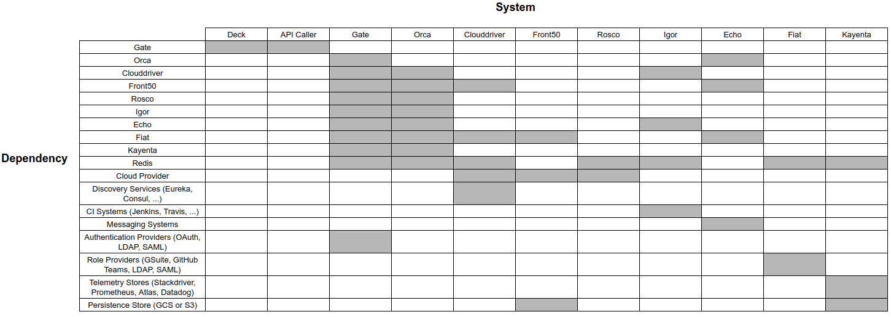



## Spinnaker Microservices

Spinnaker is composed of a number of independent microservices:

* [Deck](https://github.com/spinnaker/deck) is the browser-based UI.

* [Gate](https://github.com/spinnaker/gate) is the API gateway. The Spinnaker UI and all api callers communicate with Spinnaker via Gate.

* [Orca](https://github.com/spinnaker/orca) is the orchestration engine. It handles all ad-hoc operations and pipelines.

* [Clouddriver](https://github.com/spinnaker/clouddriver) is responsible for all mutating calls to the cloud providers and for indexing/caching all deployed
resources.

* [Front50](https://github.com/spinnaker/front50) is used to persist the metadata of applications, pipelines, projects and notifications.

* [Rosco](https://github.com/spinnaker/rosco) is the bakery. It is used to produce machine images
(e.g. [GCE images](https://cloud.google.com/compute/docs/images), [AWS AMIs](http://docs.aws.amazon.com/AWSEC2/latest/UserGuide/AMIs.html),
[Azure VM images](https://docs.microsoft.com/en-us/azure/virtual-machines/linux/classic/about-images)). It presently wraps [packer](https://www.packer.io/),
but will shortly be expanded to support additional mechanisms for producing images.

* [Igor](https://github.com/spinnaker/igor) is used to trigger pipelines via continuous integration jobs in systems like Jenkins and Travis, and to allow for
Jenkins/Travis stages to be used in pipelines.

* [Echo](https://github.com/spinnaker/echo) is Spinnaker's eventing bus. It supports sending notifications (e.g. Slack, email, Hipchat, SMS), and act on incoming webhooks from services like Github.

* [Fiat](https://github.com/spinnaker/fiat) is Spinnaker's authorization service. It is used to query a user's access permissions for accounts, applications
and service accounts.

* [Halyard](https://github.com/spinnaker/halyard) is Spinnaker's configuration service. Halyard manages the lifecycle of each of the above services. It only interacts with the above services during Spinnaker startup, updates, and rollbacks.

* [Kayenta](https://github.com/spinnaker/kayenta) provides automated canary analysis for Spinnaker.

## System Dependency Graph

graph TB

gate --> kayenta(Kayenta);
orca --> kayenta;
deck(Deck) --> gate;
api(Custom Script/API Caller) --> gate(Gate);
gate --> orca(Orca);
gate --> clouddriver(Clouddriver);
orca --> clouddriver;
gate --> rosco(Rosco);
orca --> front50;
gate --> front50(Front50);
gate --> fiat(Fiat);
clouddriver --> fiat;
orca --> fiat;
front50 --> fiat;
echo(Echo) --> orca;
echo --> front50;
igor(Igor) --> echo;

classDef default fill:#d8e8ec,stroke:#39546a;
linkStyle default stroke:#39546a,stroke-width:2px,fill:none;

classDef external fill:#c0d89d,stroke:#39546a;
class deck,api external

The diagram above represents which microservices depend on each other. The green boxes represent
"external" components, including Deck, the single-page JavaScript application that runs in your
browser.



A filled cell indicates that the system listed in the heading of that column has a dependency on the system listed in the heading of that row. As all Spinnaker
services can be run in their own server group, it is typical for services to resolve their dependencies via load balancers or discovery systems (e.g.
[Eureka](https://github.com/Netflix/eureka) or [Consul](https://www.consul.io/)).

## Port mappings

By default Spinnaker binds ports according to the following table

| Service     | Port              |
| :---------- | :---------------- |
| Deck        | 9000              |
| Gate        | 8084              |
| Orca        | 8083              |
| Clouddriver | 7002              |
| Front50     | 8080              |
| Rosco       | 8087              |
| Igor        | 8088              |
| Echo        | 8089              |
| Fiat        | 7003              |
| Halyard     | 8064              |
