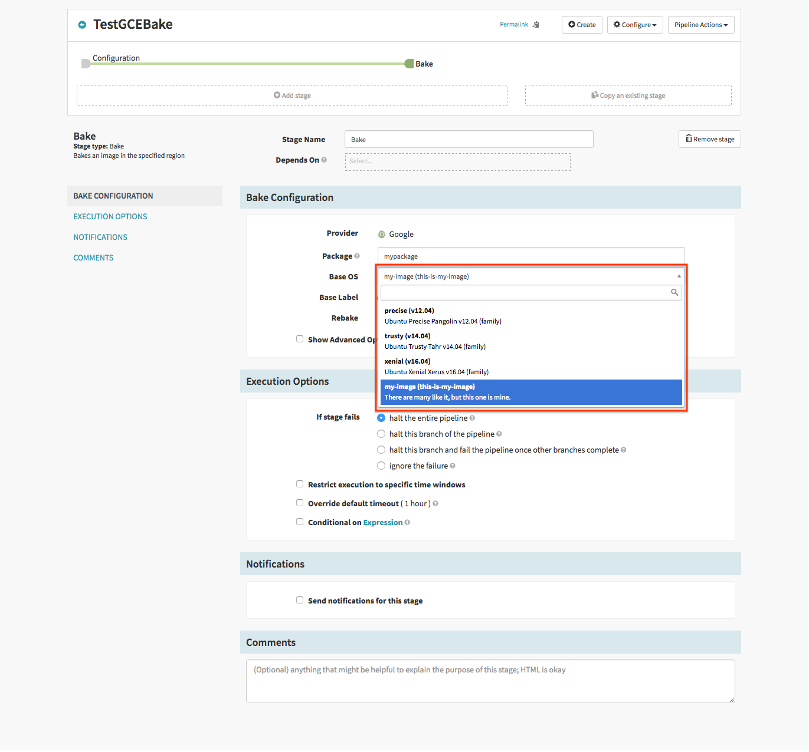

The GCE bakery configuration allows for setting the default network and zone and whether to use the public IP
address of the VM used for baking the image.

For example, to set the default zone:

```bash
hal config provider google bakery edit --zone $ZONE
```

And to set the default network:

```bash
hal config provider google bakery edit --network $YOUR_NETWORK
```

You can also define custom base images:

```bash
hal config provider google bakery base-image add $BASE_IMAGE \
    --source-image $GCE_VM_IMAGE_NAME \
    --short-description this-is-my-image \
    --detailed-description 'There are many like it, but this one is mine.' \
    --package-type deb
```

These images are used to dynamically populate the bake stage UI:



The options are fully-described here:
[here](/reference/halyard/commands/#hal-config-provider-google-bakery)
