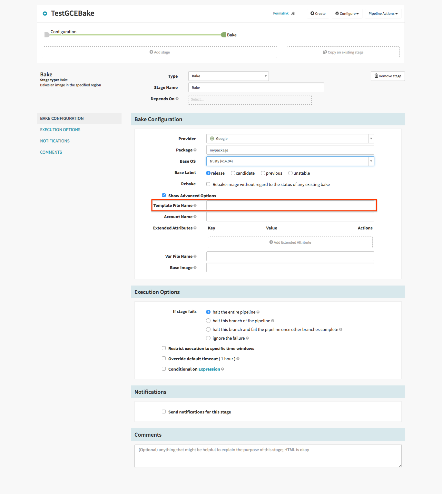



Since the concept of Immutable Infrastructure is core to Spinnaker, we provide
an image bakery powered by [Hashicorp's
Packer](https://www.packer.io/intro/){:target="\_blank"} to help you produce
machine images.

For getting started, the default configuration (no changes required) provides
you with enough Packer templates & base machine image options to learn how the
system works. However, once you want to start customizing the bake process or
use artifacts not supported by the default configuration, these documentation
pages will describe how to further configure the bakery.

There are two types of configuration of the Bakery:

1. [Packer templates](#packer-templates)
2. [Image provider configuration](#image-provider-configuration)

## Packer Templates

Every time you initiate a bake using Spinnaker, Spinnaker invokes a [packer
template](https://www.packer.io/docs/templates/index.html){:target="\_blank"}
with a mix of [variables](https://www.packer.io/docs/templates/index.html){:target="\_blank"}
provided by you, the Pipeline you are currently executing, and Spinnaker itself.
All of the default packer templates are versioned alongside Rosco, the image
bakery service
[here](https://github.com/spinnaker/rosco/tree/master/rosco-web/config/packer){:target="\_blank"}.
If want to override/include a new template, place it into
`~/.hal/$DEPLOYMENT/profiles/rosco/packer/` (`$DEPLOYMENT` is
typically `default`, read more [here](/reference/halyard/#deployments)). Any local
scripts/artifacts required by that template can also be placed into that
directory, and referenced relative to the `configDir` Packer variable that will
automatically be set.

You can then use the `Template File Name` field under `Advanced Options` in the bake
stage UI to refer to your custom template:

## Image Provider Configuration

The following providers support configuring their image bakery:

* [Google Compute Engine](/setup/bakery/google/)
* [Oracle Cloud Infrastructure](/setup/bakery/oracle/)
