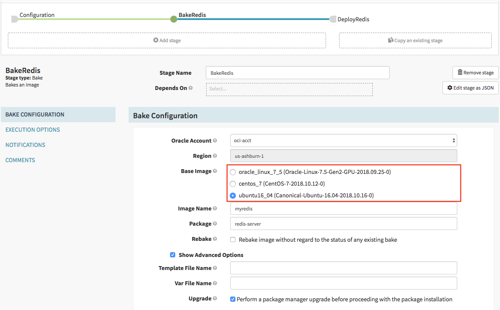

The Oracle Cloud Infrastructure (OCI) bakery configuration allows for setting the default availability domain, network, and instance shape of the VM used for baking the image:

```bash
hal config provider oracle bakery edit \
    --instance-shape $INSTANCE_SHAPE \
    --availability-domain $AVAILABILITY_DOMAIN \
    --subnet-id $SUBNET_ID
```

You can also define custom base images:

```bash
hal config provider oracle bakery base-image add $BASE_IMAGE \
    --base-image-id $OCI_IMAGE_OCID \
    --ssh-user-name $SSH_USER_NAME \
    --package-type deb
```

These images are used to dynamically populate the bake stage UI:



The options are fully-described here:
[here](/reference/halyard/commands/#hal-config-provider-oracle-bakery)
