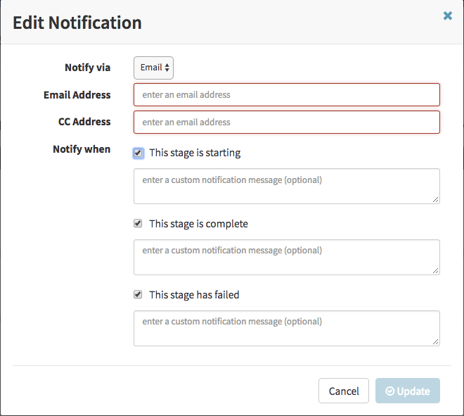



Out of the box, Spinnaker allows you to configure the following types of notifications:

* [Email](#email)
* [Slack](#slack)
* [SMS](#twilio) via Twilio

This is discussed in the Configuring Notifications section below.

Additionally, Spinnaker allows you to set webhooks for git triggers. See the [Setting up Git Triggers in Spinnaker](#setting-up-git-triggers-in-spinnaker) section.

You can also set Spinnaker to stream all its events to a downstream listener. See the [Add a Webhook to Spinnaker](#add-a-listening-webhook-to-spinnaker) section.

Additionally, Spinnaker is capable of handling cron-based triggers and detect changes in Jenkins builds and Docker images. This functionality will be documented at a later time.

See also [`hal config notifications`](/reference/halyard/commands/#hal-config-notification).

# Configuring notifications

Notification configurations are in echo.yml and settings.js. For changes to echo.yml, create echo-local.yml and put your changes in there. You can customize settings.js directly.

## Where to put echo-local.yml and settings.js

If you use Halyard to configure Spinnaker, put echo-local.yml and settings.js in `~/.hal/{deployment}/profiles/`.

If you don’t use Halyard, put echo-local.yml in the same place as the current echo.yml, in `/opt/spinnaker/config`, and put settings.js in `/opt/deck/html/`.

## Spinnaker baseURL

You need to set the `spinnaker.baseUrl` configuration value which is used by spinnaker templates. This should point back to the url for your spinnaker's UI ( deck ) instance. This url is used in notifications to link back to your spinnaker instance.

## Email

Email in spinnaker is provided by [Spring Boot Mail
starter](https://docs.spring.io/spring-boot/docs/current/reference/html/boot-features-email.html){:target="\_blank"}.
The following is an example of using hotmail to send notifications.

in echo.yml
```
mail:
  enabled: true
  from: <myemail>@hotmail.com
spring:
  mail:
    host: smtp.live.com
    username: <myemail>@hotmail.com
    password: hunter2
    port: 587
    properties:
      mail:
        smtp:
          auth: true
          starttls:
            enable: true
        transport:
          protocol: smtp
#	debug: true <- this is useful if you are mucking around with smtp properties  
```
in settings.js (deck)
```
window.spinnakerSettings = {
// ...
  notifications: {
    email: {
      enabled: true
    },
// ...
```

## Slack

For slack, you need to [create a custom bot
user](https://api.slack.com/bot-users#how_do_i_create_custom_bot_users_for_my_team){:target="\_blank"},
then get the access token associated with that new bot user. Then...

```bash
hal config notification slack enable
echo $TOKEN_FROM_SLACK | hal config notification slack edit --bot-name $SPINNAKER_BOT --token
```

Note: your users will need to invite the slack bot to private rooms that want to be notified.

## Twilio

For Twilio, you need to add your account [credentials](https://support.twilio.com/hc/en-us/articles/223136027-Auth-Tokens-and-how-to-change-them){:target="\_blank"}. Then...

```bash
hal config notification twilio enable
echo $TWILIO_AUTH_TOKEN | hal config notification twilio edit --account $TWILIO_ACCOUNT_SID --from $TWILIO_PHONE_NUMBER --token
```

## Using notifications

Once notifications have been configured, you can use them to send changes in pipelines and in the manual judgment stage in Spinnaker.

To set up an application-wide notification, go to Application -> Config -> Notifications,

Click on 'Add Notification'



Enter your notification details.

You can also set Notifications at the Pipeline level ( under configuration ) and at the stage level ( by clicking on the [ ] Send Notifications for this stage checkbox.

### Customizing notifications
Spinnaker will send a standard message based on the event that triggered the notification, indicating the stage (if applicable), the pipeline, the application, and the status of the event. It will also include a link to the pipeline.

For stage-level notifications, you can override the message by editing the JSON of the stage, adding a `customBody` field (for email) or a `customMessage` field (for Slack). If you are customizing an email notification, you can use Markdown or HTML to customize the format of the email. If you are using Slack, you can use a more [limited range of formatting](https://api.slack.com/docs/message-formatting#message_formatting).

For email messages, you can customize the subject by adding a `customSubject` field.

All standard [SpEL expressions](https://www.spinnaker.io/guides/user/pipeline/expressions/) will be evaluated prior to sending the notifications, and can be used in the custom notification fields.

There are two special variables available when adding a custom message or body: `executionId` (the ID of the execution) and `link` (a fully-formed URL for the pipeline or stage that triggered the notification). To use either of these fields, just wrap them in two curly brackets, e.g. `{{link}}`.

An example of a custom email notification:

```json
{
  "customSubject": "Beginning deployment to production (started by: ${trigger.user})",
  "customBody": "*Pipeline parameters:* ${parameters.toString()}\n\n [View the stage]({{link}}) here.",
  "notifications": [
    {
      "address": "spinnakerteam@spinnaker.io",
      "level": "stage",
      "type": "email",
      "when": [
        "stage.starting"
      ],
    }
  ],
  //...
}
```


A custom Slack message:

```json
  {
    "customMessage": "${trigger.user} started a <{{link}}|deploy to production>",
    "notifications": [
      {
        "address": "spinnaker-prod-deploys",
        "level": "stage",
        "type": "slack",
        "when": [
          "stage.starting"
        ],
      }
    ],
    //...
  }
```


> **Note**: the custom fields will apply to **all** notifications within a stage. If you have different notifications for different events (e.g. a Slack message when the stage starts **and** when it completes), the custom fields will be applied to both messages.

# Setting up Git Triggers in Spinnaker

Instead of listening for events from Github like in the Docker and Jenkins case, direct triggering from git requires a webhook endpoint to be set up in the corresponding VCS.

## Github

### Using Github as a Trigger

Go to your project's Webhooks page, for example https://github.com/spinnaker/igor/settings/hooks

Click "Add webhook"

enter `http://[spinnakerapi]/webhooks/git/github` in the Payload URL, where
`spinnakerapi` is the location of your gate installation.

select "Just the push event"

make it active

Click "Add Webhook" button


## Stash

Go to settings / hooks for your repository

Add a Post Receive webhook


Add the following URL: `http://[gate url]/webhooks/git/stash`, where `gate url`
is the url to your spinnaker api.

You are now ready to receive events from this repository.

## BitBucket Cloud

Go to settings / webhooks for your repository

Click 'Add webhook'

Add a 'Repository Push' or 'Pull Request Merged' webhook


Add the following URL: `http://[gate url]/webhooks/git/bitbucket`, where
`gate url` is the url to your spinnaker api.

You are now ready to receive events from this repository.

### Add Git Trigger in Pipeline:

Go to Pipeline > Configuration

Select Trigger Type to be Git

Set Repository Type to be github, stash, or bitbucket

Enter your Repository organization / user

Enter your Repository name

Save your pipeline

### Notes

You can access the hash of the build via expression ```${trigger.hash}```

# Add a listening webhook to spinnaker

The [echo-rest](https://github.com/spinnaker/echo/tree/master/echo-rest){:target="\_blank"}
module in spinnaker allows you to set downstream listeners keeping track of
Spinnaker events.

Whenever Spinnaker receives an event from Orca, igor, or echo, it will forward these events to the webhooks registered.

A useful pattern is to have an intermediate service that will filter and convert events you care about into the format you expect.

## Configuration in echo.yml

```
rest:
  enabled: true
  endpoints:
    -
      wrap: false
      url: http://listener.com
    -
      wrap: false
      url: http://listener2.com
```

This will post every event to listener and listener2

## Wrapping

If your endpoint expects events of the form

```
	{ "eventName" : "abc", "payload" : "[event json]"}
```

you can wrap the event via this configuration:

```
  -
      wrap: true
      flatten: true
      url: http://listener3
      eventName: spinnaker_events
      fieldName: payload
```

The flatten setting will simply make the json in content and details ( see below ) into a json String.

# Event types

Here is an example event:

```
{
    "details": {
      "source": "orca",
      "type": "orca:task:complete",
      "created": "1422487582294",
      "organization": null,
      "project": null,
      "application": "asgard",
      "_content_id": null
    },
    "content": {
      "standalone": true,
      "context": {
        "asgName": "asgard-staging-v048",
        "credentials": "test",
        "deploy.account.name": "test",
        "deploy.server.groups": {},
        "kato.last.task.id": {
          "id": "19351"
        },
        "kato.task.id": {
          "id": "19351"
        },
        "kato.tasks": [
          {
            "history": [
            ],
            "id": "19351",
            "resultObjects": []
          }
        ],
        "notification.type": "enableasg",
        "regions": ["us-west-1"],
        "targetop.asg.enableAsg.name": "asgard-staging-v048",
        "targetop.asg.enableAsg.regions": ["us-west-1"],
        "user": "clin@netflix.com",
        "zones": ["us-west-1a", "us-west-1c"]
      },
      "execution": ...
      "executionId": "62ca5574-0629-419a-b9ac-fb873aa165b2",
      "taskName": "f92239a7-b57a-408d-9d72-3a77484e050b.enableAsg.monitorAsg.9568e7e5-3c37-4699-9e93-f62118adc7c6"
    }
  }
```

Events have details, which will always be the same.

### details.type

The type of the event will outline where the event is coming from:

* orca:[task type]:[status] - where task type is either 'pipeline', 'stage' or 'task' and status is 'starting', 'completed', 'failed'
* build - from igor Jenkins events
* docker - from igor Docker events
* git - from git web triggers

### details.application

The application involved in the execution, this will only exist for orca: type events.

### content.execution

For orca type events, this is the current execution that has the entire pipeline execution.
