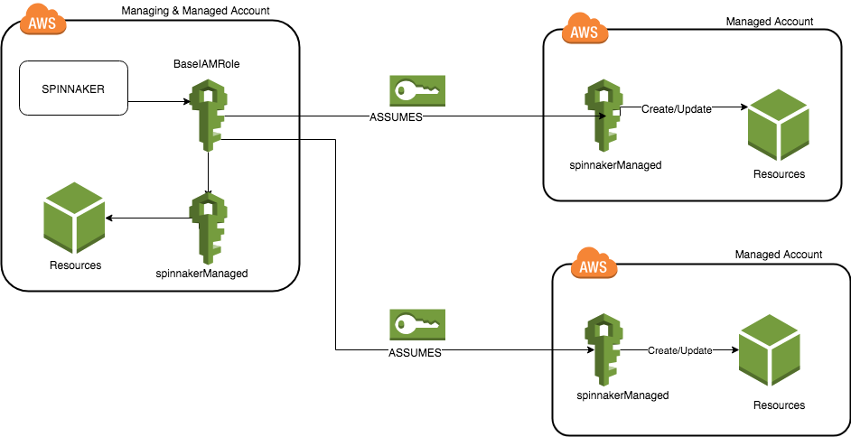



### Concepts

There are two types of Accounts in the Spinnaker AWS provider; however, the
distinction is not made in how they are configured using Halyard, but instead
how they are configured in AWS.

1. Managing accounts. There is always exactly one managing account, this
   account is what Spinnaker authenticates as, and if necessary, assumes roles
   in the managed accounts.
2. Managed accounts. Every account that you want to modify resources in is a
   managed account. These will be configured to grant AssumeRole access to the
   managed account. __This includes the managing account!__

That being said, below are some ways to configure Amazon Web Services (AWS) Cloud Provider. You may choose one or more based on your preferences

* [Amazon Elastic Compute Cloud (EC2)](/setup/install/providers/aws/aws-ec2/) - - Use this option, if you want to manage [EC2 Instances](https://aws.amazon.com/ec2/) via Spinnaker
* [Amazon Elastic Container Service (ECS)](/setup/install/providers/aws/aws-ecs/) - Use this option, if you want to manage containers in [Amazon ECS](https://aws.amazon.com/ecs/)
* [Amazon Elastic Kubernetes Service (EKS)](/setup/install/providers/aws/aws-eks/) - Use this option, if you want to manage containers in [Amazon EKS](https://aws.amazon.com/eks/). This option uses [Kubernetes V2 (manifest based) Clouddriver](/setup/install/providers/kubernetes-v2)
