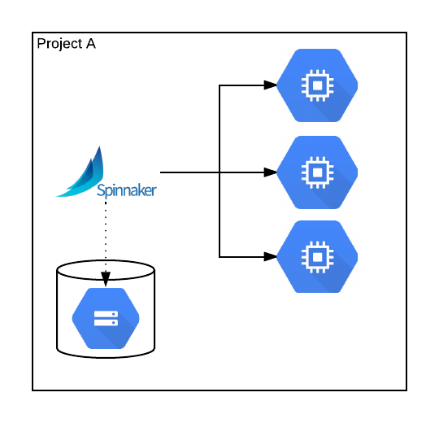
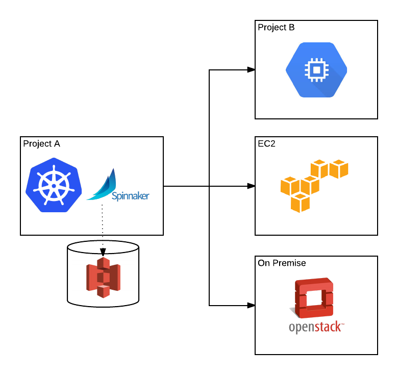



Installing Spinnaker has two basic requirements:

1. Deployment credentials for each account Spinnaker will manage.
1. Storage credentials for Spinnaker's persistent data.

The environment in which Spinnaker is installed is separate from the deployment account(s)
that it manages. 

For example, you could have a very simple setup where Spinnaker runs on a Google Compute Engine (GCE) VM, and manages other VM deployments within the same project. This setup can save data to a Google Cloud Storage (GCS) bucket:
 

Or you could have a more complex setup where Spinnaker run in containers on Kubernetes in Project A, and manage GCE deployments in Project B, EC2 instances in an AWS account, and OpenStack VMs on your premises. You could choose to use an S3 bucket to persist your data: 

## Deployment Account Credentials

Follow the instructions below for your provider to download your deployment account credentials
  
| Cloud Provider | 
| --- | 
| [AppEngine](./appengine) | 
| [Amazon Web Services](./aws) | 
| [Microsoft Azure](./azure) | 
| [Google Compute Engine](./gce) | 
| [Kubernetes](./kubernetes) | 
| [OpenStack](./openstack) | 
| [Oracle](./oracle) | 

## Storage Credentials

Spinnaker needs to store a small amount of data to a cloud storage provider in order to function. This can be from the same cloud provider as your deployment credentials, but it doesn't have to be.
 
We encourage using two separate credentials for deployment account and storage, even though you could achieve the same result using one. 

Follow the instructions for your cloud provider above to download your storage credentials. 