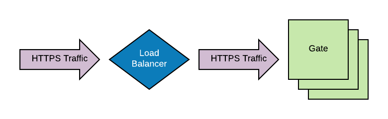



Your choice of installation environment can affect how you must configure authentication. This 
page describes some of the most common network configurations.

## Demo images

If you started your Spinnaker instance through one of the [Quickstart](/setup/quickstart) images,
you have a system that routes all Gate traffic through Deck's Apache instance. You can observe 
that the network traffic from the browser contains `/gate` at the beginning of each request path.
This is traffic destined for Gate, the API gateway.

Some users like to add a load balancer in front of this instance (to change ports or terminate 
SSL). When this happens, requests hop through two layers of proxies, which experience has shown 
causes many headaches when configuring authentication. We instead recommend having traffic go 
straight to Gate from the load balancer in this case

## Server terminated SSL

Terminating SSL within the Gate server is the de factor way to enable SSL for Spinnaker. This will 
work with or without a load balancer proxying traffic to this instance.

## Load Balancer terminated SSL

A common practice is to offload SSL-related bits to outside of the server in question. This is a 
fully supported option in Spinnaker, but it does affect the authentication configuration slightly.
See your authentication method for specifics.

## Next steps

Choose an authentication method:

* [OAuth 2.0](/setup/security/authentication/oauth/)
* [SAML](/setup/security/authentication/saml/)
* [LDAP](/setup/security/authentication/ldap/)
* [X.509](/setup/security/authentication/x509/)
