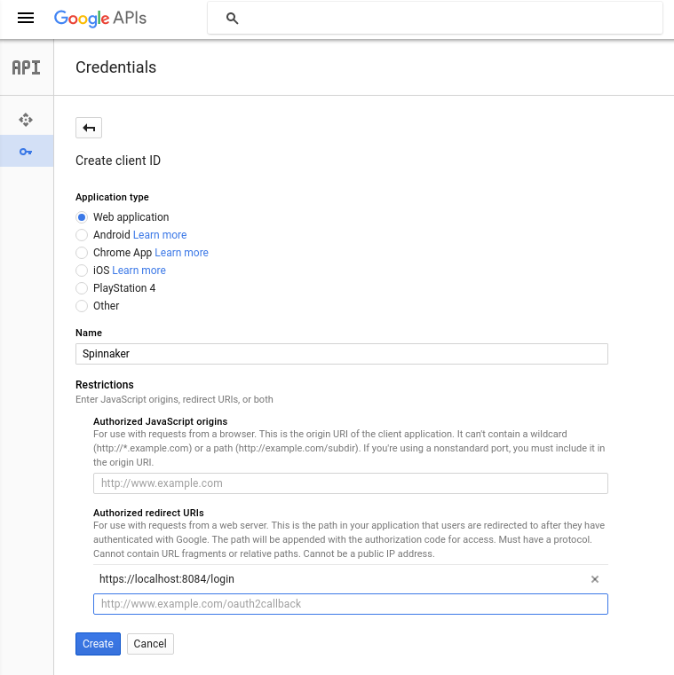

This page instructs you on how to obtain an OAuth 2.0 client ID and client secret for use with your G Suite organization
(previously known as Google Apps for Work).

## Get client ID and secret
1. Navigate to [https://console.developers.google.com/apis/credentials](https://console.developers.google.com/apis/credentials).
2. Click "Create credentials" --> OAuth client ID.
3. Select "Web Application", and enter a name.
4. Under "Authorized redirect URIs", add `https://localhost:8084/login`, replacing domain with your Gate address,
 if known, and `https` with `http` if appropriate. Click Create.
5. Note the generated client ID and client secret. Copy these to a safe place.




## Configure Halyard

You may configure Halyard either with the CLI or by manually editing the hal config.

### Hal config

```yaml
security:
  authn:
    oauth2:
      enabled: true
      client:
        clientId: # client ID from above
        clientSecret: # client secret from above
        accessTokenUri: https://www.googleapis.com/oauth2/v4/token
        userAuthorizationUri: https://accounts.google.com/o/oauth2/v2/auth
        scope: profile email
      resource:
        userInfoUri: https://www.googleapis.com/oauth2/v3/userinfo
      userInfoRequirements:
        # You almost certainly want to restrict access to your Spinnaker to
        # users whose account is from your hosted domain; without this any
        # user with a Google account will have access.
        hd: # hosted domain
      userInfoMapping:
        email: email
        firstName: given_name
        lastName: family_name
      provider: GOOGLE
```

### CLI
```bash
hal config security authn oauth2 edit --provider google \
  --client-id (client ID from above) \
  --client-secret (client secret from above)

hal config security authn oauth2 enable

```


