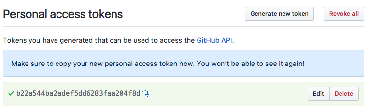



Roles from GitHub are mapped to the Teams under a specific GitHub organization.

## Personal Access Token

1. Under an administrator's account, generate a new Personal Access Token from
[https://github.com/settings/tokens](https://github.com/settings/tokens).
1. Give it a descriptive name such as "spinnaker-fiat."
1. Select the `read:org` scope.
1. Click "Generate Token"

    

## Configure with Halyard

TODO: Confirm these details when halyard supports GitHub.

With the personal access token in hand, use Halyard to configure Fiat:

```bash
TOKEN=b22a54...  # Personal access token under admin account
ORG=myorg        # GitHub Organization

hal config security authz github edit \
    --accessToken $TOKEN \
    --organization $ORG \
    --baseUrl https://api.github.com

hal config security authz edit --type github

hal config security authz enable
```
