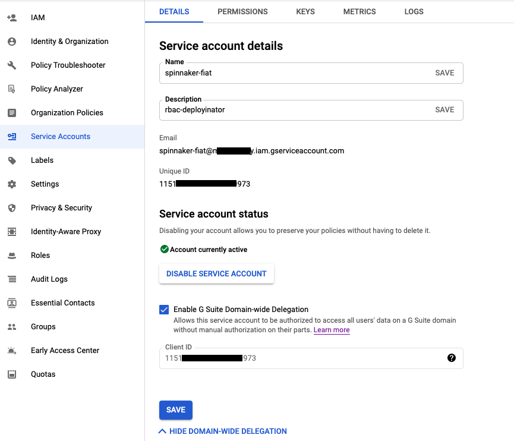
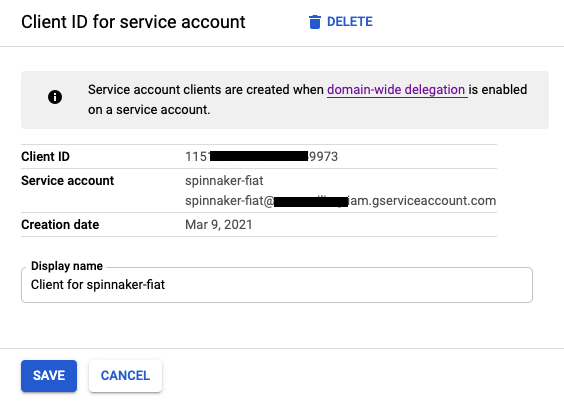
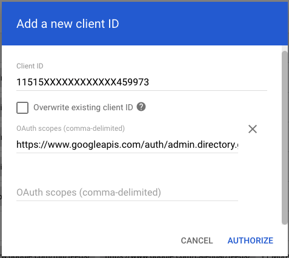



Organizations that have a G Suite account (formerly Google Apps for Work) can use Google Groups
to manage the roles users are granted.


## Service account setup

In order to access a user's group membership, we must use the Google Admin Directory API. We will
setup a Google Cloud Platform (GCP) service account and grant it access to the Directory API.

1. Enable the Admin SDK [here](https://console.cloud.google.com/apis/library/admin.googleapis.com){:target="\_blank"}.

1. In your [Cloud Console](https://console.cloud.google.com){:target="\_blank"},
create a service account that will access the G Suite Directory API.

    

    1. Navigate to the "IAM & Admin" --> Service accounts section.
    1. Click "Create Service Account."
    1. Give it a name like "spinnaker-fiat."
    1. Click Create. No Need to assign any permissions at this stage
    1. After Its created, you can go and click the service account for details.
    1. Navigate to "Details" tab, and Click "Enable G Suite Domain-wide Delegation"
    1. Navigate to "Keys" tab, to create a JSON Service.
    1. Click "ADD KEY", Key Type: "JSON"
    1. Click "Create", which should download the private key for your new service account (see
    figure below).
    1. Transfer this JSON file to a known location in your Spinnaker deployment.
    1. You should see your newly created service account in the list, along with "DwD" and an
    option to "View Client ID". Click "View Client ID" (see figure below).
    1. Note the Client ID displayed. It will be used in the next step.

    

1. Give your service account access to the G Suite Directory API in the
[G Suite Admin console](https://admin.google.com){:target="\_blank"}.

    

    1. Navigate to the "Security" Settings page.
    1. Under "API Controls", click "Domain wide delegation."
    1. Click "Add New" Enter the Client ID noted above under "Client Name."
    1. Enter `https://www.googleapis.com/auth/admin.directory.group.readonly` as the API scope.
    1. Click "Authorize."


## Configure with Halyard

1. Make sure you've configured roles for accounts, as described [here](/setup/security/authorization/#accounts). Each role included in the command must match the name of a group
in the organization.

1. With the authorized service account's credentials in hand, use Halyard to configure Fiat:

   ```bash
   ADMIN=admin@your.org              # An administrator's email address
   CREDENTIALS=/path/to/creds.json   # The downloaded service account credentials
   DOMAIN=your.org                   # Your organization's domain.
   
   hal config security authz google edit \
       --admin-username $ADMIN \
       --credential-path $CREDENTIALS \
       --domain $DOMAIN
   
   hal config security authz edit --type google
   
   hal config security authz enable
   ```
