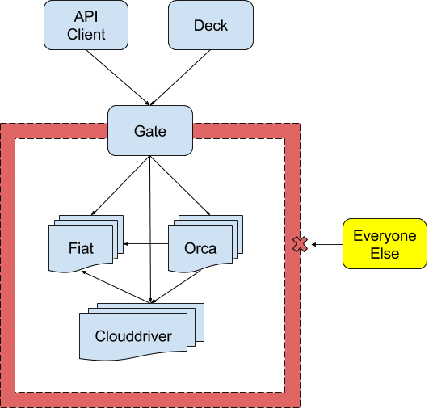
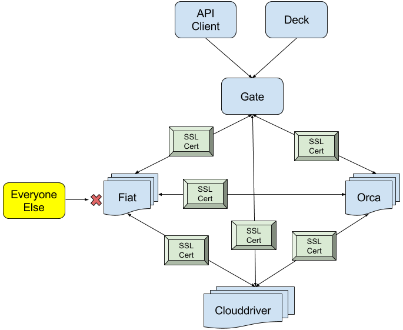
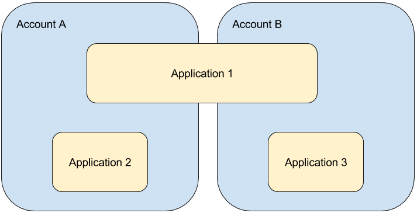
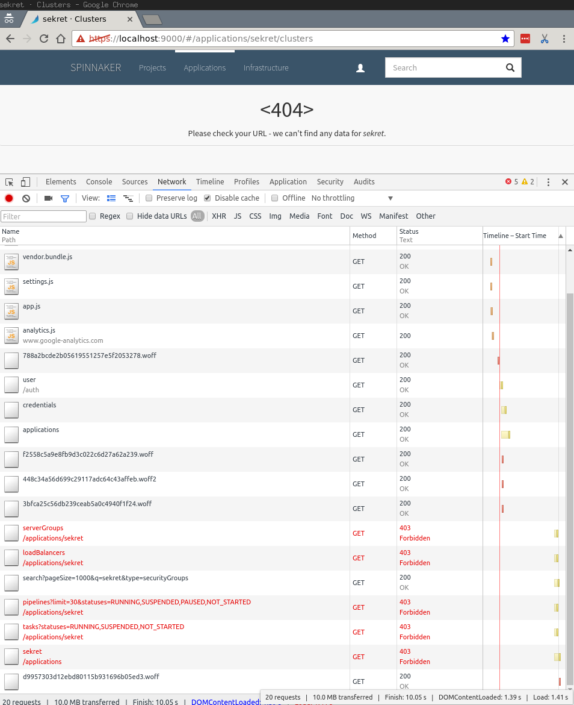



Much like authentication, Spinnaker allows for a variety of pluggable
authorization mechanisms. This page shows how to setup and configure
**Fiat**, Spinnaker's authorization microservice.


## Model and features

Fiat's authorization model is a _whitelist that is open by default_. In other words, when a
resource does _not_ define who is allowed to access it, it is considered unrestricted.

With Fiat, you can&hellip;

* Restrict access to specific [_accounts_](#accounts).
* Restrict access to specific [_applications_](#applications).
* Run externally-triggered pipelines against access-controlled applications using [_Fiat service
accounts_](#service-accounts).
* Use and periodically update user roles from a backing [role provider](#role-providers).


## Requirements

1. [Authentication](../authentication) successfully setup in Gate.

1. Configured Front50 to use S3 or Google Cloud Storage (GCS) as the backing storage mechanism for
 persistent application configurations.

1. An external role provider from one of the following:
    * Google Groups via a G Suite Account
        * With access to the G Suite Admin console
    * GitHub Team
    * LDAP server
    * SAML Identity Provider (IdP) that includes groups in the assertion
        > SAML roles are fixed at login time, and cannot be changed until the user needs to
        reauthenticate.

1. Patience&mdash;there are a lot of small details that must be _just_ right with anything related to
 authentication and authorization.

1. (Highly Suggested) All Spinnaker component microservices are either:
    1. Firewalled off as a collective group, or:

        

    1. Use mutual TLS authentication:

        


## Restrictable resources

Accounts and applications access control can be confusing unless you understand the core
relationship: accounts can contain multiple applications, and applications can span multiple
accounts.




### Accounts
In the dark ages (before Fiat), only accounts could be restricted. Because
Clouddriver is the source of truth for accounts, Fiat reaches out to Clouddriver
to gather the list of available accounts. To add access restrictions to an
account, update your `halconfig` to include the `requiredGroupMembership` field.

```bash
PROVIDER= # Your cloud provider
GROUP=    # The new group membership

hal config provider $PROVIDER account edit $ACCOUNT --add-required-group-membership $GROUP
```

Alternatively, you can overwrite the whole list using the `--required-group-membership` flag.


### Applications

Set permissions for an existing application using the application configuration:



### Unrestricted accounts and applications

It's important to understand what may happen if you leave either an account or application
without any configured permissions.

* If an account is unrestricted, any user with access to Spinnaker can deploy a new application
to that account.
* If an application is unrestricted, any user with access to Spinnaker can deploy that
application into a different account. They may also be able to see basic information like
instance names and counts within server groups.


## Effects of restrictions

Because of the new access restrictions, `https://localhost:9000/#/applications` should no longer
list applications that have been restricted. Even navigating to the previously accessible page
should be denied:



## Service accounts

A popular feature in Spinnaker is the ability to run pipelines automatically based on a
triggering event, such as a `git push` or a Jenkins build completing. When pipelines run against
accounts and applications that are protected, it is necessary to use a Fiat [service account](
./service-accounts/) with enough permissions to access those protected resources.

## Role providers

To configure an external role provider, follow one of the instructions below:

* [Google Groups with a G Suite account](./google-groups/)
* [GitHub Teams](./github-teams/)
* [LDAP Groups](./ldap/)
* [SAML Groups](./saml/)
