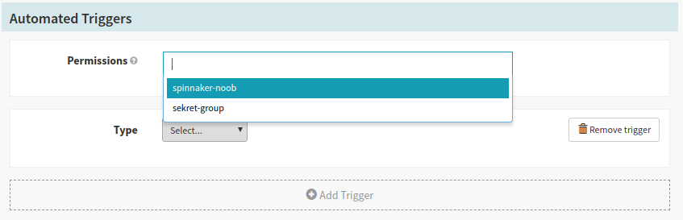





Pipeline permissions enable automatically triggered pipelines to modify
resources in protected accounts and applications. They are an alternative
to manually managing [Fiat Service Accounts](../service-accounts/).

Without pipeline permissions, a Spinnaker operator first has to create a
Fiat Service account with the correct permissions. A user can then specify the
service account as the `RunAsUser` per automated trigger. Pipeline permissions
simplifies this flow – a user only has to specify the set of roles in the
pipeline specification based on which a Fiat service account is automatically
created and associated with the pipeline.

## Enabling pipeline permissions

Pipeline permissions are disabled by default and can be enabled by
setting the following flags:

* For Orca, add the following to  `orca-local.yml`

```yaml
tasks:
  useManagedServiceAccounts: true
```

* For Deck, add the following to `settings-local.js`

```js
window.spinnakerSettings.feature.managedServiceAccounts = true;
```

## Using pipeline permissions
The permissions selector will show up automatically when an automated trigger
is added in the pipeline configuration page in the UI. You can add any of the
roles that you currently have. Once you add a role to the pipeline, only users
who have _all of the specified roles_ can edit or execute the pipeline.
This is similar to the behavior of
[Fiat service accounts](../service-accounts#service-account-roles).



## Migrating from Fiat service accounts

Once pipeline permissions are enabled, the `RunAsUser` selector will be hidden
from Deck. However, any previously configured triggers will continue to use
the previously selected service account in order to maintain backwards
compatibility. Newly added triggers will use the permssions specified. If you
wish to use pipeline permissions for the older triggers and already have
permissions specified, edit your pipeline JSON and remove the `RunAsUser` field
from your trigger.