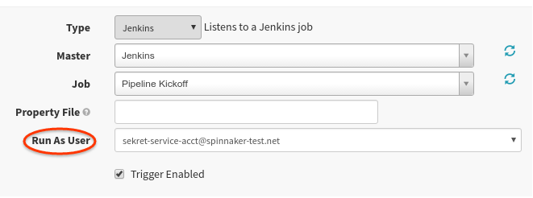



Service Accounts enable the ability for automatically triggered pipelines to modify 
resources in protected accounts or applications. Practically speaking, this means that a Git 
commit could trigger a Jenkins build that could kick then off a pipeline to deploy the newly built 
image in your access-controlled QA environment.  Service accounts are NOT authenticated accounts but
abstractions around permissions for roles.


## Creating service accounts

Service accounts are persistent and configuration merely consists of giving it a name and a set 
of roles. Therefore, Front50 is the most logical place to configure a service account. There is 
no UI for creating service accounts at the moment. 

Users with all the roles defined in the service account can grant a pipeline "Run as <service account>"
 but only if the service account itself has EXECUTE access to that app. Users with EXECUTE access to 
 the app can then run the pipeline with additional set of roles (e.g. access to a provider account or 
 some other app).

Until Halyard supports creation of service accounts, you'll need to run the following commands:

```bash
FRONT50=http://front50.url:8080

curl -X POST \
  -H "Content-type: application/json" \
  -d '{ "name": "sekret-service-account@spinnaker-test.net", "memberOf": ["myApp-prod","myApp-qa"] }' \
  $FRONT50/serviceAccounts
```

> **Note**: In the above command, `myApp-prod` and `myApp-qa` are roles, not application names.

You can see your new service account that just got created:
```bash
curl $FRONT50/serviceAccounts
```

A Fiat sync may be necessary for all affected users to pick up the changes:

```bash
FIAT=http://fiat.url:7003

curl -X POST $FIAT/roles/sync
```

Confirm the new service account has permissions to the resources that you think it should by querying 
Fiat:

```bash
$ curl $FIAT/authorize/myApp-svc-account
```

### Service account roles
The roles you give this service account determine who has access to use it. In order to prevent a
privilege escalation vulnerability, only users _with every role the service account has_ may use
it.

For example, if user "Batman" has roles `foo`, `bar`, and `baz` and service account "Alfred" has 
roles `foo` and `bar`, then "Batman" has access to use "Alfred" in his pipelines. However, user
"Joker", with role `foo`, does not have all of the roles "Alfred" has, so he cannot use it.

## Using service accounts
With Fiat enabled, you should now see a “Run As User” option in your Trigger configuration. This
list contains all of the service accounts you currently have access to.



Upon saving this pipeline, two authorization checks occur:
1. Does this user have access to this service account? (If using the UI, this should always be 
the case.)
1. Does this service account have access to this application?

At pipeline runtime, standard authorization checks against the account and application occur 
just as if it were a human user.
